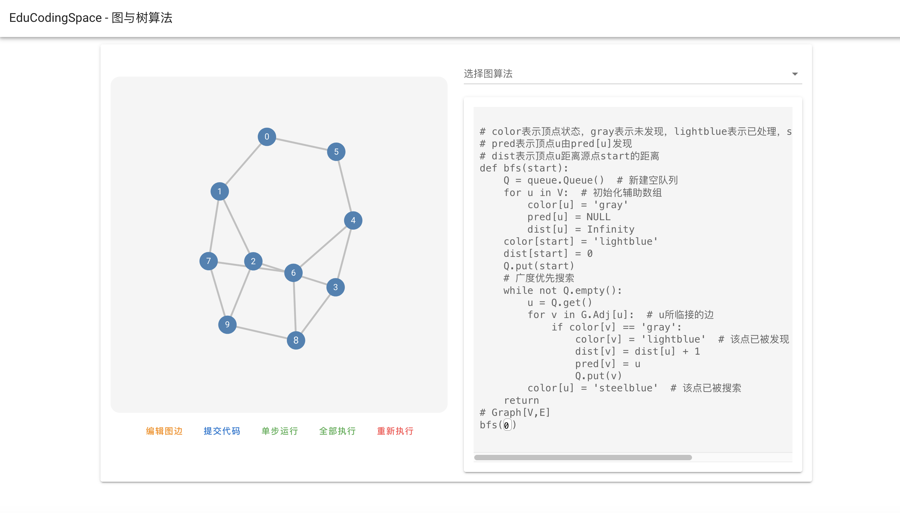

<h1 style="text-align: center"> 立体化教学资源支撑系统<br>概要设计报告 </h1>

<table>
<thead>
<tr>
<th style="text-align:center">文件状态</th>
<th style="text-align:center">文档名称</th>
<th style="text-align:center">立体化教学资源支撑系统概要设计报告</th>
</tr>
</thead>
<tbody>
<tr>
    <td style="text-align:center" rowspan="3">稳定版本发布</td>
	<td style="text-align:center">当前版本</td>
	<td style="text-align:center">1.1</td>
</tr>
<tr>
    <td style="text-align:center">作者</td>
	<td style="text-align:center">裴子祎、封静涵</td>
</tr>
<tr>
    <td style="text-align:center">完成日期</td>
	<td style="text-align:center">2023-5-11</td>
</tr>
</tbody>
</table>
<h2> 目录 </h2>

<!-- @import "[TOC]" {cmd="toc" depthFrom=1 depthTo=2 orderedList=false} -->

<!-- code_chunk_output -->

- [版本历史](#版本历史)
- [文档介绍](#文档介绍)
  - [文档目的](#文档目的)
  - [文档范围](#文档范围)
  - [读者对象](#读者对象)
- [设计要点](#设计要点)
  - [设计报告范围](#设计报告范围)
  - [关键业务功能](#关键业务功能)
  - [技术实现难点](#技术实现难点)
- [用户端基本功能](#用户端基本功能)
  - [用户端用户登录 `BAS-LOGIN`](#用户端用户登录-bas-login)
  - [用户端扫码 `BAS-QRCODE`](#用户端扫码-bas-qrcode)
- [用户端个人中心栏目](#用户端个人中心栏目)
  - [用户端查看个人信息 `BAS-USRCTR`](#用户端查看个人信息-bas-usrctr)
  - [用户端修改用户头像 `BAS-USRCTR`](#用户端修改用户头像-bas-usrctr)
  - [用户端切换课程 `BAS-USRCTR`](#用户端切换课程-bas-usrctr)
  - [用户端修改密码 `BAS-USRCTR`](#用户端修改密码-bas-usrctr)
  - [用户端退出登录 `BAS-USRCTR`](#用户端退出登录-bas-usrctr)
- [用户端仪表盘栏目](#用户端仪表盘栏目)
  - [用户端浏览个人分析 `BRD-ANLYZ`](#用户端浏览个人分析-brd-anlyz)
  - [用户端互动学习推荐 `BRD-RCMND`](#用户端互动学习推荐-brd-rcmnd)
- [用户端交互学习栏目](#用户端交互学习栏目)
  - [用户端选择交互学习 `VIS-CHOS`](#用户端选择交互学习-vis-chos)
  - [用户端交互学习提交代码 `VIS-SRCH` `VIS-SORT` `VIS-GRAPH`](#用户端交互学习提交代码-vis-srch-vis-sort-vis-graph)
  - [用户端编辑图边 `VIS-GRAPH`](#用户端编辑图边-vis-graph)
  - [用户端代码执行显示 `VIS-SRCH` `VIS-SORT` `VIS-GRAPH`](#用户端代码执行显示-vis-srch-vis-sort-vis-graph)
  - [用户端自定义互动学习 `VIS-CUSTOM`](#用户端自定义互动学习-vis-custom)
- [用户端习题社区栏目](#用户端习题社区栏目)
  - [用户端浏览习题社区 `EXC-BROWS`](#用户端浏览习题社区-exc-brows)
  - [用户端查看题组详情 `EXC-SETINFO`](#用户端查看题组详情-exc-setinfo)
  - [用户端查看习题详情 `EXC-INFO`](#用户端查看习题详情-exc-info)
  - [用户端作答习题 `EXC-INFO`](#用户端作答习题-exc-info)
- [用户交流社区栏目](#用户交流社区栏目)
  - [用户端浏览交流社区 `FRM-BROWS`](#用户端浏览交流社区-frm-brows)
  - [用户端发布帖子 `FRM-POST`](#用户端发布帖子-frm-post)
  - [用户端查看帖子/回复 `FRM-INFO`](#用户端查看帖子回复-frm-info)
  - [用户端回复帖子 `FRM-REPLY`](#用户端回复帖子-frm-reply)
  - [用户端编辑帖子/回复 `FRM-EDIT`](#用户端编辑帖子回复-frm-edit)
  - [用户端删除帖子/回复 `FRM-DELE`](#用户端删除帖子回复-frm-dele)
- [教师端课程管理](#教师端课程管理)
  - [教师端修改课程信息 `TCR-MNGCORS`](#教师端修改课程信息-tcr-mngcors)
  - [教师端加入课程用户 `TCR-MNGCORS`](#教师端加入课程用户-tcr-mngcors)
  - [教师端导入课程用户 `TCR-MNGCORS`](#教师端导入课程用户-tcr-mngcors)
  - [教师端删除课程用户 `TCR-MNGCORS`](#教师端删除课程用户-tcr-mngcors)
- [教师习题管理](#教师习题管理)
  - [教师端创建习题 `TCR-MNGEXC`](#教师端创建习题-tcr-mngexc)
  - [教师端编辑习题 `TCR-MNGEXC`](#教师端编辑习题-tcr-mngexc)
  - [教师端删除习题 `TCR-MNGEXC`](#教师端删除习题-tcr-mngexc)
  - [教师端创建题组 `TCR-MNGEXC`](#教师端创建题组-tcr-mngexc)
  - [教师端编辑题组 `TCR-MNGEXC`](#教师端编辑题组-tcr-mngexc)
  - [教师端删除题组 `TCR-MNGEXC`](#教师端删除题组-tcr-mngexc)
- [管理员全局课程管理](#管理员全局课程管理)
  - [管理员创建课程 `ADM-MNGCORS`](#管理员创建课程-adm-mngcors)
  - [管理员删除课程 `ADM-MNGCORS`](#管理员删除课程-adm-mngcors)
- [管理员全局用户管理](#管理员全局用户管理)
  - [管理员修改用户信息 `ADM-MNGUSR`](#管理员修改用户信息-adm-mngusr)
  - [管理员重置用户密码 `ADM-MNGUSR`](#管理员重置用户密码-adm-mngusr)
  - [管理员删除用户 `ADM-MNGUSR`](#管理员删除用户-adm-mngusr)
  - [管理员新建用户 `ADM-MNGUSR`](#管理员新建用户-adm-mngusr)
  - [管理员批量新建用户 `ADM-MNGUSR`](#管理员批量新建用户-adm-mngusr)
- [接口设计](#接口设计)
  - [用户登录 `login`](#用户登录-login)
  - [获取二维码 `getQrCode`](#获取二维码-getqrcode)
  - [修改头像 `changeAvatar`](#修改头像-changeavatar)
  - [修改密码 `changePassword`](#修改密码-changepassword)
  - [登出 `logout`](#登出-logout)
  - [获取用户弱点分析 `getWeakness`](#获取用户弱点分析-getweakness)
  - [获取做题情况 `getQuestionOverview`](#获取做题情况-getquestionoverview)
  - [获取推荐习题列表 `getRecQuestion`](#获取推荐习题列表-getrecquestion)
  - [二分查找代码填空提交 `postBinarySearch`](#二分查找代码填空提交-postbinarysearch)
  - [排序加载代码  `getSort`](#排序加载代码--getsort)
  - [排序提交代码 `postSort`](#排序提交代码-postsort)
  - [图加载代码 `getGraph`](#图加载代码-getgraph)
  - [图提交代码 `postGraph`](#图提交代码-postgraph)
  - [自定义提交代码 `postCustomCode`](#自定义提交代码-postcustomcode)
  - [获取习题列表 `getAllExercise`](#获取习题列表-getallexercise)
  - [获取题组列表 `getAllExam`](#获取题组列表-getallexam)
  - [获取题组详情 `getExerciseSetDetail`](#获取题组详情-getexercisesetdetail)
  - [获取习题详情 `getExerciseDetail`](#获取习题详情-getexercisedetail)
  - [用户提交作答 `submitExerciseAnswer`](#用户提交作答-submitexerciseanswer)
  - [获取帖子列表 `getAllBlogs`](#获取帖子列表-getallblogs)
  - [发布讨论帖 `postBlog`](#发布讨论帖-postblog)
  - [获取讨论帖详情 `getBlogByID`](#获取讨论帖详情-getblogbyid)
  - [获取讨论帖评论 `getBlogRemark`](#获取讨论帖评论-getblogremark)
  - [编辑讨论帖 `postBlogEdit`](#编辑讨论帖-postblogedit)
  - [编辑回复 `postBlogRemarkEdit`](#编辑回复-postblogremarkedit)
  - [删除讨论帖 `postBlogDelete`](#删除讨论帖-postblogdelete)
  - [删除回复 `postBlogRemarkDelete`](#删除回复-postblogremarkdelete)
  - [回复帖子 `postBlogRemark`](#回复帖子-postblogremark)
  - [创建新习题 `createNewExercise`](#创建新习题-createnewexercise)
  - [编辑习题 `editExercise`](#编辑习题-editexercise)
  - [删除习题 `deleteExercise`](#删除习题-deleteexercise)
  - [创建题组 `createNewExerciseSet`](#创建题组-createnewexerciseset)
  - [编辑题组 `editExerciseSet`](#编辑题组-editexerciseset)
  - [删除题组 `deleteExerciseSet`](#删除题组-deleteexerciseset)
  - [添加课程  `postCourse`](#添加课程--postcourse)
  - [删除课程 `deleteCourse`](#删除课程-deletecourse)
  - [编辑课程 `putCourse`](#编辑课程-putcourse)
  - [添加课程用户 `postCourseUser`](#添加课程用户-postcourseuser)
  - [删除课程用户 `deleteCourseUser`](#删除课程用户-deletecourseuser)
  - [添加用户 `postUser`](#添加用户-postuser)
  - [删除用户 `deleteUser`](#删除用户-deleteuser)
  - [编辑用户信息 `putUser`](#编辑用户信息-putuser)
  - [重置用户密码 `postPassword`](#重置用户密码-postpassword)
  - [获取所有用户 `getAllUsers`](#获取所有用户-getallusers)
  - [获取所有课程信息 `getAllCourses`](#获取所有课程信息-getallcourses)
- [数据结构设计](#数据结构设计)
  - [交流社区类图](#交流社区类图)
  - [习题社区类图](#习题社区类图)
  - [E-R图](#e-r图)

<!-- /code_chunk_output -->

# 版本历史

<table>
<thead>
<tr>
	<th style="text-align:center">版本号</th>
	<th style="text-align:center">作者</th>
	<th style="text-align:center">审核人</th>
    <th style="text-align:center">更新日期</th>
    <th style="text-align:center">更新说明</th>
</tr>
</thead>
<tbody>
<tr>
    <td style="text-align:center">1.0</td>
	<td style="text-align:center">裴子祎、封静涵</td>
	<td style="text-align:center">朱文涛、贺梓源</td>
    <td style="text-align:center">2023/4/26</td>
	<td style="text-align:center">完成第一版概要设计报告</td>
</tr>
<tr>
    <td style="text-align:center">1.1</td>
	<td style="text-align:center">封静涵</td>
	<td style="text-align:center">贺梓源</td>
    <td style="text-align:center">2023/5/11</td>
	<td style="text-align:center">添加需求变更后的设计说明，添加功能编号</td>
</tr>
</tbody>
</table>

# 文档介绍

## 文档目的

本设计概要书面向本软件开发人员、测试人员。

本设计概要书内详细描述了本软件支持的所有功能的实现概述以及接口定义，并且定义了数据库模型，是本软件开发人员进行系统设计的依据和基础，也为测试工作和验收工作提供了保障。

## 文档范围

本设计概要书包含以下内容：

1. 概述本系统设计要点、关键业务功能、技术实现难点；
2. 具体功能的实现简述及约定、功能实现流程、相关接口、出错处理设计、出错信息；
3. 本系统数据结构设计：包括数据元素表，E-R图，数据之间的关联关系。

## 读者对象

- 软件开发人员

  本系统采用前后端分离开发技术。前后端开发人员分别根据接口定义独立进行开发，然后连通测试，可以并行进行开发任务，工作效率高。

- 测试人员

  测试人员根据接口定义，验收前后端开发人员的任务完成情况，确保系统正常稳定的运行。

# 设计要点

## 设计报告范围

本报告主要描述软件可视化平台需求文档中提到的功能性需求的具体实现以及整个系统中会遇到的困难点。

## 关键业务功能

本系统应当包含管理端（Web）和用户端（Web）。

用户端应当包含教师和学生的所有功能需求。学生在用户端可以访问交互学习社区（编辑代码、查看运行过程等）、访问习题社区（查看题目、做题目、查看题解、查看题组、做题组、查看个人做题分析）、访问交流社区（查看分享、发起分享、回复分享）、个人账户管理（修改账户密码、修改个人信息（头像）、切换课程、注销登录）。教师除上述功能外还可以进行习题社区管理、交流社区管理、课程管理（导入学生）。管理端包含全部用户端功能，并且能够进行用户管理、课程管理。

## 技术实现难点

1. 前后端分离开发与连通

   本系统采用前后端分离开发技术，前后端先根据接口定义独立完成开发工作，后端运行在服务器上，前端可以可以直接访问，方便前端在开发过程中进行调试。连通过程中重点解决了跨域问题。

2. 网页端与手机端适应性问题

   前端开发过程中采用flex灵活布局，有较好的屏幕适应性，不仅可以在电脑网页上访问可以看到正常的排布效果，在手机上也可以显示正常的效果。方便用户使用。

# 用户端基本功能

<table>
<thead>
<tr>
	<th style="text-align:center">功能类别</th>
	<th style="text-align:center">功能名</th>
    <th style="text-align:center">功能编号</th>
	<th style="text-align:center">描述</th>
</tr>
</thead>
<tbody>
<tr>
	<td rowspan="2" style="text-align:center">用户基本功能</td>
	<td style="text-align:center">用户端用户登录</td>
    <td style="text-align:center"><code>BAS-LOGIN</code> </td>
	<td style="text-align:center">用户登录</td>
</tr>
<tr>
    <td style="text-align:center">用户端扫码</td>
    <td style="text-align:center"><code>BAS-QRCODE</code></td>
	<td style="text-align:center">用户选择展示类型并扫描二维码</td>
</tr>
</tbody>
</table>
## 用户端用户登录 `BAS-LOGIN`

### 实现简述及约定

用户使用用户名、密码进行登录。前端将用户输入的用户名、密码传给后端，后端查询数据库，返回验证信息。如用户名和密码匹配，用户登录成功跳转首页，否则前端会及时显示错误信息。

### 功能实现流程

```flow
s=>start: 用户未登录
c1=>condition: 用户名、密码是否匹配？
o1=>operation: 进入登录界面
o2=>operation: 输入用户名、密码
o3=>operation: 点击登录
e2=>end: 前端提示登录失败
e=>end: 登录成功

s(right)->o1(right)->o2(right)->o3(right)->c1(yes)->e
c1(no)->e2
```


### 界面设计


| 序号 | 元素类型 | 表现形式     | 说明                       |
| ---- | -------- | ------------ | -------------------------- |
| 1    | 输入框   | 请输入学工号 | 遵循字符要求显示在输入框中 |
| 2    | 输入框   | 请输入密码   | 遵循字符要求显示在输入框中 |
| 3    | 按钮     | 登录         | 点击按钮完成登录           |

### 相关接口

| 序号 | 接口编号/名称 | 说明           |
| ---- | ------------- | -------------- |
| 1    | login         | 登录的post请求 |

### 出错处理设计

学工号不存在或学工号和密码不匹配，后端返回错误信息，前端提示用户重新输入信息提交。

若后端返回401未认证，则前端会提示用户登录过期，并跳转到登录界面，让用户重新登录。

### 出错信息

| 序号 | 错误编码 | 错误信息                      | 说明/处理办法                  |
| ---- | -------- | ----------------------------- | ------------------------------ |
| 1    | 400      | 用户名/密码错误               | 前端提示用户重新输入信息提交   |
| 2    | 401      | 用户未认证（由token过期引起） | 前端自动跳转到登录界面重新登录 |


## 用户端扫码 `BAS-QRCODE`

### 实现简述及约定

用户登录后，点击生成二维码，前端发送获取指定二维码请求，后端以字符串形式返回二维码，前端转换成二维码形式，界面弹出二维码显示。手机登录后扫描二维码即可在手机端访问相应网页。

### 功能实现流程

```flow
s=>start: 用户登录
o4=>operation: 点击生成二维码
e=>end: 二维码显示

s(right)->o4(right)->e
```


### 界面设计


| 序号 | 元素类型 | 表现形式 | 说明           |
| ---- | -------- | -------- | -------------- |
| 1    | 弹窗     | 弹窗     | 展示           |
| 2    | 图片     | 图片     | 展示二维码     |
| 3    | 按钮     | 关闭     | 点击按关闭弹窗 |

### 相关接口

| 序号 | 接口编号/名称 | 说明       |
| ---- | ------------- | ---------- |
| 1    | getQrCode     | 获取二维码 |

### 出错处理设计

若后端返回401未认证，则前端会提示用户登录过期，并跳转到登录界面，让用户重新登录。

### 出错信息

| 序号 | 错误编码 | 错误信息                      | 说明/处理办法                  |
| ---- | -------- | ----------------------------- | ------------------------------ |
| 1    | 401      | 用户未认证（由token过期引起） | 前端自动跳转到登录界面重新登录 |

# 用户端个人中心栏目

<table>
<thead>
<tr>
	<th style="text-align:center">功能类别</th>
	<th style="text-align:center">功能名</th>
    <th style="text-align:center">功能编号</th>
	<th style="text-align:center">描述</th>
</tr>
</thead>
<tbody>
<tr>
	<td rowspan="5" style="text-align:center">用户个人中心栏目</td>
	<td style="text-align:center">用户端查看个人信息</td>
    <td rowspan="5" style="text-align:center"><code>BAS-USRCTR
</code></td>
	<td style="text-align:center">展示用户个人信息</td>
</tr>
<tr>
    <td style="text-align:center">用户端修改用户头像</td>
	<td style="text-align:center">用户修改个人头像</td>
</tr>
<tr>
	<td style="text-align:center">用户端切换课程</td>
	<td style="text-align:center">用户切换当前课程</td>
</tr>
<tr>
	<td style="text-align:center">用户端修改密码</td>
	<td style="text-align:center">用户修改密码</td>
</tr>
<tr>
	<td style="text-align:center">用户端退出登录</td>
	<td style="text-align:center">用户退出登录</td>
</tr>
</tbody>
</table>


## 用户端查看个人信息 `BAS-USRCTR`

### 实现简述及约定

用户登录后可以访问个人中心，用户成功登录后，后端将返回用户个人信息，前端将用户个人信息存储在本地。用户点击进入个人中心，即可查看用户个人信息。

### 功能实现流程

```flow
s=>start: 用户登录
o1=>operation: 后端返回的个人信息存储
o2=>operation: 用户进入个人中心界面
e=>end: 展示存储的个人信息

s(right)->o1(right)->o2(right)->e
```


### 界面设计


| 序号 | 元素类型 | 表现形式 | 说明                     |
| ---- | -------- | -------- | ------------------------ |
| 1    | 展示框   | 卡片     | 展示用户基本信息         |
| 2    | 展示     | 图片     | 展示用户头像             |
| 3    | 按钮     | 修改头像 | 点击按钮打开修改头像弹窗 |
| 4    | 按钮     | 切换课程 | 点击按钮打开切换课程弹窗 |
| 5    | 按钮     | 修改密码 | 点击按钮打开修改密码弹窗 |
| 6    | 按钮     | 退出登录 | 点击按钮打开退出登录弹窗 |

### 相关接口

依靠前端本地vuex存储载入个人信息，不需要接口。

### 出错处理

如果用户没有登录，则前端无法获得用户个人信息，会自动跳转到登录界面，让用户重新登录。

### 出错信息
| 序号 | 错误编码 | 错误信息                      | 说明/处理办法                  |
| ---- | -------- | ----------------------------- | ------------------------------ |
| 1    | 401      | 用户未认证（由token过期引起） | 前端自动跳转到登录界面重新登录 |


## 用户端修改用户头像 `BAS-USRCTR`
### 实现简述及约定

用户点击进入个人中心栏目后，点击个人信息卡片上的“修改头像”按钮，打开修改头像弹窗。在弹窗中选择新的头像图片上传，点击“确认修改”后，前端检查图片格式是否符合要求，如果符合要求，弹窗关闭，前端将新的用户头像图片文件发送给后端，后端将新用户头像存储到该用户头像对应的 url 处，前端从后端获取用户新头像，完成用户头像更新。如果不符合要求，提示用户图片格式不符合要求。

如果用户点击弹窗上的“取消”按钮，弹窗关闭，用户头像不变。

### 功能实现流程

```flow
s=>start: 用户进入个人中心栏目
o1=>operation: 点击修改头像
o2=>operation: 上传图片
c1=>condition: 图片格式是否符合要求
e2=>end: 提示用户图片格式不符合要求
o3=>operation: 前端提交修改图片文件给后端
e=>end: 完成头像更新

s(right)->o1(right)->o2(right)->c1(yes)->o3->e
c1(no)->e2
```


### 界面设计


| 序号 | 元素类型 | 表现形式 | 说明                   |
| ---- | -------- | -------- | ---------------------- |
| 1    | 弹窗     | 修改头像 | 修改头像弹窗           |
| 2    | 输入     | 上传头像 | 上传新的用户头像       |
| 3    | 按钮     | 确认修改 | 点击按钮修改头像       |
| 4    | 按钮     | 取消     | 弹窗关闭，用户头像不变 |

### 相关接口


| 序号 | 接口编号/名称 | 说明     |
| ---- | ------------- | -------- |
| 1    | changeAvatar  | 修改头像 |

### 出错处理

若后端返回401未认证，则前端会提示用户登录过期，并跳转到登录界面，让用户重新登录。

若图片格式错误，发送给后端后会返回错误编码500，前端提示用户输入图片格式不符合要求。

### 出错信息

| 序号 | 错误编码 | 错误信息                      | 说明/处理办法                                    |
| ---- | -------- | ----------------------------- | ------------------------------------------------ |
| 1    | 401      | 用户未认证（由token过期引起） | 前端自动跳转到登录界面重新登录                   |
| 2    | 500      | 服务器错误                    | 前端提示上传图片格式不符合要求，需要重新上传图片 |

## 用户端切换课程 `BAS-USRCTR`
### 实现简述及约定

用户进入课程中心后，点击切换课程按钮，打开切换课程弹窗，选择课程，点击确定，弹窗关闭，前端修改当前课程 id 完成切换。

如果用户没有选择课程，点击确定后，弹窗关闭，前端提示未改变当前课程，保持当前课程不变。

### 功能实现流程

```flow
s=>start: 用户进入个人信息栏目
o1=>operation: 点击切换课程
c1=>condition: 选择课程

e=>end: 完成课程切换
e2=>end: 当前课程不变

s(right)->o1(right)->c1(yes)->e
c1(no)->e2
```


### 界面设计


| 序号 | 元素类型 | 表现形式 | 说明                   |
| ---- | -------- | -------- | ---------------------- |
| 1    | 弹窗     | 切换课程 | 切换课程弹窗           |
| 2    | 展示     | 文本     | 提示用户当前课程       |
| 3    | 输入     | 选择课程 | 用户选择要切换到的课程 |
| 4    | 按钮     | 确定     | 完成课程切换           |

### 相关接口

修改前端本地vuex存储中的课程 id，不需要使用接口。

### 出错处理

若后端返回401未认证，则前端会提示用户登录过期，会自动跳转到登录界面，让用户重新登录。

### 出错信息
| 序号 | 错误编码 | 错误信息                      | 说明/处理办法                  |
| ---- | -------- | ----------------------------- | ------------------------------ |
| 1    | 401      | 用户未认证（由token过期引起） | 前端自动跳转到登录界面重新登录 |
## 用户端修改密码 `BAS-USRCTR`
### 实现简述及约定

用户进入个人中心，点击个人信息卡片上的修改密码按钮，打开修改密码弹窗。用户依次输入旧密码、新密码、再次输入新密码，前端进行表单校验，旧密码、新密码不能为空，再次输入新密码应与新密码输入一致，如果核验无误，用户点击确定后，将内容发送给后端，后端利用数据库内容进行旧密码校验，如果用户输入的旧密码与原来的密码不匹配，则返回错误信息。否则返回修改成功信息，前端提示用户成功修改密码，跳转到登录界面，要求用户重新登录。

### 功能实现流程

```flow
s=>start: 用户进入个人中心栏目
o1=>operation: 点击修改密码
o2=>operation: 输入密码
o3=>operation: 点击确定
c1=>condition: 后端核验旧密码是否匹配
e=>end: 成功修改密码
e2=>end: 提示错误信息

s(right)->o1(right)->o2(right)->o3(right)->c1(yes)->e
c1(no)->e2
```


### 界面设计


| 序号 | 元素类型 | 表现形式         | 说明                                   |
| ---- | -------- | ---------------- | -------------------------------------- |
| 1    | 弹窗     | 修改密码         | 用户修改密码弹窗                       |
| 2    | 输入     | 旧密码           | 用于核验                               |
| 3    | 输入     | 新密码           | 用户要更改的新密码                     |
| 4    | 输入     | 请再次输入新密码 | 用户再次确认新密码                     |
| 5    | 按钮     | 确定             | 表单验证成功后，发送修改密码信息给后端 |
| 6    | 按钮     | 取消             | 关闭弹窗                               |

### 相关接口


| 序号 | 接口编号/名称  | 说明     |
| ---- | -------------- | -------- |
| 1    | changePassword | 修改密码 |

### 出错处理

若后端返回400，旧密码无效错误，表示旧密码核验不匹配，前端提示修改密码失败。

若后端返回401未认证，则前端会提示用户登录过期，会自动跳转到登录界面，让用户重新登录。

### 出错信息
| 序号 | 错误编码 | 错误信息                      | 说明/处理办法                          |
| ---- | -------- | ----------------------------- | -------------------------------------- |
| 1    | 401      | 用户未认证（由token过期引起） | 前端自动跳转到登录界面重新登录         |
| 2    | 400      | Invalid old password          | 旧密码核验不匹配，前端提示修改密码失败 |
## 用户端退出登录 `BAS-USRCTR`

### 实现简述及约定

用户进入个人中心栏目，点击个人信息卡片上的退出登录。前端发送登出信息给后端，并跳转到登录界面。

### 功能实现流程

```flow
s=>start: 用户进入个人信息栏目
o1=>operation: 点击退出登录
e=>end: 退出登录

s(right)->o1(right)->e
```


### 界面设计

无。

### 相关接口

| 序号 | 接口编号/名称  | 说明     |
| ---- | -------------- | -------- |
| 1    | logout | 登出 |

### 出错处理

如果用户没有登录，则前端无法获得用户个人信息，会自动跳转到登录界面，让用户重新登录。

### 出错信息
| 序号 | 错误编码 | 错误信息                      | 说明/处理办法                  |
| ---- | -------- | ----------------------------- | ------------------------------ |
| 1    | 401      | 用户未认证（由token过期引起） | 前端自动跳转到登录界面重新登录 |

# 用户端仪表盘栏目

<table>
<thead>
<tr>
<th>功能类别</th>
	<th style="text-align:center">功能名</th>
    <th style="text-align:center">功能编号</th>
	<th style="text-align:center">描述</th>
</tr>
</thead>
<tbody>
<tr>
	<td rowspan="2" style="text-align:center">用户仪表盘栏目</td>
	<td style="text-align:center">用户端浏览个人分析</td>
    <td style="text-align:center"><code>BRD-ANLYZ</code></td>
	<td style="text-align:center">用户查看个人学习情况分析</td>
</tr>
<tr>
    <td style="text-align:center">用户端互动学习推荐</td>
    <td style="text-align:center"><code>BRD-RCMND</code></td>
	<td style="text-align:center">用户查看推荐习题</td>
</tr>
</tbody>
</table>


## 用户端浏览个人分析 `BRD-ANLYZ`

### 实现简述及约定

用户登录后进入仪表盘界面，前端从后端数据库中获取该用户答题情况的统计信息，以统计图的形式显示在前端界面上。

### 功能实现流程

```flow
s=>start: 用户登录
o1=>operation: 用户进入主页
o2=>operation: 获取个人答题情况
e=>end: 展示个人学习情况

s(right)->o1(right)->o2(right)->e
```


### 界面设计


| 序号 | 元素类型 | 表现形式 | 说明               |
| ---- | -------- | -------- | ------------------ |
| 1    | 统计图   | 雷达图   | 展示用户题目正确率 |
| 2    | 统计图   | 扇形图   | 展示用户做题情况   |

### 相关接口

| 序号 | 接口编号/名称       | 说明                 |
| ---- | ------------------- | -------------------- |
| 1    | getWeakness         | 获取用户弱点分析报告 |
| 2    | getQuestionOverview | 获取做题情况         |

### 出错处理设计

若后端返回401未认证，则前端会提示用户登录过期，并跳转到登录界面，让用户重新登录。

### 出错信息

| 序号 | 错误编码 | 错误信息                      | 说明/处理办法                  |
| ---- | -------- | ----------------------------- | ------------------------------ |
| 1    | 401      | 用户未认证（由token过期引起） | 前端自动跳转到登录界面重新登录 |


## 用户端互动学习推荐 `BRD-RCMND`

### 实现简述及约定

后端根据数据库中，该用户历史做题信息，利用AI算法生成推荐习题列表，前端从后端数据库中获取该用户答题情况的统计信息，生成推荐习题列表进行展示。

### 功能实现流程

```flow
s=>start: 用户登录
o1=>operation: 用户进入仪表盘
o2=>operation: 后端使用AI生成推荐习题列表
o3=>operation: 前端获取推荐习题列表
e=>end: 展示推荐习题列表

s(right)->o1(right)->o2(right)->o3(right)->e
```


### 界面设计


| 序号 | 元素类型 | 表现形式 | 说明             |
| ---- | -------- | -------- | ---------------- |
| 1    | 条目     | 表单     | 显示推荐习题列表 |

### 相关接口

| 序号 | 接口编号/名称  | 说明             |
| ---- | -------------- | ---------------- |
| 1    | getRecQuestion | 获取推荐习题列表 |

### 出错处理设计


  若后端返回401未认证，则前端会提示用户登录过期，并跳转到登录界面，让用户重新登录。

### 出错信息

| 序号 | 错误编码 | 错误信息                      | 说明/处理办法                  |
| ---- | -------- | ----------------------------- | ------------------------------ |
| 1   | 401      | 用户未认证（由token过期引起） | 前端自动跳转到登录界面重新登录 |

# 用户端交互学习栏目

<table>
<thead>
<tr>
	<th style="text-align:center">功能类别</th>
	<th style="text-align:center">功能名</th>
    <th style="text-align:center">功能编号</th>
	<th style="text-align:center" width=30%>描述</th>
</tr>
</thead>
<tbody>
<tr>
	<td rowspan="5" style="text-align:center">用户端交互学习栏目</td>
	<td style="text-align:center">用户端选择交互学习</td>
    <td style="text-align:center"><code>VIS-CHOS</code></td>
	<td style="text-align:center">用户查看交互学习都有哪些内容</td>
</tr>
<tr>
    <td style="text-align:center">用户端交互学习代码提交</td>
	<td rowspan="2" style="text-align:center"><code>VIS-SRCH</code>	<br><code>VIS-SORT</code><br><code>VIS-GRAPH
</code></td>
    <td style="text-align:center">用户进行二分查找/排序/图/树等交互学习提交编辑后代码</td>
</tr>
<tr>
	<td style="text-align:center">用户端代码执行显示</td>
	<td style="text-align:center">动态显示代码执行过程</td>
</tr>
<tr>
	<td style="text-align:center">用户端编辑图边</td>
    <td style="text-align:center"><code>VIS-GRAPH</code></td>
	<td style="text-align:center">允许用户对图边进行编辑</td>
</tr>
<tr>
	<td style="text-align:center">用户端自定义互动学习</td>
    <td style="text-align:center"><code>VIS-CUSTOM</code></td>
	<td style="text-align:center">用户可以自定义互动学习</td>
</tr>
</tbody>
</table>

## 用户端选择交互学习 `VIS-CHOS`

### 实现简述及约定

用户登录后进入交互学习社区。前端实现交互学习的分类展示。用户点击相应的卡片进入相应的交互式学习模块进行自主学习。目前主要支持的交互式学习包括：

- 二分查找专题：二分查找。
- 排序专题：冒泡排序、选择排序、快速排序。
- 图/树专题：广度优先搜索、深度优先搜索、克鲁斯卡尔算法、迪杰特斯拉算法、普利姆算法。
- 自定义算法专题。

### 功能实现流程

```flow
s=>start: 用户登录
o1=>operation: 用户进入交互学习
o2=>operation: 选择卡片点击
e=>end: 进入相应内容学习

s(right)->o1(right)->o2(right)->e
```


### 界面设计


| 序号 | 元素类型 | 表现形式             | 说明                       |
| ---- | -------- | -------------------- | -------------------------- |
| 1    | 展示框   | 展示交互学习分类图标 | 遵循格式要求展示在展示框中 |
| 2    | 按钮     | 跳转                 | 跳转到相应交互学习界面     |

### 相关接口

仅由前端实现，不需要接口。

### 出错处理设计

  若后端返回401未认证，则前端会提示用户登录过期，并跳转到登录界面，让用户重新登录。

### 出错信息

| 序号 | 错误编码 | 错误信息                      | 说明/处理办法                  |
| ---- | -------- | ----------------------------- | ------------------------------ |
| 1    | 401      | 用户未认证（由token过期引起） | 前端自动跳转到登录界面重新登录 |

## 用户端交互学习提交代码 `VIS-SRCH` `VIS-SORT` `VIS-GRAPH`

### 实现简述及约定

用户由交互学习栏目入口，选择学习算法，进入相应算法的学习详情界面。初次加载：前端发送请求，后端返回代码以及填空信息。前端提供部分代码填空，允许用户更改代码填空或输入。具体的，对于二分查找模块，代码填空支持对初始数组、查找目标、循环条件等的修改；对于排序模块，代码填空支持对初始数组、循环条件的修改；对于图/树模块，代码填空支持对算法初始运行节点的修改。代码填空完成后，用户点击提交代码，后端返回前端元素颜色如何变化，动画如何执行等。

### 功能实现流程

```flow
s=>start: 用户进入算法学习详情界面
o1=>operation: 用户编辑代码
o2=>operation: 用户提交代码
e=>end: 提交成功，后端返回代码每步执行效果

s(right)->o1(right)->o2(right)->e
```

### 界面设计




| 序号 | 元素类型 | 表现形式         | 说明                                                       |
| ---- | -------- | ---------------- | ---------------------------------------------------------- |
| 1    | 展示框   | 展示交互学习     | 遵循格式要求展示在展示框中                                 |
| 2    | 画布     | 展示算法动态效果 | 遵循格式要求展示在画布中                                   |
| 3    | 代码框   | 展示算法代码     | 遵循格式要求展示在代码框中                                 |
| 4    | 按钮     | 提交代码         | 提交用户编辑的代码                                         |


### 相关接口
| 序号 | 接口编号/名称    | 说明                 |
| ---- | ---------------- | -------------------- |
| 1    | postBinarySearch | 二分查找代码填空提交 |
| 2    | getSort          | 排序默认代码加载     |
| 3    | postSort         | 排序代码填空提交     |
| 4    | getGraph         | 图默认代码加载       |
| 5    | postGraph        | 初始图编辑提交       |


### 出错处理设计

若后端返回401未认证，则前端会提示用户登录过期，并跳转到登录界面，让用户重新登录。

若用户编辑的代码，无法进行编译，后端返回错误信息。前端提示错误信息。

### 出错信息
| 序号 | 错误编码 | 错误信息                       | 说明/处理办法                                |
| ---- | -------- | ------------------------------ | -------------------------------------------- |
| 1    | 401      | 用户未认证（由token过期引起）  | 前端自动跳转到登录界面重新登录               |
| 2    | 500      | run.py failed: exit status 1\n | 用户编辑的代码无法通过编译，前端提示用户修改 |
## 用户端编辑图边 `VIS-GRAPH`

### 实现简述及约定

图模块除了支持代码填空，也支持对初始图的修改。用户进入图相关算法详情界面，点击编辑图边按钮，打开编辑弹窗，用户在输入框内编辑节点/边。允许用户在原来的基础上添加、编辑、删除节点/边。前端验证保证只允许在已有节点之间添加边。用户点击提交修改，后端根据用户修改信息，返回新的节点颜色及动画信息等内容。前端更新展示。

### 功能实现流程

```flow
s=>start: 用户进入图与树算法界面
o1=>operation: 点击编辑图边
o2=>operation: 用户编辑
o3=>operation: 提交修改
e=>end: 完成修改

s(right)->o1(right)->o2(right)->o3(right)->e
```

### 界面设计

<center class="half">


</center>

| 序号 | 元素类型 | 表现形式      | 说明                                  |
| ---- | -------- | ------------- | ------------------------------------- |
| 1    | 弹窗     | 编辑图边      | 遵循格式要求展示在弹窗中              |
| 2    | 输入     | 节点ID        | 用户输入节点ID                        |
| 3    | 图表     | 删除          | 点击删除相应节点或边                  |
| 4    | 按钮     | 添加节点/边   | 点击增加节点/边的输入框               |
| 5    | 输入     | 选择边起/终点 | 用户从节点ID终选择节点作为边的起/终点 |
| 6    | 输入     | 边权          | 用户输入带权边的边权值                |
| 7    | 按钮     | 提交修改      | 提交用户编辑的图边信息                |

### 相关接口

| 序号 | 接口编号/名称 | 说明                       |
| ---- | ------------- | -------------------------- |
| 1    | postGraph     | 图代码填空和初始图编辑提交 |

### 出错处理设计

  若后端返回401未认证，则前端会提示用户登录过期，并跳转到登录界面，让用户重新登录。

### 出错信息

| 序号 | 错误编码 | 错误信息                      | 说明/处理办法                  |
| ---- | -------- | ----------------------------- | ------------------------------ |
| 1    | 401      | 用户未认证（由token过期引起） | 前端自动跳转到登录界面重新登录 |

## 用户端代码执行显示 `VIS-SRCH` `VIS-SORT` `VIS-GRAPH`

### 实现简介及约定

用户进入交互学习算法详情界面，点击执行相关按钮，前端根据后端返回的每一步显示条柱/图等可视化内容相关详细信息，依次展现在条柱/图等可视化内容上，实现代码执行的可视化，同时根据执行过程对执行代码进行高亮显示，帮助用户实现交互学习。

对于不同的模块，可视化功能有所差异：
- 二分查找模块：动画每一轮查找高亮展示所选取的left、mid、right元素，最终对于找到目标元素/找不到最终元素/代码执行出现错误都有一定的反馈。
- 排序模块：动画每一轮选取并交换需要交换的元素，直到列表有序。对于基于分治思想的快速排序模块，动画也会额外展示每一轮枢纽元素的选取、递归过程。
- 图/树模块：动画每一轮会高亮该算法所执行到的边/节点，同时对未处理的节点/边、已发现的节点/边、已处理的节点/边做出区分，直到该算法执行完毕。

### 功能实现流程

```flow
s=>start: 前端获得后端返回的每步执行详细信息
o1=>operation: 用户点击执行按钮
e=>end: 代码执行可视化效果

s(right)->o1(right)->e
```

### 界面设计


| 序号 | 元素类型 | 表现形式         | 说明                                                       |
| ---- | -------- | ---------------- | ---------------------------------------------------------- |
| 1    | 展示框   | 展示交互学习     | 遵循格式要求展示在展示框中                                 |
| 2    | 画布     | 展示算法动态效果 | 遵循格式要求展示在画布中                                   |
| 3    | 代码框   | 展示算法代码     | 遵循格式要求展示在代码框中                                 |
| 4    | 按钮     | 提交代码         | 提交用户编辑的代码                                         |

### 相关接口
前端利用后端已经返回的信息实现可视化，无相关接口。

### 出错处理设计
若后端返回401未认证，则前端会提示用户登录过期，并跳转到登录界面，让用户重新登录。

### 出错信息

| 序号 | 错误编码 | 错误信息                       | 说明/处理办法                                  |
| ---- | -------- | ------------------------------ | ---------------------------------------------- |
| 1    | 401      | 用户未认证（由token过期引起）  | 前端自动跳转到登录界面重新登录                 |

## 用户端自定义互动学习 `VIS-CUSTOM` 

### 实现简介及约定

用户进入交互学习界面，选择自定义算法，用户可以自定义程序代码。用户编辑完成代码后提交代码，后端返回相关数据，用户即可分步执行程序并查看程序的执行动画。程序执行动画中包含部分变量的值，以及程序运行过程中所处状态的变化。

### 功能实现流程

```flow
s=>start: 用户自定义程序代码
o3=>operation: 用户提交自定义代码
o2=>operation: 前端获得后端返回的每步执行详细信息
o1=>operation: 用户点击执行按钮
e=>end: 代码执行可视化效果

s->o3(right)->o2(right)->o1->e
```

### 界面设计


| 序号 | 元素类型 | 表现形式         | 说明                                             |
| ---- | -------- | ---------------- | ------------------------------------------------ |
| 1    | 展示框   | 展示代码运行信息 | 遵循格式要求将事件、函数、变量信息展示在展示框中 |
| 2    | 展示框   | 展示代码运行结果 | 遵循格式要求将打印信息展示在展示框中             |
| 3    | 代码框   | 展示算法代码     | 遵循格式要求将代码及代码高亮展示在代码框中       |
| 4    | 按钮     | 编辑代码         | 用户编辑的代码                                   |
| 5    | 按钮     | 提交代码         | 提交用户编辑的代码                               |
| 6    | 按钮     | 单步运行         | 代码单步运行                                     |
| 7    | 按钮     | 全部执行         | 代码全部执行                                     |
| 8    | 按钮     | 重新执行         | 代码重新执行                                     |

### 相关接口

| 序号 | 接口编号/名称  | 说明           |
| ---- | -------------- | -------------- |
| 1    | postCustomCode | 自定义提交代码 |

### 出错处理设计

若后端返回401未认证，则前端会提示用户登录过期，并跳转到登录界面，让用户重新登录。

### 出错信息

| 序号 | 错误编码 | 错误信息                      | 说明/处理办法                  |
| ---- | -------- | ----------------------------- | ------------------------------ |
| 1    | 401      | 用户未认证（由token过期引起） | 前端自动跳转到登录界面重新登录 |

# 用户端习题社区栏目

<table>
<thead>
<tr>
	<th style="text-align:center">功能类别</th>
	<th style="text-align:center">功能名</th>
    <th style="text-align:center">功能编号</th>
	<th style="text-align:center">描述</th>
</tr>
</thead>
<tbody>
<tr>
	<td rowspan="4" style="text-align:center">用户习题社区栏目</td>
	<td style="text-align:center">用户端浏览习题社区</td>
    <td style="text-align:center"><code>EXC-BROWS</code></td>
	<td style="text-align:center">用户查看习题/题组列表</td>
</tr>
<tr>
    <td style="text-align:center">用户端题组详情</td>
    <td style="text-align:center"><code>EXC-SETINFO
</code></td>
	<td style="text-align:center">用户查看题组详情</td>
</tr>
<tr>
	<td style="text-align:center">用户端习题详情</td>
    <td  rowspan="2" style="text-align:center"><code>EXC-INFO
</code></td>
	<td style="text-align:center">用户查看习题详情</td>
</tr>
<tr>
	<td style="text-align:center">用户端作答习题</td>
	<td style="text-align:center">用户端作答并完成测评</td>
</tr>
</tbody>
</table>
## 用户端浏览习题社区 `EXC-BROWS`

### 实现简述及约定

用户登录后进入习题社区，前端发送请求，从后端获取习题列表信息并展示。

### 功能实现流程


```flow
s=>start: 用户登录
o1=>operation: 用户进入习题社区
o2=>operation: 获取习题和题组列表信息
e=>end: 展示习题和题组列表信息

s(right)->o1(right)->o2(right)->e
```


### 界面设计


| 序号 | 元素类型 | 表现形式         | 说明                         |
| ---- | -------- | ---------------- | ---------------------------- |
| 1    | 展示框   | 展示习题列表     | 遵循格式要求展示在展示框中   |
| 2    | 展示框   | 展示题组列表     | 遵循格式要求展示在展示框中   |
| 3    | 条目     | 展示单条习题信息 | 遵循格式要求展示在展示列表中 |
| 4    | 条目     | 展示单条题组信息 | 遵循格式要求展示在展示列表中 |
| 5    | 选择     | 选择每页多少条   | 选择每页显示多少条           |
| 6    | 按钮     | 跳转             | 跳转到指定习题/题组详情界面  |

### 相关接口

| 序号 | 接口编号/名称  | 说明         |
| ---- | -------------- | ------------ |
| 1    | getAllExercise | 获取习题列表 |
| 2    | getAllExam     | 获取题组列表 |

### 出错处理设计

  若后端返回401未认证，则前端会提示用户登录过期，并跳转到登录界面，让用户重新登录。

### 出错信息

| 序号 | 错误编码 | 错误信息                      | 说明/处理办法                  |
| ---- | -------- | ----------------------------- | ------------------------------ |
| 1    | 401      | 用户未认证（由token过期引起） | 前端自动跳转到登录界面重新登录 |

## 用户端查看题组详情 `EXC-SETINFO`

### 实现简述及约定

用户点击题组列表中的某一个条目进入题组详情。前端从后端获取题组详情进行展示。

### 功能实现流程

```flow
s=>start: 用户登录
o1=>operation: 用户进入习题社区
o2=>operation: 用户点击题组条目
o3=>operation: 前端从后端数据库中获取题组详细信息
e=>end: 展示题组详情

s(right)->o1(right)->o2(right)->e
```


### 界面设计


| 序号 | 元素类型 | 表现形式     | 说明                                       |
| ---- | -------- | ------------ | ------------------------------------------ |
| 1    | 展示框   | 展示题组说明 | 遵循格式要求将题组题目和说明展示在展示框中 |
| 2    | 条目     | 展示习题列表 | 遵循格式要求展示该题组的习题列表           |

### 相关接口

| 序号 | 接口编号/名称        | 说明         |
| ---- | -------------------- | ------------ |
| 1    | getExerciseSetDetail | 获取题组详情 |

### 出错处理设计

  若后端返回401未认证，则前端会提示用户登录过期，并跳转到登录界面，让用户重新登录。

### 出错信息

| 序号 | 错误编码 | 错误信息                      | 说明/处理办法                  |
| ---- | -------- | ----------------------------- | ------------------------------ |
| 1    | 401      | 用户未认证（由token过期引起） | 前端自动跳转到登录界面重新登录 |

## 用户端查看习题详情 `EXC-INFO`

### 实现简述及约定

用户进入习题社区，点击习题列表中的某一个条目进入习题详情。前端从后端获取习题详情进行展示。

### 功能实现流程

```flow
s=>start: 用户登录
o1=>operation: 用户进入习题社区
o2=>operation: 用户点击习题条目
o3=>operation: 前端从后端数据库中获取习题详细信息
e=>end: 展示习题详情

s(right)->o1(right)->o2(right)->e
```


### 界面设计


| 序号 | 元素类型 | 表现形式     | 说明                       |
| ---- | -------- | ------------ | -------------------------- |
| 1    | 展示框   | 展示题目描述 | 遵循格式要求展示在展示框中 |
| 2    | 输入框   | 填空题       | 填空题按要求填空作答       |
| 3    | 单选框   | 单选题       | 单选题按要求选择作答       |
| 4    | 多选框   | 多选题       | 多选题按要求选择作答       |
| 5    | 按钮     | 提交         | 用户提交自己的做题答案     |

### 相关接口

| 序号 | 接口编号/名称     | 说明         |
| ---- | ----------------- | ------------ |
| 1    | getExerciseDetail | 获取习题详情 |

### 出错处理设计

  若后端返回401未认证，则前端会提示用户登录过期，并跳转到登录界面，让用户重新登录。

### 出错信息

| 序号 | 错误编码 | 错误信息                      | 说明/处理办法                  |
| ---- | -------- | ----------------------------- | ------------------------------ |
| 1    | 401      | 用户未认证（由token过期引起） | 前端自动跳转到登录界面重新登录 |

## 用户端作答习题 `EXC-INFO`

### 实现简述及约定

用户进入习题社区中某一习题详情界面，阅读题目，在题目下方的作答区域，完成作答，点击提交后，前端将用户答案发送给后端，后端进行测评，返回测评结果，在前端显示。

### 功能实现流程

```flow
s=>start: 用户进入习题详情
o1=>operation: 完成作答
o2=>operation: 点击提交
o3=>operation: 测评
e=>end: 显示测评结果

s(right)->o1(right)->o2(right)->o3(right)->e
```


### 界面设计


| 序号 | 元素类型 | 表现形式 | 说明                                 |
| ---- | -------- | -------- | ------------------------------------ |
| 1    | 输入框   | 作答区域 | 根据题目类型显示相应类型的作答输入框 |
| 2    | 按钮     | 提交     | 用户提交自己的做题答案               |
| 3    | 展示框   | 测评结果 | 遵循格式要求展示测评结果             |

### 相关接口

| 序号 | 接口编号/名称        | 说明         |
| ---- | -------------------- | ------------ |
| 1    | submitexerciseAnswer | 用户提交答案 |

### 出错处理设计

  若后端返回401未认证，则前端会提示用户登录过期，并跳转到登录界面，让用户重新登录。

### 出错信息

| 序号 | 错误编码 | 错误信息                      | 说明/处理办法                  |
| ---- | -------- | ----------------------------- | ------------------------------ |
| 1    | 401      | 用户未认证（由token过期引起） | 前端自动跳转到登录界面重新登录 |


# 用户交流社区栏目

<table>
<thead>
<tr>
	<th style="text-align:center">功能类别</th>
	<th style="text-align:center">功能名</th>
    <th style="text-align:center">功能编号</th>
	<th style="text-align:center">描述</th>
</tr>
</thead>
<tbody>
<tr>
	<td rowspan="6" style="text-align:center">用户交流社区栏目</td>
	<td style="text-align:center">用户端浏览交流社区</td>
	<td style="text-align:center"><code>FRM-BROWS
</code></td>
	<td style="text-align:center">用户浏览交流社区中发布的帖子</td>
</tr>
<tr>
    <td style="text-align:center">用户端发布帖子</td>
	<td style="text-align:center"><code>FRM-POST
</code></td>
    <td style="text-align:center">用户发布帖子</td>
</tr>
<tr>
	<td style="text-align:center">用户端查看帖子/回复</td>
	<td style="text-align:center"><code>FRM-INFO
</code></td>
	<td style="text-align:center">用户查看帖子详情</td>
</tr>
<tr>
	<td style="text-align:center">用户回复帖子</td>
    <td style="text-align:center"><code>FRM-REPLY
</code></td>
	<td style="text-align:center">用户对帖子进行回复</td>
</tr>
<tr>
	<td style="text-align:center">用户端编辑帖子/回复</td>
    <td style="text-align:center"><code>FRM-EDIT
</code></td>
	<td style="text-align:center">用户对发布的帖子/回复进行编辑</td>
</tr>
<tr>
	<td style="text-align:center">用户删除帖子/回复</td>
    <td style="text-align:center"><code>FRM-DELE
</code></td>
	<td style="text-align:center">用户对对发布的帖子/回复进行删除</td>
</tr>
</tbody>
</table>


## 用户端浏览交流社区 `FRM-BROWS`

### 实现简述及约定

在用户的登录后点击左侧导航栏交流社区按钮进入交流社区主页，前端从后端获取当前时间已经发送的所有帖子内容，并展示在交流社区首页。

允许附加功能：

- 搜索——前端实现，根据用户输入关键字并点击搜索，前端界面只展示帖子标题或内容中含有用户输入字符的帖子。
- 刷新——前端重新从后端获取帖子。
- 分页切换——前端实现当前页面只展示制定数量的帖子，用户可以通过点击页面切换栏切换查看下一页帖子。

### 功能实现流程

```flow
s=>start: 用户登录
o1=>operation: 点击分享社区按钮
c1=>condition: 获取帖子列表
e=>end: 结束
e2=>end: 提示错误
s(right)->o1(right)->c1(yes)->e
c1(no)->e2
```


### 界面设计


| 序号 | 元素类型 | 表现形式             | 说明                                               |
| ---- | -------- | -------------------- | -------------------------------------------------- |
| 1    | 展示框   | 展示交流社区帖子     | 遵循格式要求将帖子列表展示在展示框中               |
| 2    | 条目     | 展示帖子列表         | 遵循格式要求展示帖子列表                           |
| 3    | 卡片     | 帖子简略信息条目跳转 | 以卡片的形式展示帖子简略信息，点击后跳转到帖子详情 |
| 4    | 输入框   | 请输入关键词         | 输入搜索关键词                                     |
| 5    | 按钮     | 搜索                 | 根据关键词展示筛选后的帖子                         |
| 6    | 按钮     | 全部                 | 获取并展示全部帖子                                 |
| 7    | 按钮     | 创建讨论帖           | 打开创建帖子弹窗                                   |

### 相关接口

| 序号 | 接口编号/名称        | 说明         |
| ---- | -------------------- | ------------ |
| 1    | getAllBlogs | 获取帖子列表 |

### 出错处理设计

  若后端返回401未认证，则前端会提示用户登录过期，并跳转到登录界面，让用户重新登录。

### 出错信息

| 序号 | 错误编码 | 错误信息                      | 说明/处理办法                  |
| ---- | -------- | ----------------------------- | ------------------------------ |
| 1    | 401      | 用户未认证（由token过期引起） | 前端自动跳转到登录界面重新登录 |


## 用户端发布帖子 `FRM-POST`

### 实现简述及约定

用户点击交流社区首页的“创建讨论帖”按钮，前端弹出可编辑窗口，允许用户编辑帖子标题以及帖子内容，用户编辑完成后，点击确认创建，前端将用户填写信息发送给后端，后端返回是否成功接收信息，如果成功接收后端将帖子内容存储到数据库。

其他功能实现：

- 取消发布——点击“取消创建”按钮，弹窗框消失，无其他变化。

### 功能实现流程

```flow
s=>start: 已进入分享社区首页
o1=>operation: 点击创建讨论帖
o2=>operation: 编辑帖子内容
o3=>operation: 点击确认创建
c1=>condition: 发帖成功
e=>end: 结束
e2=>end: 提示错误
s(right)->o1(right)->o2(right)->o3(right)->c1(yes)->e
c1(no)->e2
```

### 界面设计


| 序号 | 元素类型 | 表现形式           | 说明                               |
| ---- | -------- | ------------------ | ---------------------------------- |
| 1    | 弹窗     | 创建讨论帖弹窗     | 遵循格式要求将帖子输入展示在弹窗中 |
| 2    | 输入框   | 讨论帖标题         | 用户输入讨论帖标题                 |
| 3    | 输入框   | 用户输入讨论帖内容 | 用户输入帖子内容                   |
| 4    | 按钮     | 取消创建           | 点击后关闭弹窗                     |
| 5    | 按钮     | 确认创建           | 用户创建帖子                       |

### 相关接口

| 序号 | 接口编号/名称 | 说明       |
| ---- | ------------- | ---------- |
| 1    | postBlog      | 发布讨论帖 |

### 出错处理设计

  若后端返回401未认证，则前端会提示用户登录过期，并跳转到登录界面，让用户重新登录。

### 出错信息

| 序号 | 错误编码 | 错误信息                      | 说明/处理办法                  |
| ---- | -------- | ----------------------------- | ------------------------------ |
| 1    | 401      | 用户未认证（由token过期引起） | 前端自动跳转到登录界面重新登录 |

## 用户端查看帖子/回复 `FRM-INFO`

### 实现简述及约定

用户点击指定帖子，页面跳转到帖子详情界面，前端将帖子id传给后端，从后端获取帖子内容以及帖子相关的所有评论，并在界面上展示出来。

### 功能实现流程

```flow
s=>start: 用户进入分享社区主页
o1=>operation: 点击指定帖子
c1=>condition: 获取该帖子详情及评论
e2=>end: 提示错误
e=>end: 用户查看帖子
s(right)->o1(right)->c1(yes)->e
c1(no)->e2
```

### 界面设计


| 序号 | 元素类型 | 表现形式 | 说明                                                |
| ---- | -------- | -------- | --------------------------------------------------- |
| 1    | 展示框   | 卡片     | 遵循格式要求将帖子详细信息展示在卡片上              |
| 2    | 按钮     | 回复     | 打开输入回复弹窗                                    |
| 3    | 按钮     | 编辑     | 打开编辑弹窗，弹窗获取原帖子/评论内容，允许用户编辑 |
| 4    | 按钮     | 删除     | 用户删除帖子/回复                                   |
| 5    | 展示框   | 卡片     | 遵循格式要求将回复详细信息展示在卡片上              |

### 相关接口

| 序号 | 接口编号/名称 | 说明           |
| ---- | ------------- | -------------- |
| 1    | getBlogByID   | 获取讨论帖详情 |
| 2    | getBlogRemark | 获取讨论帖评论 |

### 出错处理设计

  若后端返回401未认证，则前端会提示用户登录过期，并跳转到登录界面，让用户重新登录。

### 出错信息

| 序号 | 错误编码 | 错误信息                      | 说明/处理办法                  |
| ---- | -------- | ----------------------------- | ------------------------------ |
| 1    | 401      | 用户未认证（由token过期引起） | 前端自动跳转到登录界面重新登录 |


## 用户端回复帖子 `FRM-REPLY`
### 实现简述及约定

用户点击“回复”按钮，前端弹出可编辑对话框，允许用户编辑评论。用户编辑完成后点击”确认创建“，前端将用户填写信息发送给后端，后端返回是否成功接收信息，如果成功接收后端将帖子内容存储到数据库。

其他功能实现：

- 取消发布——点击“取消创建”按钮，弹窗框消失，无其他变化。

### 功能实现流程

```flow
s=>start: 已进入帖子详情界面
o1=>operation: 点击回复
o2=>operation: 编辑评论内容
o3=>operation: 点击确认创建
c1=>condition: 发布成功
e=>end: 结束
e2=>end: 错误信息
s(right)->o1(right)->o2(right)->o3(right)->c1(yes)->e
c1(no)->e2
```

### 界面设计


| 序号 | 元素类型 | 表现形式         | 说明                                       |
| ---- | -------- | ---------------- | ------------------------------------------ |
| 1    | 弹窗     | 回复该贴         | 遵循格式要求将回复需要输入信息展示在弹窗中 |
| 2    | 输入框   | 用户输入回复内容 | 用户输入帖子回复内容                       |
| 3    | 按钮     | 取消创建         | 点击后关闭弹窗                             |
| 4    | 按钮     | 确认创建         | 用户创建该贴回复                           |

### 相关接口

| 序号 | 接口编号/名称  | 说明     |
| ---- | -------------- | -------- |
| 1    | postBlogRemark | 回复帖子 |

### 出错处理设计

  若后端返回401未认证，则前端会提示用户登录过期，并跳转到登录界面，让用户重新登录。

### 出错信息

| 序号 | 错误编码 | 错误信息                      | 说明/处理办法                  |
| ---- | -------- | ----------------------------- | ------------------------------ |
| 1    | 401      | 用户未认证（由token过期引起） | 前端自动跳转到登录界面重新登录 |

## 用户端编辑帖子/回复 `FRM-EDIT`

### 实现简述及约定

用户点击帖子/回复上的编辑按钮，打开编辑弹窗，利用已经获取到的帖子/回复详情信息，将详情内容展示到可编辑窗口，用户编辑后点击确认修改，即可提交修改，然后重新获取帖子/回复详情，完成帖子/回复编辑。

其他功能实现：

- 取消修改——弹窗关闭

权限问题：学生仅允许编辑自己发布的帖子/回复。助教、教师、管理员可以编辑所有帖子/回复。

### 功能实现流程

```flow
s=>start: 已进入帖子详情界面
o1=>operation: 点击编辑
o2=>operation: 用户编辑帖子/回复
o3=>operation: 确认修改
c1=>condition: 成功修改
o4=>operation: 重新获取帖子/回复详情
e=>end: 结束
e2=>end: 错误信息
s(right)->o1(right)->o2(right)->o3(right)->c1(yes)->o4->e
c1(no)->e2
```


### 界面设计


| 序号 | 元素类型 | 表现形式      | 说明                                       |
| ---- | -------- | ------------- | ------------------------------------------ |
| 1    | 弹窗     | 编辑帖子/回复 | 遵循格式要求将回复需要输入信息展示在弹窗中 |
| 2    | 输入框   | mavon-editor  | 展示原来帖子/回复的信息，可编辑            |
| 3    | 按钮     | 取消修改      | 点击后关闭弹窗                             |
| 4    | 按钮     | 确认修改      | 用户修改该帖子/回复，重新获取帖子/回复展示 |

### 相关接口

| 序号 | 接口编号/名称      | 说明           |
| ---- | ------------------ | -------------- |
| 1    | getBlogByID        | 获取讨论帖详情 |
| 2    | getBlogRemark      | 获取讨论帖评论 |
| 3    | postBlogEdit       | 编辑讨论帖     |
| 4    | postBlogRemarkEdit | 编辑回复       |


### 出错处理设计
若后端返回401未认证，则前端会提示用户登录过期，并跳转到登录界面，让用户重新登录。

### 出错信息

| 序号 | 错误编码 | 错误信息                      | 说明/处理办法                  |
| ---- | -------- | ----------------------------- | ------------------------------ |
| 1    | 401      | 用户未认证（由token过期引起） | 前端自动跳转到登录界面重新登录 |


## 用户端删除帖子/回复 `FRM-DELE`

### 实现简述及约定

用户点击帖子/回复上的删除按钮，打开确认删除弹窗，点击确认删除，完成帖子/回复删除。

其他功能实现：

- 取消删除——弹窗关闭。

权限问题：学生仅允许删除自己发布的帖子/回复。助教、老师、管理员可以删除所有帖子/回复。

### 功能实现流程

```flow
s=>start: 已进入帖子详情界面
o1=>operation: 点击删除
o2=>operation: 打开确认删除弹窗
o3=>operation: 确认删除
c1=>condition: 成功删除
e=>end: 结束
e2=>end: 错误信息
s(right)->o1(right)->o2(right)->o3(right)->c1(yes)->e
c1(no)->e2
```


### 界面设计


| 序号 | 元素类型 | 表现形式      | 说明                                     |
| ---- | -------- | ------------- | ---------------------------------------- |
| 1    | 弹窗     | 删除帖子/回复 | 遵循格式要求将提示信息信息展示在弹窗中   |
| 2    | 按钮     | 取消删除      | 点击后关闭弹窗                           |
| 3    | 按钮     | 确认删除      | 用户删除帖子/回复，重新获取帖子/回复展示 |

### 相关接口

| 序号 | 接口编号/名称        | 说明           |
| ---- | -------------------- | -------------- |
| 1    | getBlogByID          | 获取讨论帖详情 |
| 2    | getBlogRemark        | 获取讨论帖评论 |
| 3    | postBlogDelete       | 删除讨论帖     |
| 4    | postBlogRemarkDelete | 删除回复       |


### 出错处理设计
若后端返回401未认证，则前端会提示用户登录过期，并跳转到登录界面，让用户重新登录。

### 出错信息

| 序号 | 错误编码 | 错误信息                      | 说明/处理办法                  |
| ---- | -------- | ----------------------------- | ------------------------------ |
| 1    | 401      | 用户未认证（由token过期引起） | 前端自动跳转到登录界面重新登录 |


# 教师端课程管理

<table>
<thead>
<tr>
	<th style="text-align:center">功能类别</th>
	<th style="text-align:center">功能名</th>
    <th style="text-align:center">功能编号</th>
	<th style="text-align:center">描述</th>
</tr>
</thead>
<tbody>
<tr>
	<td rowspan="4" style="text-align:center">教师课程管理</td>
	<td style="text-align:center">教师端修改课程信息</td>
 	<td rowspan="4" style="text-align:center"><code>TCR-MNGCORS</code></td>
	<td style="text-align:center">教师修改课程信息</td>
</tr>
<tr>
    <td style="text-align:center">教师端加入课程用户</td>
	<td style="text-align:center">教师从用户列表里选择用户加入课程</td>
</tr>
<tr>
	<td style="text-align:center">教师端导入课程用户</td>
	<td style="text-align:center">教师通过文件将用户导入并加入课程</td>
</tr>
<tr>
	<td style="text-align:center">教师端删除课程用户</td>
	<td style="text-align:center">教师将用户从课程里删除</td>
</tr>
</tbody>
</table>


## 教师端修改课程信息 `TCR-MNGCORS`

### 实现简述及约定

教师用户点击导航栏管理端，点击课程管理，点击某个课程的编辑按钮，前端即弹出可编辑窗口，允许用户编辑课程名称及课程信息，用户编辑完成后，点击确定，前端将用户填写的信息发送给后端，后端返回是否成功接受的信息，如果成功接受，后端将课程信息内容存储到数据库。

其他功能实现：

- 取消编辑——点击“取消”按钮，弹窗框消失，无其他变化。

### 功能实现流程

```flow
s=>start: 已进入课程管理页面
o11=>operation: 点击编辑
o12=>operation: 编辑课程信息
o13=>operation: 点击确认
c11=>condition: 成功修改课程信息
e=>end: 结束
error=>end: 提示错误
s(right)->o11(right)->o12(right)->o13(right)->c11(yes)->e
c11(no)->error
```

### 界面设计


| 序号 | 元素类型 | 表现形式         | 说明                               |
| ---- | -------- | ---------------- | ---------------------------------- |
| 1    | 弹窗     | 编辑课程信息弹窗 | 遵循格式要求将课程信息展示在弹窗中 |
| 2    | 输入框   | 课程名称         | 用户输入课程名称                   |
| 4    | 输入框   | 课程介绍         | 用户输入课程介绍                   |
| 5    | 按钮     | 取消             | 点击后关闭弹窗                     |
| 6    | 按钮     | 确认             | 用户确认编辑课程信息               |

### 相关接口

| 序号 | 接口编号/名称 | 说明         |
| ---- | ------------- | ------------ |
| 1    | putCourse     | 编辑课程信息 |

### 出错处理设计

若后端返回401未认证，则前端会提示用户登录过期，并跳转到登录界面，让用户重新登录。

### 出错信息

| 序号 | 错误编码 | 错误信息                      | 说明/处理办法                  |
| ---- | -------- | ----------------------------- | ------------------------------ |
| 1    | 401      | 用户未认证（由token过期引起） | 前端自动跳转到登录界面重新登录 |


## 教师端加入课程用户 `TCR-MNGCORS`

### 实现简述及约定

教师用户登录后点击导航栏管理端，点击课程管理，点击某个课程的用户管理，点击上方的选择用户添加，如果要选择某个用户加入课程，则勾选该用户前面对应的方框。选择完毕后，点击确定添加，在出现的弹窗中选择确定添加，即可将选中的用户加入课程。

其他功能实现：

- 在选择用户界面，点击取消添加，不进行任何操作，退回到该课程用户管理界面。
- 在确定添加窗口，点击取消，弹窗框消失，无其他变化。

### 功能实现流程

```flow
s=>start: 进入课程管理界面
o1=>operation: 点击选择用户添加
o2=>operation: 选择用户
o3=>operation: 点击确定添加
c1=>condition: 成功将用户加入课程
e=>end:   结束
error=>end: 提示错误信息
s(right)->o1(right)->o2(right)->o3(right)->c1(yes)->e
c1(no)->error
```


### 界面设计


| 序号 | 元素类型 | 表现形式             | 说明                           |
| ---- | -------- | -------------------- | ------------------------------ |
| 1    | 展示框   | 展示未在课程中的用户 | 遵循格式要求展示在展示框中     |
| 2    | 输入框   | 用户编码             | 输入要搜索的用户编码           |
| 4    | 输入框   | 学号                 | 输入要搜索的用户学号           |
| 5    | 输入框   | 用户名               | 输入要搜索的用户名             |
| 6    | 输入框   | 用户权限             | 输入要搜索的权限               |
| 7    | 按钮     | 全部                 | 获取并展示所有未在课程中的用户 |
| 5    | 按钮     | 取消添加             | 点击后返回到课程用户管理界面   |
| 6    | 按钮     | 确定添加             | 点击后出现确定添加弹窗         |

### 相关接口

| 序号 | 接口编号/名称  | 说明           |
| ---- | -------------- | -------------- |
| 1    | postCourseUser | 将用户加入课程 |

### 出错处理设计

若后端返回401未认证，则前端会提示用户登录过期，并跳转到登录界面，让用户重新登录。

### 出错信息

| 序号 | 错误编码 | 错误信息                      | 说明/处理办法                  |
| ---- | -------- | ----------------------------- | ------------------------------ |
| 1    | 401      | 用户未认证（由token过期引起） | 前端自动跳转到登录界面重新登录 |


## 教师端导入课程用户 `TCR-MNGCORS`

### 实现简述及约定

教师用户登录后点击导航栏管理端，点击课程管理，点击某个课程的用户管理，点击上方的文件导入用户组，根据弹窗的提示信息上传一个符合格式的表格文件。文件上传完毕后，点击确定添加，表格信息会被转换为json信息发送给后端，后端将表格中的用户加入课程。

其他功能实现：

- 在上传文件窗口，点击取消，弹窗框消失，无其他变化。

### 功能实现流程

```flow
s=>start: 进入课程管理界面
o1=>operation: 点击文件导入用户组
o2=>operation: 选择文件上传
o3=>operation: 点击确定添加
c1=>condition: 成功将用户组加入课程
e=>end:   结束
er=>end: 提示错误信息
s(right)->o1(right)->o2(right)->o3(right)->c1(yes)->e
c1(no)->er
```

### 界面设计


| 序号 | 元素类型 | 表现形式         | 说明                                   |
| ---- | -------- | ---------------- | -------------------------------------- |
| 1    | 弹窗     | 上传用户文件弹窗 | 遵循格式要求将提示信息展示在弹窗中     |
| 2    | 输入框   | 文件上传框       | 用户上传符合格式的文件                 |
| 5    | 按钮     | 取消             | 点击后关闭弹窗                         |
| 6    | 按钮     | 确定添加         | 点击后读取文件中的用户信息，加入数据库 |

### 相关接口

| 序号 | 接口编号/名称  | 说明           |
| ---- | -------------- | -------------- |
| 1    | postCourseUser | 将用户加入课程 |

### 出错处理设计

若后端返回401未认证，则前端会提示用户登录过期，并跳转到登录界面，让用户重新登录。

### 出错信息

| 序号 | 错误编码 | 错误信息                      | 说明/处理办法                  |
| ---- | -------- | ----------------------------- | ------------------------------ |
| 1    | 401      | 用户未认证（由token过期引起） | 前端自动跳转到登录界面重新登录 |


## 教师端删除课程用户 `TCR-MNGCORS`

### 实现简述及约定

教师用户登录后点击导航栏管理端，点击课程管理，点击某个课程的用户管理，点击要删除的用户对应的删除按钮，在弹出的删除确认框里，点击确定删除，即可将用户从课程删除。

其他功能实现：

- 在确认删除窗口，点击取消，弹窗框消失，无其他变化。

### 功能实现流程

```flow
s=>start: 进入课程管理界面
o1=>operation: 点击用户管理
o2=>operation: 点击删除
o3=>operation: 点击确定
c1=>condition: 成功将用户移出课程
e=>end: 结束
er=>end: 提示错误信息
s(right)->o1(right)->o2(right)->o3(right)->c1(yes)->e
c1(no)->er
```


### 界面设计


| 序号 | 元素类型 | 表现形式     | 说明                                   |
| ---- | -------- | ------------ | -------------------------------------- |
| 1    | 弹窗     | 确认删除弹窗 | 遵循格式要求将删除提示信息展示在弹窗中 |
| 2    | 按钮     | 取消         | 点击后关闭弹窗                         |
| 3    | 按钮     | 确认         | 点击后将用户从课程中删除               |

### 相关接口

| 序号 | 接口编号/名称    | 说明               |
| ---- | ---------------- | ------------------ |
| 1    | deleteCourseUser | 将用户从课程中删除 |

### 出错处理设计

若后端返回401未认证，则前端会提示用户登录过期，并跳转到登录界面，让用户重新登录。

### 出错信息

| 序号 | 错误编码 | 错误信息                      | 说明/处理办法                  |
| ---- | -------- | ----------------------------- | ------------------------------ |
| 1    | 401      | 用户未认证（由token过期引起） | 前端自动跳转到登录界面重新登录 |


# 教师习题管理

<table>
<thead>
<tr>
	<th style="text-align:center">功能类别</th>
	<th style="text-align:center">功能名</th>
    <th style="text-align:center">功能编号</th>
	<th style="text-align:center">描述</th>
</tr>
</thead>
<tbody>
<tr>
	<td rowspan="6" style="text-align:center">教师习题管理</td>
	<td style="text-align:center">教师端创建习题</td>
    <td rowspan="6" style="text-align:center"><code>TCR-MNGEXC</code></td>
	<td style="text-align:center">教师创建一个习题</td>
</tr>
<tr>
    <td style="text-align:center">教师端编辑习题</td>
	<td style="text-align:center">教师对指定习题进行编辑</td>
</tr>
<tr>
	<td style="text-align:center">教师端删除习题</td>
	<td style="text-align:center">教师删除指定习题</td>
</tr>
<tr>
	<td style="text-align:center">教师端创建题组</td>
	<td style="text-align:center">教师创建一个题组</td>
</tr>
<tr>
	<td style="text-align:center">教师端编辑题组</td>
	<td style="text-align:center">教师编辑指定题组</td>
</tr>
<tr>
	<td style="text-align:center">教师端删除题组</td>
	<td style="text-align:center">教师删除题组</td>
</tr>
</tbody>
</table>


## 教师端创建习题 `TCR-MNGEXC`

### 实现简述及约定

用户以教师身份登录，进入习题社区，点击创建新习题按钮，打开编辑习题弹窗，对习题进行编辑，然后点击提交。后端将习题信息存储入数据库，前端重新载入习题列表完成新建题目。

其他功能：

- 点击弹窗右上角的叉可以关闭弹窗。
- 点击重置表单可以实现将原表单清空功能。

### 功能实现流程

```flow
s=>start: 已进入管理习题界面
o1=>operation: 点击创建新习题
o2=>operation: 编辑习题内容
o3=>operation: 点击确认
c1=>condition: 创建习题成功
e=>end: 结束
e2=>end: 错误信息
s(right)->o1(right)->o2(right)->o3(right)->c1(yes)->e
c1(no)->e2
```


### 界面设计


| 序号 | 元素类型 | 表现形式             | 说明                     |
| ---- | -------- | -------------------- | ------------------------ |
| 1    | 弹窗     | 编辑题目             | 允许用户编辑题目的弹窗   |
| 2    | 输入     | 习题标题             | 允许用户输入习题标题     |
| 3    | 输入     | 题目内容             | mavon-editor组件允许编辑 |
| 4    | 输入     | 单选                 | 选择题目类型             |
| 5    | 输入     | 请输入正确选项后提交 | 可编辑填空/单选/多选     |
| 6    | 输入     | 题目标签             | 可选择多个习题相关的标签 |
| 7    | 按钮     | 提交                 | 提交创建习题             |
| 8    | 按钮     | 重置表单             | 表单清空                 |
| 9    | 按钮     | 关闭弹窗             | 关闭弹窗                 |

### 相关接口

| 序号 | 接口编号/名称     | 说明       |
| ---- | ----------------- | ---------- |
| 1    | createNewExercise | 创建新习题 |

### 出错处理设计

若后端返回401未认证，则前端会提示用户登录过期，并跳转到登录界面，让用户重新登录。

### 出错信息

| 序号 | 错误编码 | 错误信息                      | 说明/处理办法                  |
| ---- | -------- | ----------------------------- | ------------------------------ |
| 1    | 401      | 用户未认证（由token过期引起） | 前端自动跳转到登录界面重新登录 |


## 教师端编辑习题 `TCR-MNGEXC`
### 实现简述及约定

用户以教师身份登录，进入习题社区，指定习题后面的编辑习题按钮，打开编辑习题弹窗，弹窗载入原题目信息，用户对习题进行编辑，然后点击提交，后端更新数据库内容，前端重新获取习题列表，完成习题编辑。

其他功能：

- 点击弹窗右上角的叉可以关闭弹窗。
- 点击重置表单可以实现将原表单清空功能。

### 功能实现流程

```flow
s=>start: 已进入管理习题界面
o1=>operation: 点击编辑习题
o2=>operation: 编辑习题内容
o3=>operation: 点击确认
c1=>condition: 编辑习题成功
e=>end: 结束
er=>end: 提示错误信息
s(right)->o1(right)->o2(right)->o3(right)->c1(yes)->e
c1(no)->er
```


### 界面设计


| 序号 | 元素类型 | 表现形式             | 说明                     |
| ---- | -------- | -------------------- | ------------------------ |
| 1    | 弹窗     | 编辑题目             | 允许用户编辑题目的弹窗   |
| 2    | 输入     | 习题标题             | 允许用户输入习题标题     |
| 3    | 输入     | 题目内容             | mavon-editor组件允许编辑 |
| 4    | 输入     | 单选                 | 选择题目类型             |
| 5    | 输入     | 请输入正确选项后提交 | 可编辑填空/单选/多选     |
| 6    | 输入     | 题目标签             | 多选                     |
| 7    | 按钮     | 提交                 | 提交创建习题             |
| 8    | 按钮     | 重置表单             | 表单清空                 |
| 9    | 按钮     | 关闭弹窗             | 关闭弹窗                 |

### 相关接口

| 序号 | 接口编号/名称 | 说明     |
| ---- | ------------- | -------- |
| 1    | editExercise  | 编辑习题 |

### 出错处理设计

若后端返回401未认证，则前端会提示用户登录过期，并跳转到登录界面，让用户重新登录。

### 出错信息

| 序号 | 错误编码 | 错误信息                      | 说明/处理办法                  |
| ---- | -------- | ----------------------------- | ------------------------------ |
| 1    | 401      | 用户未认证（由token过期引起） | 前端自动跳转到登录界面重新登录 |


## 教师端删除习题 `TCR-MNGEXC`

### 实现简述及约定

用户以教师身份登录，进入习题社区，点击指定习题后面的删除习题按钮，打开删除习题确认弹窗，然后点击确定。后端删除习题，前端重新获取习题列表，完成题目删除。

其他功能：

- 点击取消可以关闭弹窗。

### 功能实现流程

```flow
s=>start: 已进入管理习题界面
o1=>operation: 点击删除习题
o2=>operation: 点击确认
c1=>condition: 删除习题成功
e=>end: 结束
e2=>end: 错误信息
s(right)->o1(right)->o2(right)->c1(yes)->e
c1(no)->e2
```


### 界面设计


| 序号 | 元素类型 | 表现形式 | 说明                       |
| ---- | -------- | -------- | -------------------------- |
| 1    | 弹窗     | 删除题目 | 用户确认删除某一题目的弹窗 |
| 2    | 按钮     | 取消     | 关闭弹窗                   |
| 3    | 按钮     | 确定     | 删除这一项                 |

### 相关接口

| 序号 | 接口编号/名称  | 说明     |
| ---- | -------------- | -------- |
| 1    | deleteExercise | 删除习题 |

### 出错处理设计

若后端返回401未认证，则前端会提示用户登录过期，并跳转到登录界面，让用户重新登录。

### 出错信息

| 序号 | 错误编码 | 错误信息                      | 说明/处理办法                  |
| ---- | -------- | ----------------------------- | ------------------------------ |
| 1    | 401      | 用户未认证（由token过期引起） | 前端自动跳转到登录界面重新登录 |


## 教师端创建题组 `TCR-MNGEXC`

### 实现简述及约定

用户以教师身份登录，进入习题社区，用户点击创建新题组按钮，打开编辑题组弹窗，对题组进行编辑，然后点击提交。后端将题组信息存储入数据库，前端重新载入题组列表完成新建题目。

其他功能：

- 点击弹窗右上角的叉可以关闭弹窗。
- 点击重置表单可以实现将原表单清空功能。

### 功能实现流程

```flow
s=>start: 已进入管理题组界面
o1=>operation: 点击创建新题组
o2=>operation: 编辑题组内容
o3=>operation: 点击确认
c1=>condition: 创建题组成功
e=>end: 结束
e2=>end: 错误信息
s(right)->o1(right)->o2(right)->o3(right)->c1(yes)->e
c1(no)->e2
```


### 界面设计


| 序号 | 元素类型 | 表现形式     | 说明                         |
| ---- | -------- | ------------ | ---------------------------- |
| 1    | 弹窗     | 编辑题组     | 允许用户编辑题组的弹窗       |
| 2    | 输入     | 题组标题     | 允许用户输入题组标题         |
| 3    | 输入     | 题组内容     | mavon-editor组件允许编辑     |
| 4    | 列表     | 可选习题列表 | 允许用户选择习题加入题组列表 |
| 7    | 按钮     | 提交         | 提交创建题组                 |
| 8    | 按钮     | 重置表单     | 表单清空                     |
| 9    | 按钮     | 关闭弹窗     | 关闭弹窗                     |

### 相关接口

| 序号 | 接口编号/名称 | 说明       |
| ---- | ------------- | ---------- |
| 1    | createNewExam | 创建新题组 |

### 出错处理设计

若后端返回401未认证，则前端会提示用户登录过期，并跳转到登录界面，让用户重新登录。

### 出错信息

| 序号 | 错误编码 | 错误信息                      | 说明/处理办法                  |
| ---- | -------- | ----------------------------- | ------------------------------ |
| 1    | 401      | 用户未认证（由token过期引起） | 前端自动跳转到登录界面重新登录 |


## 教师端编辑题组 `TCR-MNGEXC`

### 实现简述及约定

用户以教师身份登录，进入题组社区，用户点击指定题组后面的编辑题组按钮，打开编辑题组弹窗，弹窗载入原题组信息，用户对题组进行编辑，然后点击提交，后端更新数据库内容，前端重新获取题组列表，完成题组编辑。

其他功能：

- 点击弹窗右上角的叉可以关闭弹窗。
- 点击重置表单可以实现将原表单清空功能。

### 功能实现流程

```flow
s=>start: 已进入管理题组界面
o1=>operation: 点击编辑题组
o2=>operation: 编辑题组内容
o3=>operation: 点击确认
c1=>condition: 编辑题组成功
e=>end: 结束
e2=>end: 错误信息
s(right)->o1(right)->o2(right)->o3(right)->c1(yes)->e
c1(no)->e2
```


### 界面设计


| 序号 | 元素类型 | 表现形式             | 说明                     |
| ---- | -------- | -------------------- | ------------------------ |
| 1    | 弹窗     | 编辑题目             | 允许用户编辑题组的弹窗   |
| 2    | 输入     | 习题标题             | 允许用户输入习题标题     |
| 3    | 输入     | 题目内容             | mavon-editor组件允许编辑 |
| 4    | 输入     | 单选                 | 选择题目类型             |
| 5    | 输入     | 请输入正确选项后提交 | 可编辑填空/单选/多选     |
| 6    | 输入     | 题目标签             | 多选                     |
| 7    | 按钮     | 提交                 | 提交创建题组             |
| 8    | 按钮     | 重置表单             | 表单清空                 |
| 9    | 按钮     | 关闭弹窗             | 关闭弹窗                 |

### 相关接口

| 序号 | 接口编号/名称 | 说明     |
| ---- | ------------- | -------- |
| 1    | editExam      | 编辑题组 |

### 出错处理设计

若后端返回401未认证，则前端会提示用户登录过期，并跳转到登录界面，让用户重新登录。

### 出错信息

| 序号 | 错误编码 | 错误信息                      | 说明/处理办法                  |
| ---- | -------- | ----------------------------- | ------------------------------ |
| 1    | 401      | 用户未认证（由token过期引起） | 前端自动跳转到登录界面重新登录 |


## 教师端删除题组 `TCR-MNGEXC`

### 实现简述及约定

用户以教师身份登录，进入习题社区，用户点击指定题组后面的删除题组按钮，打开删除题组确认弹窗，然后点击确定。后端删除题组，前端重新获取题组列表，完成题组删除。

  其他功能：

  - 点击取消可以关闭弹窗。

### 功能实现流程

```flow
s=>start: 已进入管理题组界面
o1=>operation: 点击删除题组
o2=>operation: 点击确认
c1=>condition: 删除题组成功
e=>end: 结束
e2=>end: 错误信息
s(right)->o1(right)->o2(right)->c1(yes)->e
c1(no)->e2
```


### 界面设计


| 序号 | 元素类型 | 表现形式 | 说明                       |
| ---- | -------- | -------- | -------------------------- |
| 1    | 弹窗     | 删除题目 | 用户确认删除某一题组的弹窗 |
| 2    | 按钮     | 取消     | 关闭弹窗                   |
| 3    | 按钮     | 确定     | 删除这一项                 |

### 相关接口

| 序号 | 接口编号/名称 | 说明     |
| ---- | ------------- | -------- |
| 1    | deleteExam    | 删除题组 |

### 出错处理设计

若后端返回401未认证，则前端会提示用户登录过期，并跳转到登录界面，让用户重新登录。

### 出错信息

| 序号 | 错误编码 | 错误信息                      | 说明/处理办法                  |
| ---- | -------- | ----------------------------- | ------------------------------ |
| 1    | 401      | 用户未认证（由token过期引起） | 前端自动跳转到登录界面重新登录 |


# 管理员全局课程管理

<table>
<thead>
<tr>
	<th style="text-align:center">功能类别</th>
	<th style="text-align:center">功能名</th>
    <th style="text-align:center">功能编号</th>
	<th style="text-align:center">描述</th>
</tr>
</thead>
<tbody>
<tr>
	<td rowspan="6" style="text-align:center">管理员课程管理</td>
	<td style="text-align:center">管理员修改课程信息</td>
    <td rowspan="6" style="text-align:center"><code>ADM-MNGCORS
</code></td>
	<td style="text-align:center">管理员修改课程信息，与教师端一致</td>
</tr>
<tr>
    <td style="text-align:center">管理员加入课程用户</td>
	<td style="text-align:center">管理员从用户列表里选择用户加入课程，与教师端一致</td>
</tr>
<tr>
	<td style="text-align:center">管理员导入课程用户</td>
	<td style="text-align:center">管理员通过文件将用户导入并加入课程，与教师端一致</td>
</tr>
<tr>
	<td style="text-align:center">管理员删除课程用户</td>
	<td style="text-align:center">管理员将用户从课程里移出，与教师端一致</td>
</tr>
<tr>
	<td style="text-align:center">管理员创建课程</td>
	<td style="text-align:center">管理员创建一个新的课程</td>
</tr>
<tr>
	<td style="text-align:center">管理员删除课程</td>
	<td style="text-align:center">管理员删除一个课程</td>
</tr>
</tbody>
</table>


## 管理员创建课程 `ADM-MNGCORS`

### 实现简述及约定

管理员用户登录后点击导航栏管理端，点击管理端课程管理，点击上方栏的新建，在弹出的弹窗里编辑课程信息，课程信息包括课程信息和课程介绍。用户编辑完毕后，点击确定，即可新建课程。

其他功能实现：

- 在弹出窗口，点击取消，弹窗框消失，无其他变化。

### 功能实现流程

```flow
s=>start: 进入课程管理界面
o1=>operation: 点击新建
o2=>operation: 编辑课程内容
o3=>operation: 点击确定
c1=>condition: 成功新建课程
e=>end:   结束
er=>end: 提示错误信息
s(right)->o1(right)->o2(right)->o3(right)->c1(yes)->e
c1(no)->er
```

### 界面设计


| 序号 | 元素类型 | 表现形式             | 说明                           |
| ---- | -------- | -------------------- | ------------------------------ |
| 1    | 弹窗     | 编辑新建课程信息弹窗 | 遵循格式要求将信息展示在弹窗中 |
| 2    | 输入框   | 课程名称             | 管理员输入课程名称             |
| 4    | 输入框   | 课程介绍             | 管理员输入课程介绍             |
| 5    | 按钮     | 取消                 | 点击后关闭弹窗                 |
| 6    | 按钮     | 确认                 | 管理员新建课程                 |

### 相关接口

| 序号 | 接口编号/名称 | 说明     |
| ---- | ------------- | -------- |
| 1    | postCourse    | 新建课程 |

### 出错处理设计

若后端返回401未认证，则前端会提示用户登录过期，并跳转到登录界面，让用户重新登录。

### 出错信息

| 序号 | 错误编码 | 错误信息                      | 说明/处理办法                  |
| ---- | -------- | ----------------------------- | ------------------------------ |
| 1    | 401      | 用户未认证（由token过期引起） | 前端自动跳转到登录界面重新登录 |


## 管理员删除课程 `ADM-MNGCORS`

### 实现简述及约定

管理员用户登录后点击导航栏管理端，点击课程管理，点击要删除课程对应的删除按钮，点击删除，即可将课程删除。

其他功能实现：

- 在确认删除窗口，点击取消，弹窗框消失，无其他变化。

### 功能实现流程

```flow
s=>start: 进入课程管理界面
o1=>operation: 点击删除
o2=>operation: 点击确定
c1=>condition: 成功删除课程
e=>end:   结束
er=>end: 提示错误信息
s(right)->o1(right)->o2(right)->c1(yes)->e
c1(no)->er
```


### 界面设计


| 序号 | 元素类型 | 表现形式     | 说明                                   |
| ---- | -------- | ------------ | -------------------------------------- |
| 1    | 弹窗     | 确认删除弹窗 | 遵循格式要求将删除提示信息展示在弹窗中 |
| 2    | 按钮     | 取消         | 点击后关闭弹窗                         |
| 3    | 按钮     | 确认         | 点击后删除课程                         |

### 相关接口

| 序号 | 接口编号/名称 | 说明     |
| ---- | ------------- | -------- |
| 1    | deleteCourse  | 删除课程 |

### 出错处理设计

若后端返回401未认证，则前端会提示用户登录过期，并跳转到登录界面，让用户重新登录。

### 出错信息

| 序号 | 错误编码 | 错误信息                      | 说明/处理办法                  |
| ---- | -------- | ----------------------------- | ------------------------------ |
| 1    | 401      | 用户未认证（由token过期引起） | 前端自动跳转到登录界面重新登录 |


# 管理员全局用户管理

<table>
<thead>
<tr>
	<th style="text-align:center">功能类别</th>
	<th style="text-align:center">功能名</th>
    <th style="text-align:center">功能编号</th>
	<th style="text-align:center">描述</th>
</tr>
</thead>
<tbody>
<tr>
	<td rowspan="5" style="text-align:center">管理员课程管理</td>
	<td style="text-align:center">管理员修改用户信息</td>
    <td rowspan="5" style="text-align:center"><code>ADM-MNGUSR
</code></td>
	<td style="text-align:center">管理员修改用户信息</td>
</tr>
<tr>
    <td style="text-align:center">管理员重置用户密码</td>
	<td style="text-align:center">管理员重置某个用户的密码</td>
</tr>
<tr>
	<td style="text-align:center">管理员删除用户</td>
	<td style="text-align:center">管理员删除一个用户</td>
</tr>
<tr>
	<td style="text-align:center">管理员新建用户</td>
	<td style="text-align:center">管理员新建一个用户</td>
</tr>
<tr>
	<td style="text-align:center">管理员批量新建用户</td>
	<td style="text-align:center">管理员从文件导入用户信息并批量新建用户</td>
</tr>
</tbody>
</table>


## 管理员修改用户信息 `ADM-MNGUSR`

### 实现简述及约定

管理员点击导航栏管理端，点击管理员用户管理，点击某个用户后的编辑按钮，前端即弹出可编辑窗口，允许用户编辑用户名及学号，用户编辑完成后，点击确定，前端将用户填写的信息发送给后端，后端返回是否成功接受的信息，如果成功接受后端将用户信息内容存储到数据库。

其他功能实现：

- 取消编辑——点击“取消”按钮，弹窗框消失，无其他变化。

### 功能实现流程

```flow
s=>start: 进入用户管理界面
o1=>operation: 点击编辑
o2=>operation: 编辑内容
o3=>operation: 点击确定
c1=>condition: 成功编辑用户信息
e=>end:   结束
er=>end: 提示错误信息
s(right)->o1(right)->o2(right)->o3(right)->c1(yes)->e
c1(no)->er
```

### 界面设计


| 序号 | 元素类型 | 表现形式         | 说明                               |
| ---- | -------- | ---------------- | ---------------------------------- |
| 1    | 弹窗     | 编辑课程信息弹窗 | 遵循格式要求将课程信息展示在弹窗中 |
| 2    | 输入框   | 用户名           | 用户输入用户名                     |
| 4    | 输入框   | 学号             | 用户输入学号                       |
| 5    | 按钮     | 取消             | 点击后关闭弹窗                     |
| 6    | 按钮     | 确认             | 管理员编辑用户信息                 |

### 相关接口

| 序号 | 接口编号/名称 | 说明         |
| ---- | ------------- | ------------ |
| 1    | putUser       | 编辑用户信息 |

### 出错处理设计

若后端返回401未认证，则前端会提示用户登录过期，并跳转到登录界面，让用户重新登录。

### 出错信息

| 序号 | 错误编码 | 错误信息                      | 说明/处理办法                  |
| ---- | -------- | ----------------------------- | ------------------------------ |
| 1    | 401      | 用户未认证（由token过期引起） | 前端自动跳转到登录界面重新登录 |


## 管理员重置用户密码 `ADM-MNGUSR`

### 实现简述及约定

管理员点击导航栏管理端，点击管理员用户管理，点击某个用户后的重置密码按钮，前端即弹出可编辑窗口，允许管理员编辑新密码，管理员编辑完成后，点击确定，前端将管理员填写的信息发送给后端，后端返回是否成功接受的信息，如果成功接受后端将密码信息内容存储到数据库。

其他功能实现：

- 取消重置——点击“取消”按钮，弹窗框消失，无其他变化。

### 功能实现流程

```flow
s=>start: 进入用户管理界面
o1=>operation: 点击重置密码
o2=>operation: 输入密码
o3=>operation: 点击确定
c1=>condition: 成功重置用户密码
e=>end:   结束
er=>end: 提示错误信息
s(right)->o1(right)->o2(right)->o3(right)->c1(yes)->e
c1(no)->er
```

### 界面设计


| 序号 | 元素类型 | 表现形式       | 说明                           |
| ---- | -------- | -------------- | ------------------------------ |
| 1    | 弹窗     | 编辑新密码弹窗 | 遵循格式要求将信息展示在弹窗中 |
| 2    | 输入框   | 重置密码       | 用户输入密码                   |
| 3    | 按钮     | 取消           | 点击后关闭弹窗                 |
| 4    | 按钮     | 确认           | 管理员编辑新密码               |

### 相关接口

| 序号 | 接口编号/名称 | 说明     |
| ---- | ------------- | -------- |
| 1    | putPassword   | 重置密码 |

### 出错处理设计

若后端返回401未认证，则前端会提示用户登录过期，并跳转到登录界面，让用户重新登录。

### 出错信息

| 序号 | 错误编码 | 错误信息                      | 说明/处理办法                  |
| ---- | -------- | ----------------------------- | ------------------------------ |
| 1    | 401      | 用户未认证（由token过期引起） | 前端自动跳转到登录界面重新登录 |


## 管理员删除用户 `ADM-MNGUSR`

### 实现简述及约定

管理员用户登录后点击导航栏管理端，点击用户管理，点击某个用户后的删除按钮，在弹出的删除确认框里，点击确定删除，即可将用户从课程删除。

其他功能实现：

- 在确认删除窗口，点击取消，弹窗框消失，无其他变化。

### 功能实现流程

```flow
s=>start: 进入用户管理界面
o1=>operation: 点击删除
o2=>operation: 点击确定
c1=>condition: 成功删除用户
e=>end:   结束
er=>end: 提示错误信息
s(right)->o1(right)->o2(right)->c1(yes)->e
c1(no)->er
```


### 界面设计


| 序号 | 元素类型 | 表现形式     | 说明                                   |
| ---- | -------- | ------------ | -------------------------------------- |
| 1    | 弹窗     | 确认删除弹窗 | 遵循格式要求将删除提示信息展示在弹窗中 |
| 2    | 按钮     | 取消         | 点击后关闭弹窗                         |
| 3    | 按钮     | 确认         | 点击后删除用户                         |

### 相关接口

| 序号 | 接口编号/名称 | 说明     |
| ---- | ------------- | -------- |
| 1    | deleteUser    | 删除用户 |

### 出错处理设计

若后端返回401未认证，则前端会提示用户登录过期，并跳转到登录界面，让用户重新登录。

### 出错信息

| 序号 | 错误编码 | 错误信息                      | 说明/处理办法                  |
| ---- | -------- | ----------------------------- | ------------------------------ |
| 1    | 401      | 用户未认证（由token过期引起） | 前端自动跳转到登录界面重新登录 |


## 管理员新建用户 `ADM-MNGUSR`

### 实现简述及约定

管理员用户登录后点击导航栏管理端，点击管理端用户管理，点击上方栏的新建用户，在弹出的弹窗里编辑用户信息，点击确定，即可新建用户。

其他功能实现：

- 在弹出窗口，点击取消，弹窗框消失，无其他变化。

### 功能实现流程

```flow
s=>start: 进入用户管理界面
o1=>operation: 点击新建用户
o2=>operation: 输入用户信息
o3=>operation: 点击确定
c1=>condition: 成功新建用户
e=>end:   结束
er=>end: 提示错误信息
s(right)->o1(right)->o2(right)->o3(right)->c1(yes)->e
c1(no)->er
```

### 界面设计


| 序号 | 元素类型 | 表现形式             | 说明                           |
| ---- | -------- | -------------------- | ------------------------------ |
| 1    | 弹窗     | 编辑新建用户信息弹窗 | 遵循格式要求将信息展示在弹窗中 |
| 2    | 输入框   | 用户名               | 管理员输入用户名               |
| 4    | 输入框   | 学号                 | 管理员输入用户学号             |
| 5    | 输入框   | 用户密码             | 管理员输入用户密码             |
| 6    | 输入框   | 用户权限             | 管理员输入用户权限             |
| 5    | 按钮     | 取消                 | 点击后关闭弹窗                 |
| 6    | 按钮     | 确认                 | 管理员新建用户                 |

### 相关接口

| 序号 | 接口编号/名称 | 说明     |
| ---- | ------------- | -------- |
| 1    | postUser      | 新建用户 |

### 出错处理设计

若后端返回401未认证，则前端会提示用户登录过期，并跳转到登录界面，让用户重新登录。

### 出错信息

| 序号 | 错误编码 | 错误信息                      | 说明/处理办法                  |
| ---- | -------- | ----------------------------- | ------------------------------ |
| 1    | 401      | 用户未认证（由token过期引起） | 前端自动跳转到登录界面重新登录 |


## 管理员批量新建用户 `ADM-MNGUSR`

### 实现简述及约定

管理员用户登录后点击导航栏管理端，点击管理员用户管理，点击上方的批量新建用户，根据提示上传表格文件。文件上传完毕后，点击确定创建，即可将表格中的用户加入课程。

其他功能实现：

- 在上传文件窗口，点击取消，弹窗框消失，无其他变化。

### 功能实现流程

```flow
s=>start: 进入用户管理界面
o1=>operation: 点击批量新建用户
o2=>operation: 选择文件上传
o3=>operation: 点击确定
c1=>condition: 成功批量新建用户
e=>end:   结束
er=>end: 提示错误信息
s(right)->o1(right)->o2(right)->o3(right)->c1(yes)->e
c1(no)->er
```

### 界面设计


| 序号 | 元素类型 | 表现形式         | 说明                                   |
| ---- | -------- | ---------------- | -------------------------------------- |
| 1    | 弹窗     | 上传用户文件弹窗 | 遵循格式要求将提示信息展示在弹窗中     |
| 2    | 输入框   | 文件上传框       | 用户上传符合格式的文件                 |
| 5    | 按钮     | 取消             | 点击后关闭弹窗                         |
| 6    | 按钮     | 确定添加         | 点击后读取文件中的用户信息，加入数据库 |

### 相关接口

| 序号 | 接口编号/名称 | 说明     |
| ---- | ------------- | -------- |
| 1    | putUser       | 创建用户 |

### 出错处理设计

若后端返回401未认证，则前端会提示用户登录过期，并跳转到登录界面，让用户重新登录。

### 出错信息

| 序号 | 错误编码 | 错误信息                      | 说明/处理办法                  |
| ---- | -------- | ----------------------------- | ------------------------------ |
| 1    | 401      | 用户未认证（由token过期引起） | 前端自动跳转到登录界面重新登录 |


# 接口设计

| 序号 |  接口编号/名称       |  说明                 |
| ---- |  ------------------- | -------------------- |
| 1    | `login`             |  用户登录             |
| 2    | `getQrCode`         |  用户获取二维码       |
| 3    |  `changeAvatar`      |  用户修改头像         |
| 4    | `changePassword`    | 用户修改密码         |
| 5    | `logout`            | 用户退出登录         |
| 6   |  `getWeakness`       |  获取用户弱点分析报告 |
| 7   | `getQuestionOverview` |  获取做题情况         |
| 8   | `getRecQuestion`     | 获取推荐习题列表     |
| 9 | `postBinarySearch`   | 二分查找代码填空提交 |
| 10 | `getSort`            | 排序加载代码           |
| 11 | `postSort`           | 排序提交代码         |
| 12 | `getGraph` | 图加载代码 |
| 13 | `postGraph` | 图提交代码 |
| 14 | `postCustomCode` | 自定义提交代码 |
| 15 | `getAllExercise`     | 获取习题列表         |
| 16 | `getAllExam`         | 获取题组列表         |
| 17  | `getExerciseSetDetail` | 获取题组详情         |
| 18  | `getExerciseDetail`  | 获取习题详情         |
| 19 | `submitExerciseAnswer` | 用户提交答案         |
| 20 | `getAllBlogs`        | 获取帖子列表         |
| 21 | `postBlog`           | 发布讨论帖           |
| 22 | `getBlogByID`        | 获取讨论帖详情       |
| 23  | `getBlogRemark`      | 获取讨论帖评论       |
| 24 | `postBlogEdit`       | 编辑讨论帖           |
| 25 | `postBlogRemarkEdit` | 编辑回复             |
| 26 | `postBlogDelete`     | 删除讨论帖           |
| 27 | `postBlogRemarkDelete` | 删除回复             |
| 28 | `postBlogRemark`     | 回复帖子             |
| 29 | `createNewExercise`  | 创建新习题 |
| 30 | `editExerise`        | 编辑习题   |
| 31 | `deleteExercise`     | 删除习题   |
| 32 | `createNewExerciseSet` | 创建题组   |
| 33 | `editExerciseSet`    | 编辑题组   |
| 34 | `deleteExerciseSet`  | 删除题组   |
| 35 | `postCourse`     | 添加课程     |
| 36 | `deleteCourse`   | 删除课程     |
| 37 | `putCourse`      | 编辑课程  |
| 38 | `postCourseUser` | 添加课程用户 |
| 39 | `deleteCourseUser` | 删除课程用户 |
| 40 | `postUser`       | 添加用户     |
| 41 | `deleteUser`     | 删除用户     |
| 42 | `putUser`        | 编辑用户信息 |
| 43 | `postPassword`   | 重置用户密码 |
| 44 | `getAllUsers` | 获取所有用户 |
| 45 | `getAllCourses` | 获取所有课程 |

## 用户登录 `login`

### 接口信息

POST `/users/login`

### 接口条件

无

### 接口参数


请求参数表

| 名称     | 位置 | 类型   | 必选 | 中文名 | 说明       |
| -------- | ---- | ------ | ---- | ------ | ---------- |
| buaa_id  | body | string | 是   | 学工号 | 用户学工号 |
| password | body | string | 是   | 密码   | 用户密码   |

### 接口返回值 ###

成功状态**200**


返回数据结构

| 名称     | 类型     | 必选 | 中文名         | 说明                                 |
| -------- | -------- | ---- | -------------- | ------------------------------------ |
| buaa_id  | string   | true | 学工号         | 用户学工号                           |
| role     | string   | true | 用户身份       | 包括“学生”、“助教”、“教师”、“管理员” |
| token    | string   | true | 登录身份验证符 | 登录成功返回 token                   |
| user_id  | integer  | true | 用户 id        | 用户主键                             |
| username | string   | true | 用户名         | 用户名                               |
| avatar   | string   | true | 用户头像       | 头像 url                             |
| courses  | [object] | true | 课程信息       | 用户选择课程信息，包含id、name属性   |
| id       | integer  | true | 课程id         | 用户选择课程 id                      |
| name     | string   | true | 课程名         | 用户选择课程名                       |

失败状态**400**

| 名称  | 类型   | 必选 |  中文名 | 说明             |
| ----- | ------ | ---- |  ------ | ---------------- |
| error | string | true | 错误   | 登录失败返回原因 |

## 获取二维码 `getQrCode`

### 接口信息

GET `/utils/getqrcode`

### 接口请求

需要在 Header 中携带有效的用户 Token

### 接口参数

请求参数

| 名称 | 位置  | 类型   | 必选 | 中文名   | 说明                     |
| ---- | ----- | ------ | ---- | -------- | ------------------------ |
| url  | query | string | 否   | 网址 url | 前端请求获得二维码的网址 |

请求URL示例

```
前端域名/utils/getqrcode?url=http%3A%2F%2F114.116.211.180%3A8080%2F%23%2Fvisualization%2Fsort%2FquickSort"
```

### 接口返回值

二进制编码的图片文件ArrayBuffer形式（需要前端转换显示为二维码）

## 修改头像 `changeAvatar`

### 接口信息

POST `/users/upload-avatar/{user_id}`

### 接口条件

需要在 Header 中携带有效的用户 Token。

### 接口参数


请求参数表

| 名称    | 位置 | 类型   | 必选 | 中文名   | 说明                     |
| ------- | ---- | ------ | ---- | -------- | ------------------------ |
| user_id | path | string | 是   | 用户 id  | 需要修改头像的用户 id    |
| image   | body | string | 是   | 头像图片 | 用户要修改的头像图片文件 |

### 接口返回值


后续处理：前端获取到后端成功接收信息后，利用时间信息更新图片 url，展示用户修改后的头像，实现用户头像更新。

## 修改密码 `changePassword`

### 接口信息

PUT `/users/{user_id}/changePassword`

后端验证，如果用户输入的旧密码`old_password`和数据库中的密码相同，则将密码更新为`new_password`。否则返回错误信息。

### 接口条件

需要在 Header 中携带有效的用户 Token。

### 接口参数

请求参数表

| 名称         | 位置 | 类型   | 必选 | 中文名  | 说明                 |
| ------------ | ---- | ------ | ---- | ------- | -------------------- |
| user_id      | path | string | 是   | 用户 id | 用户主键             |
| old_password | body | string | 是   | 旧密码  | 用于校验的更新前密码 |
| new_password | body | string | 是   | 新密码  | 用户需要更新的密码   |

### 接口返回值

状态码**200**

| 名称    | 类型   | 必选 | 中文名 | 说明         |
| ------- | ------ | ---- | ------ | ------------ |
| message | string | true | 信息   | 更新密码成功 |

状态码**400**


| 名称    | 类型   | 必选 | 中文名 | 说明         |
| ------- | ------ | ---- | ------ | ------------ |
| error | string | true | 信息   | 旧密码无效 |
## 登出 `logout`

### 接口信息

POST `/users/logout`

### 接口条件

需要在 Header 中携带有效的用户 Token

### 接口参数

无

### 接口返回值


返回数据结构

状态码**200**

| 名称    | 类型   | 必选 | 中文名 | 说明         |
| ------- | ------ | ---- | ------ | ------------ |
| message | string | true | 信息   | 登出成功 |

## 获取用户弱点分析 `getWeakness`

### 接口信息

GET `/users/{user_id}/weakness`

### 接口条件

需要在 Header 中携带有效的用户 Token

### 接口参数

Path请求参数

| 名称    | 位置 | 类型   | 必选 | 中文名  | 说明     |
| ------- | ---- | ------ | ---- | ------- | -------- |
| user_id | path | string | 是   | 用户 id | 用户主键 |

### 接口返回值

返回数据结构

| 名称   | 类型     | 必选 | 中文名     | 说明                                              |
| ------ | -------- | ---- | ---------- | ------------------------------------------------- |
| labels | [object] | true | 标签       | 显示在统计图上的标签，包含name、max属性           |
| name   | string   | true | 标签名     | 统计图上条目的标签名                              |
| max    | integer  | true | 标定最大值 | 一般来说就是1                                     |
| data   | [object] | true | 数据       | 统计图中每个标签对应的数据，包含label、weight属性 |
| label  | string   | true | 数据标签   | 显示的数据标签                                    |
| weight | number   | true | 数据权重   | 相较于max的一个权重，可代表错误率等属性           |

## 获取做题情况 `getQuestionOverview`

### 接口信息

GET `/users/{user_id}/questionOverview`

### 接口条件

需要在 Header 中携带有效的用户 Token

### 接口参数

Path请求参数

| 名称    | 位置 | 类型   | 必选 | 中文名  | 说明     |
| ------- | ---- | ------ | ---- | ------- | -------- |
| user_id | path | string | 是   | 用户 id | 用户主键 |

### 接口返回值

返回数据结构

| 名称       | 类型     | 必选 | 中文名     | 说明                                                   |
| ---------- | -------- | ---- | ---------- | ------------------------------------------------------ |
| overview   | [object] | true | 做题情况   | 用户做题情况，包含correctNum、notDoneNum、wrongNum属性 |
| correctNum | integer  | true | 正确题目数 | 用户做题正确的数目数                                   |
| notDoneNum | integer  | true | 未做题目数 | 用户未作答题目数                                       |
| wrongNum   | integer  | true | 错误题目数 | 用户做题错误的题目数                                   |

## 获取推荐习题列表 `getRecQuestion`

### 接口信息

GET `/users/{user_id}/recQuestion`

### 接口条件

需要在 Header 中携带有效的用户 Token

### 接口参数

Path请求参数

| 名称    | 位置 | 类型   | 必选 | 中文名  | 说明     |
| ------- | ---- | ------ | ---- | ------- | -------- |
| user_id | path | string | 是   | 用户 id | 用户主键 |

### 接口返回值

返回数据结构

| 名称          | 类型     | 必选 | 中文名       | 说明                                                         |
| ------------- | -------- | ---- | ------------ | ------------------------------------------------------------ |
| questionList  | [object] | true | 推荐习题列表 | 该用户的推荐习题列表，包含problem_id、problem_title、tags属性 |
| problem_id    | integer  | true | 习题 id      | 该习题主键                                                   |
| problem_title | string   | true | 习题标题     | 该习题标题                                                   |
| tags          | [string] | true | 习题标签     | 该习题标签                                                   |

##   二分查找代码填空提交 `postBinarySearch`

### 接口信息

POST `/visualizations/binarySearch/submitCode`

接口说明

```python
# 格式：##CodeBlank[i]##  i为第几个空
# 样例：
import json

def normalize(arr):
    min_val = min(arr)
    max_val = max(arr)

    normalized_arr = []
    for val in arr:
        normalized_val = round(20 + ((val - min_val) / (max_val - min_val)) * 150)
        normalized_arr.append(normalized_val)

    return normalized_arr

def binary_search(array, target):
    res = {
        "barNum": len(array),
        "steps": [],
        "barValue": [],
        "barHeight": []
    }
    for item in array:
        if type(item) != int:
            res["success"] = "array初值错误"
            return -1
        else:
            res["barValue"].append(item)
    res["barHeight"] = normalize(res["barValue"])

    left = 0
    right = len(array) - 1
    res["steps"].append(['' for _ in range(len(array))])
    while $$CodeBlank[0]$$ :
        mid = (left + right) // 2
        cur_step = ['lightblue' for _ in range(len(array))]
        cur_step[left] = 'yellow'
        cur_step[right] = 'yellow'
        cur_step[mid] = 'red' # 优先显示red
        if array[mid] == target:
            res["steps"].append(cur_step)
            return res
        elif array[mid] < target:
            left = $$CodeBlank[1]$$
        else:
            right = $$CodeBlank[2]$$
        res["steps"].append(cur_step)
    return res

array = $$CodeBlank[3]$$
target = $$CodeBlank[4]$$
print(json.dumps(binary_search(array, target)))
```

### 接口条件

需要在 Header 中携带有效的用户 Token

### 接口参数


请求参数

| 名称       | 位置 | 类型     | 必选 | 中文名       | 说明 |
| ---------- | ---- | -------- | ---- | ------------ | ---- |
| codeBlanks | body | [string] | 是   | 代码填空数组 | 代码填空数组 |

### 接口返回值

接口数据结构

| 名称      | 类型      | 必选 | 中文名        | 说明                                                       |
| --------- | --------- | ---- | ------------- | ---------------------------------------------------------- |
| barNum    | integer   | true | 条柱数量      | 二分查找的数据数量                                         |
| steps     | [array]   | true | step 信息数组 | 每一个运行步骤各条柱的颜色                                 |
| barHeight | [integer] | true | 条柱高度      | 从左到右每一个条柱的高度。高度由数值归一化而来，30~150之间 |
| barValue  | [integer] | true | 条柱数值      | 从左到右每一个条柱的实际数值                               |

## 排序加载代码  `getSort`

### 接口信息

GET `/visualizations/sort/{type}`

接口说明

type参数为'bubbleSort'，'selectionSort'，'quickSort'，返回对应的前端展示代码填空字符串，和填空的默认值.
**加入提交代码的4个返回值 heights,values,steps,detail **
这四个值就是对应排序的默认执行结果。

### 接口条件

需要在 Header 中携带有效的用户 Token

### 接口参数

| 名称 | 位置 | 类型   | 必选 | 中文名 | 说明 |
| ---- | ---- | ------ | ---- | ------ | ---- |
| type | path | string | 是   | 类型   |  type参数为'bubbleSort'，'selectionSort'，'quickSort'    |

### 接口返回值

返回数据列表

| 名称         | 类型      | 必选 | 中文名        | 说明                                                       |
| ------------ | --------- | ---- | ------------- | ---------------------------------------------------------- |
| code         | string    | true | 代码          | 返回请求类型排序的代码                                     |
| inputDefault | [string]  | true | 输入框默认值  | 允许用户输入部分输入框的默认值                             |
| values       | [integer] | true | 条柱数值      | 从左到右每一个条柱的实际数值                               |
| heights      | [integer] | true | 条柱高度      | 从左到右每一个条柱的高度。高度由数值归一化而来，30~150之间 |
| steps        | [array]   | true | step 信息数组 | 每一个运行步骤需要交换哪两个条柱                           |
| detail       | [array]   | true | 条柱颜色      | 每一运行步骤，各条柱颜色。如果为空，则赋予各条柱随机颜色   |

## 排序提交代码 `postSort`

### 接口信息

POST `/visualizations/sort/submitCode/{type}`

### 接口条件

需要在 Header 中携带有效的用户 Token

### 接口参数


请求参数列表

| 名称       | 位置 | 类型     | 必选 | 中文名       | 说明         |
| ---------- | ---- | -------- | ---- | ------------ | ------------ |
| type       | path | string   | 是   | 类型         | 排序类型     |
| codeBlanks | body | [string] | 是   | 代码填空数组 | 代码填空数组 |

### 接口返回值


返回数据列表

| 名称    | 类型      | 必选 | 中文名        | 说明             |
| ------- | --------- | ---- | ------------- | ---------------- |
| values  | [integer] | true | 条柱数值      | 数组真实值       |
| heights | [integer] | true | 条柱高度      | 数组归一化高度   |
| steps   | [array]   | true | step 信息数组 | 数组交换步骤     |
| detail  | [array]   | true | 条柱颜色      | 数组颜色变化步骤 |

## 图加载代码 `getGraph`

### 接口信息

GET `/visualizations/graph/{type}`

参数type为图算法的类型。返回值含 code, inputDefault, 以及该算法默认代码、输入运行结果[nodeColors, nodeLabelColors, linkTextColors,linkColor]
额外返回一个默认图的信息。
weight为空字符串的话，代表无权图

### 接口条件

需要在 Header 中携带有效的用户 Token

### 接口参数
| 名称 | 位置 | 类型   | 必选 | 中文名     | 说明                             |
| ---- | ---- | ------ | ---- | ---------- | -------------------------------- |
| type | path | string | 是   | 图算法类型 | 例如dfs、dijkstra、kruskal、prim |

### 接口返回值


返回数据列表

| 名称            | 类型     | 必选 | 中文名         | 说明                                   |
| --------------- | -------- | ---- | -------------- | -------------------------------------- |
| code            | string   | true | 代码           | 返回请求类型图的代码                   |
| inputDefault    | [string] | true | 输入框默认值   | 如果没有输入框，数组为空               |
| nodeColors      | [array]  | true | 节点颜色       | 每一步骤各节点颜色                     |
| linkColors      | [array]  | true | 连接边的颜色   | 每一步各连接边的颜色                   |
| nodeLabelColors | [array]  | true | 节点标签颜色   | 每一步节点标签颜色                     |
| linkTextColors  | [array]  | true | 连接边文字颜色 | 每一步边标签颜色，如果为空默认使用黑色 |
| links           | [object] | true | 连接边         | 包含source、target、weight属性         |
| source          | integer  | true | 边起点         | -                                      |
| target          | integer  | true | 边终点         | -                                      |
| weight          | integer  | true | 边权重         | -                                      |

## 图提交代码 `postGraph`

### 接口信息

POST `/visualizations/graph/submitCode/{type}`

同样的post,区别是代码的输入图在参数graphInfo里面
返回值4个四个颜色数组[nodeColors,linkcolors,nodeLabelColors,linkTextColors]

### 接口条件

需要在 Header 中携带有效的用户 Token

### 接口参数


请求参数列表

| 名称       | 位置 | 类型     | 必选 | 中文名     | 说明                          |
| ---------- | ---- | -------- | ---- | ---------- |-----------------------------|
| type       | path | string   | 是   | 图算法类型 | 例如dfs、dijkstra、kruskal、prim |
| codeBlanks | body | [string] | 是   | 代码块     | 如果用户没有填写代码，返回空数组            |
| graphInfo  | body | object   | 是   | 图信息     | 包含nodes、links属性             |
| nodes      | body | [object] | 是   | 节点信息   | 包含id属性                      |
| id         | body | integer  | 是   | 节点 id    | -                           |
| links      | body | [object] | 是   | 连接边信息 | 包含source、target、weight属性    |
| source     | body | integer  | 是   | 边起点     | -                           |
| target     | body | integer  | 是   | 边终点     | -                           |
| weight     | body | integer  | 是   | 边权重     | -                           |

### 接口返回值

返回值数据结构

| 名称            | 类型    | 必选 | 中文名         | 说明                                   |
| --------------- | ------- | ---- | -------------- | -------------------------------------- |
| nodeColors      | [array] | true | 节点颜色       | 每一步骤各节点颜色                     |
| linkColors      | [array] | true | 边颜色         | 每一步骤各边的颜色                     |
| nodeLabelColors | [array] | true | 节点标签颜色   | 每一步节点标签颜色                     |
| linkTextColors  | [array] | true | 连接边文字颜色 | 每一步边标签颜色，如果为空默认使用黑色 |

## 自定义提交代码 `postCustomCode`

### 接口信息

POST `/visualizations/custom/submitCode`

提交完整代码字符串。后端调用py解析脚本进行解析，返回python stdout中打印的json。

### 接口条件

需要在 Header 中携带有效的用户 Token

### 接口参数


请求参数

| 名称 | 位置 | 类型   | 必选 | 中文名 | 说明                 |
| ---- | ---- | ------ | ---- | ------ | -------------------- |
| code | body | string | 是   | 代码   | 提交的完整代码字符串 |

### 接口返回值

接口数据结构

| 名称           | 类型                                                         | 必选 | 中文名   | 说明                                 |
| -------------- | ------------------------------------------------------------ | ---- | -------- | ------------------------------------ |
| highlightSteps | [integer]                                                    | true | 高亮步骤 | 需要高亮步骤，一个整数数组           |
| steps          | [object{5}]                                                  | true | 步骤     | step 信息数组                        |
| stdout         | string                                                       | true | 标准输出 | step中返回的标准输出信息             |
| event          | string                                                       | true | 事件     | step中返回的事件                     |
| func_name      | string                                                       | true | 函数名   | step中返回的函数名                   |
| global_vars    | [object{2}]                                                  | true | 全局变量 | step中返回数组，包括全局变量名和其值 |
| key            | string                                                       | true | 关键词   | global_vars中全局变量名              |
| value          | string\|integer<br>\|boolean\|array <br>\|object{0}<br>\|number\|null | true | 值       | global_vars中全局变量值              |
| local_vars     | [object{2}]                                                  | true | 局部变量 | step中返回数组，包括局部变量名和其值 |
| key            | string                                                       | true | 关键词   | local_vars中局部变量名               |
| value          | string\|integer<br>\|boolean\|array <br>\|object{0}<br>\|number\|null | true | 值       | local_vars中局部变量值               |

## 获取习题列表 `getAllExercise`

### 接口信息

GET `/questions/getall`

### 接口条件

需要在 Header 中携带有效的用户 Token

### 接口参数

无

### 接口返回值

返回数据结构列表

| 名称       | 类型     | 必选  | 中文名           | 说明                                                  |
| ---------- | -------- | ----- | ---------------- |-----------------------------------------------------|
| id         | integer  | true  | 习题 id          | 习题主键                                                |
| title      | string   | true  | 习题题目         | 习题名                                                 |
| content    | string   | true  | 习题内容         | 习题内容（Markdown格式）                                    |
| answer     | string   | true  | 习题答案         | -                                                   |
| tags       | [string] | true  | 习题知识点标签   | -                                                   |
| created_at | string   | true  | 习题创建时间     | 创建时间                                                |
| updated_at | string   | true  | 习题最后更新时间 | 最后更新时间                                              |
| type       | string   | true  | 习题类型         | 包含”fill_blank"填空、“single_select"单选、”multi_select“多选 |
| data       | object   | false | 习题数据         | 后端存储本字段的 json 格式字符串                                 |
| choices    | [string] | false | 习题选项         | 如果习题为选择题，该项为习题各选项内容，否则为空                            |

## 获取题组列表 `getAllExam`

### 接口信息

GET `/exams/getall`

### 接口条件

需要在 Header 中携带有效的用户 Token

### 接口参数

无

### 接口返回值


返回数据结构列表

| 名称        | 类型    | 必选 | 中文名           | 说明               |
| ----------- | ------- | ---- | ---------------- | ------------------ |
| id          | integer | true | 题组 id          | 题组主键           |
| name        | string  | true | 题组名称         | 题组名称           |
| description | string  | true | 题组简介         | 题组简介(Markdown) |
| created_at  | string  | true | 题组创建时间     | 创建时间           |
| updated_at  | string  | true | 题组最后更新时间 | 最后更新时间       |

## 获取题组详情 `getExerciseSetDetail`

### 接口信息

GET `/exams/{exam_id}`

### 接口条件

需要在 Header 中携带有效的用户 Token

### 接口参数

| 名称    | 位置 | 类型   | 必选 | 中文名 | 说明 |
| ------- | ---- | ------ | ---- | ------ | ---- |
| exam_id | path | string | 是   |        | 题组id |

### 接口返回值

返回数据结构

| 名称        | 类型     | 必选 | 中文名             | 说明                    |
| ----------- | -------- | ---- | ------------------ | ----------------------- |
| id          | integer  | true | 题组 id            | 题组主键                |
| title       | string   | true | 题组标题           | 题组名                  |
| description | string   | true | 题组简介           | markdown形式            |
| questions   | [Object] | true | 题组包含的题目列表 | 包含id、title、tags属性 |
| id          | integer  | true | 习题 id            | 习题主键                |
| title       | string   | true | 习题标题           | 习题名                  |
| tags        | [string] | true | 习题标签列表       | 习题知识点标签          |

## 获取习题详情 `getExerciseDetail`

### 接口信息

GET `/questions/{question_id}`

### 接口条件

需要在 Header 中携带有效的用户 Token

### 接口参数

| 名称          | 位置   | 类型   | 必选 | 中文名 | 说明 |
| ------------- | ------ | ------ | ---- | ------ | ---- |
| question_id   | path   | string | 是   | 习题 id | 习题主键 |

### 接口返回值


| 名称       | 类型     | 必选  | 中文名       | 说明                                                         |
| ---------- | -------- | ----- | ------------ | ------------------------------------------------------------ |
| id         | integer  | true  | 习题 id      | 习题主键                                                     |
| title      | string   | true  | 习题标题     | 习题名                                                       |
| content    | string   | true  | 习题内容     | 习题内容（Markdown格式）                                     |
| tags       | [string] | true  | 习题标签列表 | 习题知识点标签                                               |
| created_at | string   | true  | 习题创建时间 | 创建时间                                                     |
| updated_at | string   | true  | 习题更新时间 | 最后更新时间                                                 |
| type       | string   | true  | 习题类型     | 包含”fill_blank"填空、“single_select"单选、”multi_select“多选 |
| data       | object   | false | 习题数据     | 后端存储本字段的 json 格式字符串，包含choices属性            |
| choices    | [string] | false | 习题选项     | 如果习题为选择题，该项为习题各选项内容，否则为空             |

## 用户提交作答 `submitExerciseAnswer`

### 接口信息

POST `/questions/{question_id}/submit`

### 接口条件

需要在 Header 中携带有效的用户 Token

接口参数

| 名称        | 位置 | 类型   | 必选 | 中文名   | 说明               |
| ----------- | ---- | ------ | ---- | -------- | ------------------ |
| question_id | path | string | 是   | 习题 id  | 习题主键           |
| answer      | body | string | 是   | 习题作答 | 用户提交的习题答案 |

### 接口返回值


返回数据结构

| 名称        | 类型    | 必选 | 中文名       | 说明                    |
| ----------- | ------- | ---- | ------------ | ----------------------- |
| result      | boolean | true | 评测结果     | true为正确，false为错误 |
| result_desc | string  | true | 评测结果说明 | -                       |

## 获取帖子列表 `getAllBlogs`

### 接口信息

GET `/posts/getall`

### 接口条件

需要在 Header 中携带有效的用户 Token

### 接口参数
无


### 接口返回值


| 名称          | 类型     | 必选 | 中文名       | 说明                                                         |
| ------------- | -------- | ---- | ------------ | ------------------------------------------------------------ |
| posts         | [object] | true | 帖子列表     | 返回所有帖子列表，包含id、title、created_at、updated_at、poster_avatar、poster_name、info属性 |
| id            | integer  | true | 帖子 id      | post主键                                                     |
| title         | string   | true | 帖子标题     | 帖子标题                                                     |
| created_at    | string   | true | 帖子创建时间 | 创建时间                                                     |
| updated_at    | string   | true | 帖子更新时间 | 最后更新时间                                                 |
| poster_avatar | string   | true | 发帖人头像   | 发帖人头像 url                                               |
| poster_name   | string   | true | 发帖人姓名   | -                                                            |
| intro         | string   | true | 帖子简介     | 来源于帖子内容，不超过50字，多余用“……”表示                   |

## 发布讨论帖 `postBlog`

### 接口信息

POST `/posts/postblog`

### 接口条件

需要在 Header 中携带有效的用户 Token

### 接口参数

请求参数列表

| 名称    | 位置 | 类型   | 必选 | 中文名   | 说明  |
| ------- | ---- | ------ | ---- | -------- |-----|
| title   | body | string | 是   | 帖子标题 | -   |
| content | body | string | 是   | 帖子内容 | -   |

### 接口返回值

返回值数据结构

| 名称    | 类型   | 必选 | 中文名 | 说明             |
| ------- | ------ | ---- | ------ | ---------------- |
| message | string | true | 信息   | 返回成功发帖信息 |

## 获取讨论帖详情 `getBlogByID`

### 接口信息

GET `/posts/{post_id}`

### 接口条件

需要在 Header 中携带有效的用户 Token

### 接口参数

| 名称    | 位置 | 类型   | 必选 | 说明    |
| ------- | ---- | ------ | ---- | ------- |
| post_id | path | string | 是   | 帖子 id |

### 接口返回值

返回数据结构

| 名称          | 类型    | 必选 | 中文名       | 说明         |
| ------------- | ------- | ---- | ------------ |------------|
| id            | integer | true | 帖子 id      | 帖子主键       |
| title         | string  | true | 帖子标题     | 帖子标题       |
| content       | string  | true | 帖子内容     | -          |
| poster_id     | integer | true | 发帖人 id    | 用户主键       |
| poster_name   | string  | true | 发帖人用户名 | 发帖人用户名     |
| poster_avatar | string  | true | 发帖人头像   | -          |
| created_at    | string  | true | 帖子创建时间 | -          |
| updated_at    | string  | true | 帖子更新时间 | 帖子最近一次更新时间 |

## 获取讨论帖评论 `getBlogRemark`

### 接口信息

GET `/comments/getall/{post_id}`

### 接口条件

需要在 Header 中携带有效的用户 Token

### 接口参数

| 名称    | 位置 | 类型   | 必选 | 说明    |
| ------- | ---- | ------ | ---- | ------- |
| post_id | path | string | 是   | 帖子 id |

### 接口返回值

返回数据结构

| 名称        | 类型     | 必选 | 中文名     | 说明          |
| ----------- | -------- | ---- | ---------- |-------------|
| comments    | [object] | true | 回复       | 包含下面列举的其他属性 |
| id          | integer  | true | 回复 ID    | 回复主键        |
| content     | string   | true | 回复内容   | -           |
| user_id     | integer  | true | 回复者 id  | 用户主键        |
| user_name   | string   | true | 回复者昵称 | 用户名         |
| user_avatar | string   | true | 回复者头像 | 用户头像 url    |
| created_at  | string   | true | 创建时间   | 回复创建时间      |
| updated_at  | string   | true | 更新时间   | 回复更新时间      |

## 编辑讨论帖 `postBlogEdit`

### 接口信息

PUT `/posts/{post_id}`

### 接口条件

需要在 Header 中携带有效的用户 Token

### 接口参数

请求参数列表

| 名称    | 位置 | 类型   | 必选 | 中文名  | 说明     |
| ------- | ---- | ------ | ---- | ------- | -------- |
| post_id | path | string | 是   | 帖子 id | 帖子主键 |
| title   | body | string | 是   | 标题    | 帖子标题 |
| content | body | string | 是   | 内容    | 帖子内容 |

### 接口返回值

返回数据结构

| 名称    | 类型   | 必选 | 中文名 | 说明                 |
| ------- | ------ | ---- | ------ | -------------------- |
| message | string | true | 信息   | 返回成功编辑帖子信息 |

## 编辑回复 `postBlogRemarkEdit`

### 接口信息

PUT `/comments/{comment_id}`

### 接口条件

需要在 Header 中携带有效的用户 Token

### 接口参数

请求参数列表

| 名称       | 位置 | 类型   | 必选 | 中文名   | 说明     |
| ---------- | ---- | ------ | ---- | -------- | -------- |
| comment_id | path | string | 是   | 评论 id  | 评论主键 |
| content    | body | string | 是   | 评论内容 | 评论内容 |

### 接口返回值


返回数据结构

| 名称    | 类型   | 必选 | 中文名 | 说明                 |
| ------- | ------ | ---- | ------ | -------------------- |
| message | string | true | 信息   | 返回成功编辑回复信息 |

## 删除讨论帖 `postBlogDelete`

### 接口信息

DELETE `/posts/{post_id}`

### 接口条件

需要在 Header 中携带有效的用户 Token

### 接口参数

| 名称    | 位置 | 类型   | 必选 | 说明    |
| ------- | ---- | ------ | ---- | ------- |
| post_id | path | string | 是   | 帖子 id |

### 接口返回值


返回数据结构

| 名称    | 类型   | 必选 | 中文名 | 说明                 |
| ------- | ------ | ---- | ------ | -------------------- |
| message | string | true | 信息   | 返回成功删除帖子信息 |

## 删除回复 `postBlogRemarkDelete`

### 接口信息

DELETE `/comments/{comment_id}`

### 接口条件

需要在 Header 中携带有效的用户 Token

### 接口参数

| 名称       | 位置 | 类型   | 必选 | 中文名  | 说明     |
| ---------- | ---- | ------ | ---- | ------- | -------- |
| comment_id | path | string | 是   | 评论 id | 评论主键 |

### 接口返回值

返回数据结构

| 名称    | 类型   | 必选 | 中文名 | 说明                 |
| ------- | ------ | ---- | ------ | -------------------- |
| message | string | true | 信息   | 返回成功删除回复信息 |

## 回复帖子 `postBlogRemark`

### 接口信息

POST `/comments/addcomment`

### 接口条件

需要在 Header 中携带有效的用户 Token

### 接口参数

请求参数列表

| 名称    | 位置 | 类型    | 必选 | 中文名   | 说明     |
| ------- | ---- | ------- | ---- | -------- | -------- |
| post_id | body | integer | 是   | 帖子 id  | 帖子主键 |
| content | body | string  | 是   | 评论内容 | 评论内容 |

### 接口返回值

返回数据结构

| 名称    | 类型   | 必选 | 中文名 | 说明                 |
| ------- | ------ | ---- | ------ | -------------------- |
| message | string | true | 信息   | 返回成功创建回复信息 |

## 创建新习题 `createNewExercise`

### 接口信息

POST `/questions/addquestion`
习题类型有多选、单选、填空三种：{"multi_choice","single_choice","fill_blank"}; 
习题详情存在data: 填空题无，选择题的选项在 data.choices :array[string]

### 接口条件

需要在 Header 中携带有效的用户 Token

### 接口参数


请求数据列表

| 名称      | 位置 | 类型     | 必选 | 中文名  | 说明                                                         |
| --------- | ---- | -------- | ---- | ------- | ------------------------------------------------------------ |
| course_id | body | integer  | 是   | 课程 id | 课程主键                                                     |
| title     | body | string   | 是   | 标题    | 习题名                                                       |
| content   | body | string   | 是   | 内容    | 习题内容（Markdown格式）                                     |
| answer    | body | string   | 是   | 答案    | 习题答案                                                     |
| tags      | body | [string] | 是   | 标签    | 习题知识点标签                                               |
| type      | body | string   | 是   | 类型    | 习题类型有多选、单选、填空三种：{"multi_choice","single_choice","fill_blank"}; |
| data      | body | object   | 否   | 数据    | 后端存储本字段的 json 格式字符串                             |
| choices   | body | [string] | 否   | 选项    | 习题包含选项（如果题目不是选择题，则该属性为空）             |

### 接口返回值

返回数据结构

| 名称    | 类型   | 必选 | 中文名 | 说明                 |
| ------- | ------ | ---- | ------ | -------------------- |
| message | string | true | 信息   | 返回成功创建新题信息 |

## 编辑习题 `editExercise`

### 接口信息

PUT `/questions/{question_id}`

### 接口条件

需要在 Header 中携带有效的用户 Token

### 接口参数

请求参数列表

| 名称        | 位置 | 类型     | 必选 | 中文名  | 说明                                                         |
| ----------- | ---- | -------- | ---- | ------- | ------------------------------------------------------------ |
| question_id | path | string   | 是   | 习题 id | 习题主键                                                     |
| course_id   | body | integer  | 是   | 课程 id | 课程主键                                                     |
| title       | body | string   | 是   | 标题    | 习题名                                                       |
| content     | body | string   | 是   | 内容    | 习题内容（Markdown格式）                                     |
| answer      | body | string   | 是   | 答案    | 习题答案                                                     |
| tags        | body | [string] | 是   | 标签    | 习题知识点标签                                               |
| type        | body | string   | 是   | 类型    | 习题类型有多选、单选、填空三种：{"multi_choice","single_choice","fill_blank"}; |
| data        | body | object   | 否   | 数据    | 后端存储本字段的 json 格式字符串，包含choices属性            |
| choices     | body | [string] | 否   | 选项    | 习题包含选项（如果题目不是选择题，则该属性为空）             |

### 接口返回值

返回数据结构

| 名称    | 类型   | 必选 | 中文名 | 说明                 |
| ------- | ------ | ---- | ------ | -------------------- |
| message | string | true | 信息   | 返回成功编辑习题信息 |

## 删除习题 `deleteExercise`

### 接口信息

DELETE `/questions/{question_id}`

### 接口条件

需要在 Header 中携带有效的用户 Token

### 接口参数

| 名称        | 位置 | 类型   | 必选 | 中文名  | 说明     |
| ----------- | ---- | ------ | ---- | ------- | -------- |
| question_id | path | string | 是   | 习题 id | 习题主键 |

### 接口返回值


返回数据结构

| 名称    | 类型   | 必选 | 中文名 | 说明                 |
| ------- | ------ | ---- | ------ | -------------------- |
| message | string | true | 信息   | 返回成功删除习题信息 |

## 创建题组 `createNewExerciseSet`

### 接口信息

POST `/exams/addexam`

### 接口条件

需要在 Header 中携带有效的用户 Token

### 接口参数

请求参数列表

| 名称        | 位置 | 类型      | 必选 | 中文名   | 说明               |
| ----------- | ---- | --------- | ---- | -------- | ------------------ |
| name        | body | string    | 是   | 题组名称 | 题组名称           |
| description | body | string    | 是   | 题组描述 | 题组简介(Markdown) |
| questions   | body | [integer] | 是   | 题组问题 | 包含题目id的数组   |

### 接口返回值

返回数据结构

| 名称    | 类型   | 必选 | 中文名 | 说明                 |
| ------- | ------ | ---- | ------ | -------------------- |
| message | string | true | 信息   | 返回成功创建题组信息 |

## 编辑题组 `editExerciseSet`

### 接口信息

PUT `/exams/{exam_id}`

### 接口条件

需要在 Header 中携带有效的用户 Token

### 接口参数

请求参数列表

| 名称        | 位置 | 类型      | 必选 | 中文名   | 说明                   |
| ----------- | ---- | --------- | ---- | -------- | ---------------------- |
| exam_id     | path | string    | 是   | 题组 id  | 题组主键               |
| name        | body | string    | 是   | 题组名称 | 题组名称               |
| description | body | string    | 是   | 题组描述 | 题组简介(Markdown)     |
| questions   | body | [integer] | 是   | 题组问题 | 题组包含的问题 id 列表 |

### 接口返回值


返回数据结构

| 名称    | 类型   | 必选 | 中文名 | 说明                 |
| ------- | ------ | ---- | ------ | -------------------- |
| message | string | true | 信息   | 返回成功编辑题组信息 |

## 删除题组 `deleteExerciseSet`

### 接口信息

DELETE `/exams/{exam_id}`

### 接口条件

需要在 Header 中携带有效的用户 Token

### 接口参数

| 名称    | 位置 | 类型   | 必选 | 中文名  | 说明     |
| ------- | ---- | ------ | ---- | ------- | -------- |
| exam_id | path | string | 是   | 题组 id | 题组主键 |

### 接口返回值


返回数据结构

| 名称    | 类型   | 必选 | 中文名 | 说明                 |
| ------- | ------ | ---- | ------ | -------------------- |
| message | string | true | 信息   | 返回成功删除题组信息 |

## 添加课程  `postCourse`

### 接口信息

POST `/courses/signup`

### 接口条件

需要在 Header 中携带有效的用户 Token

### 接口参数

| 名称        | 位置 | 类型     | 必选 | 中文名 | 说明         |
| ----------- | ---- | -------- | ---- | ------ | ------------ |
| array       | body | [object] | true | 数组   | 课程对象数组 |
| name        | body | string   | true | 名称   | 课程名称     |
| description | body | string   | true | 描述   | 课程描述     |

### 接口返回值

成功200

| 名称    | 类型   | 必选 | 中文名 | 说明             |
| ------- | ------ | ---- | ------ | ---------------- |
| message | string | true | 信息   | 返回是否成功信息 |

## 删除课程 `deleteCourse`

### 接口信息

DELETE `/courses/{course_id}`

### 接口条件

需要在 Header 中携带有效的用户 Token

### 接口参数

| 名称      | 位置 | 类型   | 必选 | 中文名 | 说明       |
| --------- | ---- | ------ | ---- | ------ | ---------- |
| course_id | path | string | true | 课程id | 课程的主键 |

### 接口返回值

成功200

| 名称    | 类型   | 必选 | 中文名 | 说明             |
| ------- | ------ | ---- | ------ | ---------------- |
| message | string | true | 信息   | 返回是否成功信息 |

## 编辑课程 `putCourse`

### 接口信息

PUT `/courses/{course_id}`

### 接口条件

需要在 Header 中携带有效的用户 Token

### 接口参数

| 名称        | 位置 | 类型   | 必选 | 中文名   | 说明     |
| ----------- | ---- | ------ | ---- | -------- | -------- |
| course_id   | path | string | true | 课程主键 | 课程主键 |
| name        | body | string | true | 名称     | 课程名称 |
| description | body | string | true | 介绍     | 课程介绍 |

### 接口返回值

成功200

| 名称    | 类型   | 必选 | 中文名 | 说明             |
| ------- | ------ | ---- | ------ | ---------------- |
| message | string | true | 信息   | 返回是否成功信息 |

## 添加课程用户 `postCourseUser`

### 接口信息

POST `/courses/{course_id}/add_students`

### 接口条件

需要在 Header 中携带有效的用户 Token

### 接口参数

| 名称      | 位置 | 类型      | 必选  | 中文名 | 说明                     |
| --------- | ---- | --------- | ----- | ------ | ------------------------ |
| course_id | path | string    | true  | 课程id | 课程主键                 |
| array     | body | [integer] | false | 数组   | 要加入某个课程的用户主键 |

### 接口返回值

成功200

| 名称    | 类型   | 必选 | 中文名 | 说明             |
| ------- | ------ | ---- | ------ | ---------------- |
| message | string | true | 信息   | 返回是否成功信息 |

## 删除课程用户 `deleteCourseUser`

### 接口信息

DELETE `/courses/{course_id}/students/{student_id}`

### 接口条件

需要在 Header 中携带有效的用户 Token

### 接口参数

| 名称       | 位置 | 类型   | 必选 | 中文名 | 说明     |
| ---------- | ---- | ------ | ---- | ------ | -------- |
| course_id  | path | string | true | 课程id | 课程主键 |
| student_id | path | string | true | 用户id | 用户主键 |

### 接口返回值

成功200

| 名称    | 类型   | 必选 | 中文名 | 说明             |
| ------- | ------ | ---- | ------ | ---------------- |
| message | string | true | 信息   | 返回是否成功信息 |

## 添加用户 `postUser`

### 接口信息

POST `/users/signup`

### 接口条件

需要在 Header 中携带有效的用户 Token

### 接口参数

| 名称     | 位置 | 类型     | 必选 | 中文名 | 说明                         |
| -------- | ---- | -------- | ---- | ------ | ---------------------------- |
| array    | body | [object] | true | 数组   | 用户信息数组，包含下列其他项 |
| username | body | string   | true | 用户id | 用户主键                     |
| role     | body | integer  | true | 角色   | 用户权限                     |
| password | body | string   | true | 密码   | 用户密码                     |
| buaa_id  | body | string   | true | 学工号 | 用户学工号                   |

### 接口返回值

成功200

| 名称    | 类型   | 必选 | 中文名 | 说明             |
| ------- | ------ | ---- | ------ | ---------------- |
| message | string | true | 信息   | 返回是否成功信息 |

## 删除用户 `deleteUser`

### 接口信息

DELETE `/users/{user_id}`

### 接口条件

需要在 Header 中携带有效的用户 Token

### 接口参数

| 名称    | 位置 | 类型   | 必选 | 中文名 | 说明     |
| ------- | ---- | ------ | ---- | ------ | -------- |
| user_id | path | string | true | 用户id | 用户主键 |

### 接口返回值

  成功200

| 名称    | 类型   | 必选 | 中文名 | 说明             |
| ------- | ------ | ---- | ------ | ---------------- |
| message | string | true | 信息   | 返回是否成功信息 |

## 编辑用户信息 `putUser`

### 接口信息

PUT `/users/{user_id}`

### 接口条件

需要在 Header 中携带有效的用户 Token

### 接口参数

| 名称     | 位置 | 类型    | 必选  | 中文名 | 说明       |
| -------- | ---- | ------- | ----- | ------ | ---------- |
| user_id  | path | string  | true  | 用户id | 用户编号   |
| username | body | string  | true  | 用户名 | 用户名     |
| buaa_id  | body | string  | false | 学工号 | 用户学工号 |
| role     | body | integer | true  | 角色   | 用户权限   |

### 接口返回值

成功200

| 名称    | 类型   | 必选 | 中文名 | 说明             |
| ------- | ------ | ---- | ------ | ---------------- |
| message | string | true | 信息   | 返回是否成功信息 |

## 重置用户密码 `postPassword`

### 接口信息

POST `/users/resetPassword`

### 接口条件

需要在 Header 中携带有效的用户 Token

### 接口参数

| 名称     | 位置 | 类型   | 必选 | 中文名 | 说明       |
| -------- | ---- | ------ | ---- | ------ | ---------- |
| buaa_id  | body | string | true | 学工号 | 用户学工号 |
| password | body | string | true | 密码   | 用户密码   |

### 接口返回值

成功200

| 名称    | 类型   | 必选 | 中文名 | 说明             |
| ------- | ------ | ---- | ------ | ---------------- |
| message | string | true | 信息   | 返回是否成功信息 |

## 获取所有用户 `getAllUsers`

### 接口信息

GET `/users/getall`

### 接口条件

需要在 Header 中携带有效的用户 Token

### 接口参数

无

### 接口返回值

成功200

| 名称       | 类型    | 必选 | 中文名   | 说明                 |
| ---------- | ------- | ---- | -------- | -------------------- |
| id         | integer | true | id       | 用户主键             |
| username   | string  | true | 用户名   | 用户名               |
| buaa_id    | string  | true | 学工号   | 用户学工号           |
| role       | integer | true | 角色     | 用户权限             |
| created_at | string  | true | 创建时间 | 用户创建时间         |
| updated_at | string  | true | 更新时间 | 用户信息被更新的时间 |

## 获取所有课程信息 `getAllCourses`

### 接口信息

GET `/courses/getall`

### 接口条件

需要在 Header 中携带有效的用户 Token

### 接口参数

| 名称        | 类型    | 必选 | 中文名   | 说明             |
| ----------- | ------- | ---- | -------- | ---------------- |
| id          | integer | true | 主键     | 课程主键         |
| name        | string  | true | 名称     | 课程名称         |
| description | string  | true | 描述     | 课程介绍         |
| created_at  | string  | true | 创建时间 | 课程创建时间     |
| updated_at  | string  | true | 更新时间 | 课程最后更新时间 |

### 接口返回值

成功200

| 名称    | 类型   | 必选 | 中文名 | 说明             |
| ------- | ------ | ---- | ------ | ---------------- |
| message | string | true | 信息   | 返回是否成功信息 |

# 数据结构设计

## 交流社区类图


## 习题社区类图


## E-R图


