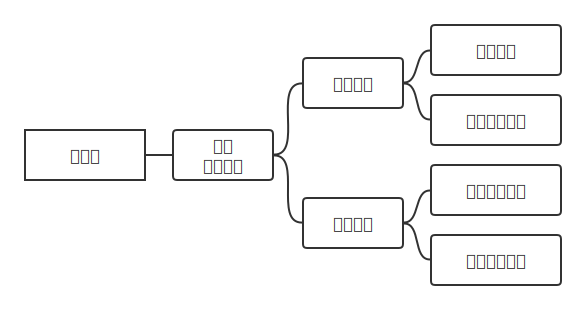

<h1 style="text-align: center"> 立体化教学资源支撑系统 需求规格说明书 </h1>

|   文件状态   | 文档名称 | 立体化教学资源支撑系统需求规格说明书 |
| :----------: | :------: | :----------------------------------: |
| 稳定版本发布 | 当前版本 |                 1.5                  |
|      ^       |   作者   |            贺梓源、封静涵            |
|      ^       | 完成日期 |               2023-5-9               |

<h2> 目录 </h2>

<!-- @import "[TOC]" {cmd="toc" depthFrom=1 depthTo=2 orderedList=false} -->

<!-- code_chunk_output -->

- [版本历史](#版本历史)
- [文档介绍](#文档介绍)
  - [文档目的](#文档目的)
  - [文档范围](#文档范围)
- [项目概述](#项目概述)
  - [项目背景](#项目背景)
  - [用户群体](#用户群体)
  - [系统范围](#系统范围)
- [功能性需求](#功能性需求)
  - [功能性需求整体框架](#功能性需求整体框架)
  - [功能性需求分类](#功能性需求分类)
  - [用户端基本功能](#用户端基本功能)
  - [用户端仪表盘栏目](#用户端仪表盘栏目)
  - [用户端互动学习栏目](#用户端互动学习栏目)
  - [用户端习题社区栏目](#用户端习题社区栏目)
  - [用户端交流社区栏目](#用户端交流社区栏目)
  - [教师功能模块](#教师功能模块)
  - [管理员功能模块](#管理员功能模块)
- [非功能性需求](#非功能性需求)
  - [用户界面需求](#用户界面需求)
  - [软硬件环境需求](#软硬件环境需求)
  - [产品/软件质量需求](#产品软件质量需求)
  - [其它需求](#其它需求)

<!-- /code_chunk_output -->

 

# 版本历史

| 版本号 | 作者  | 审核人 | 更新日期 | 更新说明 |
| :------: | :---: | :----: | :------: | :------: |
| 1.0 | 贺梓源 封静涵 | 贺梓源 | 2023/3/21 | 完成第一版需求规格说明书 |
| 1.1 | 贺梓源 | 宋鸿堃 裴子祎 封静涵 | 2023/3/22 | 修改部分功能性需求细节 |
| 1.2 | 贺梓源 | 贺梓源 | 2023/4/5 | 根据重构后的设计修订了功能性需求 |
| 1.3 | 贺梓源 | 贺梓源 | 2023/4/11 | 完善了习题社区的功能性需求说明 |
| 1.4 | 贺梓源 | 朱文涛 | 2023/4/22 | 完善了交互学习的功能性需求说明，校对并修订格式 |
| 1.5 | 贺梓源 | 朱文涛 | 2023/5/9 | 完善了需求编号，添加了新增需求的说明 |

 

# 文档介绍

## 文档目的

该需求规格书面向本软件开发人员以及使用本软件的所有用户。需求规格书内详细描述了本软件支持的所有功能性需求以及非功能性需求，定义了本软件的系统范围，是本软件开发人员进行系统设计的依据和基础，也为测试和验收工作提供了保障。同时，规格书内描述了本软件各项功能的使用流程，为使用本软件的用户提供了有效参考。

## 文档范围

该需求规格书包含的内容如下：

1. 该需求规格书的介绍、规格书内容的范围、规格书面向的读者对象、规格书中内容涉及到的参考文档、规格书中涉及的专业词汇的意义。
2. 本软件的背景概述、面向的用户群体、以及本软件系统的责任范围。
3. 本软件需要满足的所有功能性需求的总体流程、功能性需求分类、每个具体功能性需求的功能介绍、前提条件、使用流程、后继效果、以及可能的补充说明。
4. 本软件需要满足的所有非功能性需求（分为软件需求和硬件需求）相关内容。

# 项目概述

## 项目背景

随着信息技术的不断发展，越来越多的人开始学习编程。然而，编程对于初学者来说较为抽象，不易理解。目前多数教学形式仅停留于教材、幻灯片展示。而对于编程类课程，仅仅通过教材或课件进行理论教学，仍然不够直观。部分编程课程通过动画展示算法运行流程，较为直观，但样例较为单一，且制作动画难度较大。
学生不通过实践进行编程学习是十分困难的。而交互式编程教学则可以解决这个问题。通过算法可视化、程序运行可视化，学生可以进行实践学习。因此，我们计划开发了一个互动式编程教学平台，为教材、幻灯片等传统教学工具提供更先进、立体的教学辅助手段，以帮助学生更好地学习编程、算法课程。

## 用户群体
本系统面向希望进行编程学习的初学者，以及任教编程相关课程的教育工作者。
对于学习者而言，他们对编程学习的认识模糊而有限，本系统提供了交互式学习模块，具象生动地使程序运行可视化，辅助其编程学习。同时本系统也提供了相关练习，在学习者练习的同时也会统计其知识点掌握情况，并据此推荐相关习题。此外，系统也提供了心得交流社区，用户可以在学习的过程中分享心得。
对于教育工作者而言，他们希望使用较短的时间进行程序可视化动画制作，本系统提供了一套便捷的动画开发方法，使得教育工作者可以快速、方便的开发出可交互的学习模块。同时，也可以通过系统内的练习模块布置练习题，并了解学生的知识点掌握情况。此外，也可以通过社区与同学们分享心得。

## 系统范围

本系统应当包含管理端（Web）和用户端（Web）。
管理端应当包含管理员的所有功能需求。管理员可以进行用户管理、课程管理。
用户端应当包含教师和学生的所有功能需求。学生在用户端可以进行访问习题社区（查看题目、做题目、查看题组、做题组、查看个人做题分析）、进行交互式学习（学习搜索相关算法、学习排序相关算法、学习树和图相关算法、学习自定义相关算法）、访问交流社区（查看分享、发起分享、回复分享）、个人账户管理（修改头像、切换课程、修改账户密码）。教师除上述功能外还可以进行习题社区管理、交流社区管理。

# 功能性需求

## 功能性需求整体框架

用户端功能性需求整体框架如下图所示。

管理端功能性需求整体框架如下图所示。

## 功能性需求分类

| 功能类别 | 功能编号 | 功能名称 |
| :---: | :---: | :---: |
| 用户端基本功能 | `BAS-LOGIN` | 用户端用户登录 |
| ^ | `BAS-QRCODE` | 用户端扫码 |
| ^ | `BAS-USRCTR` | 用户端个人中心栏目 |
| 用户端仪表盘栏目 | `BRD-ANLYZ` | 用户端浏览个人分析 |
| ^ | `BRD-RCMND` | 用户端弱项知识点习题推荐 |
| 用户端互动学习栏目 | `VIS-CHOS` | 用户端选择互动学习 |
| ^ | `VIS-SRCH` | 用户端二分查找互动学习 |
| ^ | `VIS-SORT` | 用户端排序互动学习 |
| ^  | `VIS-GRAPH` |  用户端树与图互动学习 |
| ^ | `VIS-CUSTOM` | 用户端自定义互动学习 |
| 用户端习题社区栏目 | `EXC-BROWS` | 用户端浏览习题社区 |
| ^ | `EXC-SETINFO` | 用户端题组详情 |
| ^ | `EXC-INFO` | 用户端习题详情 |
| 用户端交流社区栏目 | `FRM-BROWS` | 用户端浏览交流社区 |
| ^ | `FRM-POST` | 用户端发布帖子 |
| ^ | `FRM-INFO` | 用户端查看帖子 |
| ^ | `FRM-REPLY` | 用户端回复帖子 |
| 教师功能模块 | `TCR-MNGCORS` | 教师课程管理 |
| ^ | `TCR-MNGEXC` | 教师习题管理 |
| 管理员功能模块 | `ADM-MNGCORS` | 管理员全局课程管理 |
| ^ | `ADM-MNGUSR` | 管理员全局用户管理 |

## 用户端基本功能

### 用户端用户登录 `BAS-LOGIN`
- 功能介绍
    - 用户使用用户名和密码进行登录。
- 前提条件
    - 当前客户端没有已登录的用户（注销或刚刚启动）。
- 使用流程
    - 满足前提条件时，自动跳转到登录界面。
    - 键入用户名及密码，点击登录。
    - 用户名和密码正确时，进行课程选择，选择课程后完成登录。
    - 其它所有失败情况下提示错误信息。
- 后继效果
    - 登录成功时当前客户端保持登录状态，跳转至用户端首页。
    - 登录失败后清空密码栏内容，保持在当前界面。
- 补充说明
    - 选择课程为登录成功的前提条件，当前课程是完整的登录状态的一个属性。
    - 后续考虑增加约束防止恶意登录。

### 用户端二维码跳转 `BAS-QRCODE`
- 功能介绍
    - 用户可以通过手机扫描二维码查看对应互动学习、查看对应帖子或查看对应习题或题组。
- 前提条件
    - 用户通过手机扫描有效的二维码，登录后即可跳转到对应链接。
- 使用流程
    - 满足前提条件时，用户使用手机扫描二维码后即可跳转到对应资源界面。
- 后继效果
    - 无后继效果。

### 用户端个人中心栏目 `BAS-USRCTR`
- 功能介绍
    - 学生可以查看本人信息、修改密码、注销登录、切换课程等。
- 前提条件
    - 当前客户端学生用户已登录。
- 使用流程
    - 在主界面，通过个人信息入口，进入个人信息界面。
    - 修改头像：通过修改个人信息功能入口，可以对个人信息进行修改。
    - 修改密码：通过修改密码功能入口，输入旧密码和新密码进行修改。
    - 注销登录：点击注销登录，退出登录。
    - 切换课程：点击切换课程，弹出选择课程弹窗，选择课程后完成切换。
- 后继效果
    - 修改头像后，数据库中用户的个人头像更改。
    - 修改密码：修改成功，数据库中用户的密码更改；修改失败，则提示错误信息。
    - 注销登录：清空当前登录状态。

## 用户端仪表盘栏目

### 用户端浏览个人分析 `BRD-ANLYZ`
- 功能介绍
    - 用户可以查看个人的答题历史分析，个人分析包含总体正确率、统计信息。同时可以查看AI分析的知识点掌握报告。
- 前提条件
    - 当前客户端用户已登录。
- 使用流程
    - 满足前提条件时，在仪表盘栏目即可查看到个人分析，可以查看到总体正确率、统计信息、知识点掌握报告。
- 后继效果
    - 无后继效果。
- 补充说明
    - 由于服务器负载，个人分析每一段时间会更新。

### 用户端弱项知识点习题推荐 `BRD-RCMND`
- 功能介绍
    - 用户可以查看 AI 根据个人分析推荐的习题。
- 前提条件
    - 当前客户端用户已登录。
- 使用流程
    - 满足前提条件时，在仪表盘栏目即可查看到习题推荐，可以查看到推荐的习题。
- 后继效果
    - 无后继效果。

## 用户端互动学习栏目

### 用户端选择互动学习 `VIS-CHOS`
- 功能介绍
    - 用户可以在互动学习栏目选择感兴趣的知识点专题进行互动式学习。
- 前提条件
    - 当前客户端用户已登录。
- 使用流程
    - 满足前提条件时，从互动学习栏目可以看到所有的互动式学习入口，通过入口可以进入对应的互动式学习。
- 补充说明
    - 每个互动式学习的实现均不相同，使用流程以实际为准。

### 用户端二分查找互动学习 `VIS-SRCH`
- 功能介绍
    - 用户可以互动学习编程中的二分查找知识。
- 前提条件
    - 当前客户端用户已登录，进入了二分查找互动学习。
- 使用流程
    - 满足前提条件时，跳转到二分查找互动学习界面。根据界面提示进行操作。
    - 用户可以改变二分查找程序中待查找数组的初值，可以进行部分代码填空，可以分步执行程序并查看程序的执行动画。程序执行动画中包含部分变量的值，以及查找时在数组中一步步缩小搜索范围的数组动画。
- 后继效果
    - 无后继效果。

### 用户端排序互动学习 `VIS-SORT`
- 功能介绍
    - 用户可以互动学习编程中的排序知识。
- 前提条件
    - 当前客户端用户已登录，进入了排序互动学习。
- 使用流程
    - 满足前提条件时，跳转到排序互动学习界面。根据界面提示进行操作。
    - 用户可以改变排序程序中的数组初值，可以选择排序方式，可以进行部分代码填空，可以分步执行程序并查看程序的执行动画。程序执行动画中包含部分变量的值，以及排序过程中数组内容的变化图。
- 后继效果
    - 无后继效果。
- 补充说明
    - 排序互动学习目前支持冒泡排序、选择排序、快速排序。

### 用户端树与图互动学习 `VIS-GRAPH`
- 功能介绍
    - 用户可以互动学习编程中的树和图知识。
- 前提条件
    - 当前客户端用户已登录，进入了树与图学习。
- 使用流程
    - 满足前提条件时，跳转到树与图互动学习界面。根据界面提示进行操作。
    - 用户可以选择算法，可以修改初始的树或图的结构，可以进行部分代码填空，可以分步执行程序并查看程序的执行动画。程序执行动画中包含部分变量的值，以及程序运行过程中所处节点及树或图的变化。
- 后继效果
    - 无后继效果。
- 补充说明
    - 树与图互动学习目前支持深度优先遍历、广度优先遍历、迪杰斯特拉算法、普利姆算法、克鲁斯卡尔算法。

### 用户端自定义互动学习 `VIS-CUSTOM`
- 功能介绍
    - 用户可以自定义互动学习。
- 前提条件
    - 当前客户端用户已登录，进入了自定义互动学习。
- 使用流程
    - 满足前提条件时，跳转到自定义互动学习界面。根据界面提示进行操作。
    - 用户可以自定义程序代码，可以分步执行程序并查看程序的执行动画。程序执行动画中包含部分变量的值，以及程序运行过程中所处状态的变化。
- 后继效果
    - 无后继效果。

## 用户端习题社区栏目

### 用户端浏览习题社区 `EXC-BROWS`
- 功能介绍
    - 用户浏览习题社区界面展示的练习题和题组。
- 前提条件
    - 当前客户端用户已登录。
- 使用流程
    - 满足前提条件时，用户进入习题社区后，可以看到全部习题、全部题组两个标签页。
    - 在全部习题标签页可以查看到当前课程的所有习题。
    - 在全部题组标签页可以查看到当前课程的所有题组。
- 后继效果
    - 无后继效果。

### 用户端题组详情 `EXC-SETINFO`
- 功能介绍
    - 用户可以查看课程中的题组的详情。
- 前提条件
    - 当前客户端用户已登录。
- 使用流程
    - 在满足前提条件时，用户在习题社区的全部题组标签页内，选择任何一个题组点击进入。
    - 用户可以查看到该题组的题组描述，可以查看题组内的习题列表。
    
- 后继效果
    - 无后继效果。

### 用户端习题详情 `EXC-INFO`

- 功能介绍
    - 用户可以查看习题详情，支持单选题、多选题、填空题。
- 前提条件
    - 当前客户端用户已登录。
- 使用流程
    - 在满足前提条件时，用户在习题社区的全部习题标签页内，选择任何一个习题点击进入。
    - 用户可以查看到该习题的详情，包括习题标题、习题内容、习题知识点内容。
    - 用户可以进行答题，答题后可以进行提交并自动评阅。
    
- 后继效果
    - 用户提交答案时，用户答案会传输到后端进行自动评阅，后端记录此次提交，并返回评阅结果。
- 补充说明
    - 为防止恶意提交，提交存在冷却。

## 用户端交流社区栏目

### 用户端浏览交流社区 `FRM-BROWS`
- 功能介绍
    - 用户可以查看所在课程下交流社区的所有帖子。
- 前提条件
    - 当前客户端用户已登录。
- 使用流程
    - 满足前提条件时，用户进入交流社区页面后，即可查看当前课程交流社区中的全部帖子。也可以使用搜索功能，对帖子进行筛选。用户在交流社区主界面可以查看到帖子的标题、作者、部分内容。
- 后继效果
    - 无后继效果。

### 用户端发布帖子 `FRM-POST`

- 功能介绍
    - 用户可以在所在课程下课程的交流社区中，发布新的帖子。
- 前提条件
    - 当前客户端用户已登录。
- 使用流程
    - 满足前提条件时，用户可以在交流社区界面进行发帖操作。用户选择发帖后，弹出窗口进入帖子编辑。用户可以编辑帖子的标题、内容。编辑完成之后可以选择发布，或点击返回取消发布。
- 后继效果
    - 选择发布帖子后，帖子会被添加到所在课程的交流社区。选择取消发布后，无效果。
- 补充说明
    - 学生用户发布帖子存在冷却时间，避免恶意发布帖子的情况。帖子的标题、内容的大小应存在限制。

### 用户端查看帖子 `FRM-INFO`
- 功能介绍
    - 用户可以在交流社区中，选择一个帖子查看详细内容。用户可以查看到该帖子的完整内容以及所有回复。
- 前提条件
    - 当前客户端用户已登录。帖子属于当前客户端用户的当前所在课程。
- 使用流程
    - 在交流社区主界面点击对应的帖子，即可进入该帖子的详细内容界面。可以浏览帖子内容及所有回复。
    - 具有权限的用户可以对帖子进行编辑和删除。
- 后继效果
    - 编辑和删除会将变更提交到数据库。
- 补充说明
    - 所有用户具有编辑和删除自己发表的帖子或回复的权限。
    - 高级用户（如教师、助教）具有编辑和删除所有帖子或回复的权限。
    - 删除帖子的需求编号别名为 `FRM-DELE`，编辑帖子的需求编号别名为 `FRM-EDIT`。

### 用户端回复帖子 `FRM-REPLY`
- 功能介绍
    - 用户可以在交流社区中的一个帖子内，进行回复。
- 前提条件
    - 当前客户端用户已登录。被查看的帖子存在于交流社区主界面。
- 使用流程
    - 用户在帖子内点击回复，用户选择回复后，进入编辑。用户可以编辑回复的内容。编辑完成之后可以选择发布回复，或点击返回取消发布回复。
    - 具有权限的用户可以对回复进行编辑和删除。
- 后继效果
    - 选择发布回复后，回复会被添加到对应帖子。选择取消发布后，无效果。
- 补充说明
    - 学生用户发布回复应存在冷却时间。
    - 所有用户具有编辑和删除自己发表的帖子或回复的权限。
    - 高级用户（如教师、助教、管理员）具有编辑和删除所有帖子或回复的权限。
    - 删除回复的需求编号别名为 `FRM-DELE`，编辑回复的需求编号别名为 `FRM-EDIT`。

## 教师功能模块

### 教师课程管理 `TCR-MNGCORS`
- 功能介绍
    - 教师可以查询自己所在的全部课程信息。
    - 教师可以对自己所在的课程进行管理。包括为课程添加学生、修改课程信息。
- 前提条件
    - 当前客户端教师已登录。
- 使用流程
    - 管理员在客户端选择教学管理模块，选择课程管理子模块。
    - 随后即可查询到所在的全部课程列表。在课程列表中，可以对查询到的课程进行编辑。在课程列表中可以通过搜索课程名来进行筛选。
    - 选择编辑课程后，可以修改课程名称、修改课程中包含的学生、修改课程信息。
- 后继结果
    - 编辑课程提交后数据库中对应课程信息被修改。
- 补充说明
    - 支持批量向课程中添加学生。

### 教师习题管理 `TCR-MNGEXC`
- 功能介绍
    - 教师可以在习题社区界面添加习题和题组。
- 前提条件
    - 当前客户端教师已登录。
- 使用流程
    - 满足前提条件时，用户进入习题社区后，在全部习题、全部题组两个标签页下可以看到添加习题、添加题组的入口。
    - 选择添加习题后，弹出窗口进入习题编辑。用户可以编辑习题详情并提交。
    - 选择添加题组后，弹出窗口进入题组编辑。用户可以编辑题组详情并提交。
- 后继效果
    - 提交添加习题后，习题会被添加到当前课程习题社区。
    - 提交添加题组后，题组会被添加到当前课程习题社区。

## 管理员功能模块

### 管理员全局课程管理 `ADM-MNGCORS`
- 功能介绍
    - 管理员可以查询全部课程信息。
    - 管理员可以对课程进行管理。包括创建课程、删除课程、为课程添加用户、修改课程信息。
- 前提条件
    - 当前客户端管理员已登录。
- 使用流程
    - 管理员在客户端选择全局管理模块，选择课程管理子模块。
    - 随后即可查询到全部课程列表。在课程列表中，可以对查询到的课程进行删除或编辑。在课程列表中可以通过搜索课程名来进行筛选。
    - 选择编辑课程后，可以修改课程名称、修改课程中包含的学生、修改课程信息。
    - 在课程管理界面还可以进行添加课程。
- 后继结果
    - 编辑课程提交后数据库中对应课程信息被修改。
    - 创建课程提交后数据库中添加新课程。
- 补充说明
    - 只有管理员可以访问全局管理模块。
    - 支持批量向课程中添加学生。

### 管理员全局用户管理 `ADM-MNGUSR`
- 功能介绍
    - 管理员可以查询全部用户信息。
    - 管理员可以对用户进行管理。包括注册用户、删除用户、重置用户密码、修改用户信息。
- 前提条件
    - 当前客户端管理员已登录。
- 使用流程
    - 管理员在客户端选择全局管理模块，选择用户管理子模块。
    - 随后即可查询到全部用户列表。在用户列表中，可以对查询到的用户进行删除或编辑。在用户列表中可以通过搜索用户名来进行筛选。
    - 选择编辑用户后，可以重置用户密码、修改用户信息。
    - 在用户管理界面还可以进行注册用户。
- 后继结果
    - 编辑用户后，数据库中对应用户信息被修改。
    - 创建用户后，数据库中添加新用户。
- 补充说明
    - 只有管理员可以访问全局管理模块。
    - 支持批量注册学生。

# 非功能性需求

在本节中主要描述项目所包含的非功能性方面的需求，主要包括用户界面需求、软硬件环境需求、产品/软件质量需求、其他需求。

## 用户界面需求

用户界面大致分为两部分：学生/教师Web客户端、教师/管理员Web管理端。
对于学生，界面应简洁易用，避免带来更高的学习成本。
对于教师，界面应能高效完成各种功能性需求，减小因维护本软件而产生的额外工作量。
对于管理员，界面应能准确、完整的提供各种管理接口，便于维护和管理。

| 需求名 | 详细要求 |
| --- | --- |
| 界面观感舒适 | 1.界面颜色搭配得当，美观大方 2.界面风格统一，组件风格一致 3.界面布局合理，界面不空、不拥挤 |
| 交互友好 | 1.互动组件尺寸合适，不过大或过小 2.尽可能减少用户输入，改善使用体验 3.交互反馈流畅，过渡不卡顿 4.动画效果流畅美观 5.用户功能入口明确，避免层层跳转 |
| 信息提示清楚 | 1.界面能够根据需要进行必要的信息提示 2.信息提示应该出现在屏幕中较为明显的地方 |
| 界面整体一致统一 | 1.页面对齐，字号统一，尺寸统一 2.同一功能、元素的描述在各处一致 |

## 软硬件环境需求

| 需求名 | 详细要求 |
| --- | --- |
| 用户端 | 1.支持在Chrome/Edge/Firefox/IE11/Safari浏览器上运行 |
| 服务端 | 1.服务器应长时间稳定运行 2.服务器应能处理一定规模的并发访问 3.服务器应具有良好的可维护性 |

## 产品/软件质量需求

| 主要质量属性 | 详细要求 |
| --- | --- |
| 正确性 | 1.软件应能成功完成所有功能性需求。 |
| 健壮性 | 1.软件应能识别异常情况，对于未期望的行为和错误，应及时终止。 2.对于异常情况终止执行时，应准确且无歧义地向用户展示全面的错误信息。 |
| 可靠性 | 1.服务器端发生故障的频率不高于1000小时/次。 2.因软件系统失效而无法完成业务的概率要小于0.5%。 |
| 性能，效率 | 1.系统应该保证在非高峰期<0.5s，高峰期<2s的响应能力。 2.系统提供一定的并发能力。 3.执行功能时，使用合适数量和类别的资源，提高空间效率。 |
| 易用性 | 1.界面功能明确，导向清楚。 2.新用户（学生用户、教师用户、管理员用户）应能快速熟悉软件使用。 |
| 清晰性 | 1.团队应维护清晰易读、易理解的软件开发文档。 2.软件代码结构清晰，功能明确。 |
| 安全性 | 1.进行访问权限控制。用户经过身份认证后，才可以登录。且只能进行其权限范围内的操作。对于非用户权限范围内的操作，前端后端均不应留有相应接口。 2.提供运行日志管理及安全审计功能，可追踪系统的历史使用情况。 3.能经受一定强度的恶意攻击。如病毒攻击、口令猜测攻击、黑客入侵等。 4.网络传递数据应经过加密。需要保证数据在采集、传输和处理过程中不被偷窥、窃取、篡改。业务数据需要在存储时进行加密，确保不可破解。 |
| 可扩展性 | 1.系统之间之间耦合性应较低，增加新的功能模块较为容易，且不影响旧模块的功能。 2.考虑到软件的版本迭代以及后续功能的扩展，应该为之后可能添加的功能预留接口。 |
| 兼容性 | 1.系统应支持iOS/Android/Windows/MacOS操作系统。 |
| 可移植性 | 1.后端应具有一定程度的可移植性，包括但不限于更换服务端操作系统、数据库等。 |

## 其它需求

| 需求名 | 详细要求 |
| --- | --- |
| 数据恢复与备份 | 1.对于系统设计文档、用户资料、操作记录等重要文件均需要进行备份。 2.系统文件能够按照设定的时间进行自动备份。 3.运维可以手动将备份系统上的数据恢复到本地系统中。 4.能够实现检测并恢复备份库中的数据至服务器。 |
| 用户规模 | 1.使用规模方面，目前面向用户为高校算法课学生以及教师和助教，未来可能面向社会的所有算法学习人员。潜在用户规模巨大。在软件的初期，仅面向校内若干门课程，预计用户规模在1000人左右。 |