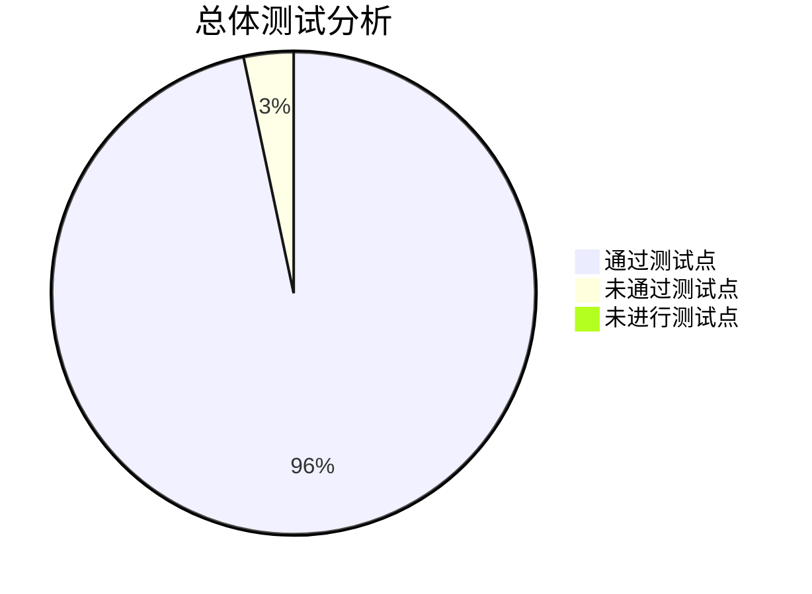

<h1 style="text-align: center"> 立体化教学资源支撑系统  内部测试报告 </h1>

| 文件状态 | 文档名称 | 立体化教学资源支撑系统内部测试报告 |
| :------: | :------: | :--------------------------------: |
|   Beta 版本   | 当前版本 |                1.2                 |
|    ^     |   作者   |               贺梓源               |
|    ^     | 完成日期 |             2023-5-23              |

<h2> 目录 </h2>

<!-- @import "[TOC]" {cmd="toc" depthFrom=1 depthTo=2 orderedList=false} -->

<!-- code_chunk_output -->

- [版本历史](#版本历史)
- [文档介绍](#文档介绍)
  - [文档简介](#文档简介)
  - [项目简介](#项目简介)
- [测试目标与环境](#测试目标与环境)
  - [测试目标](#测试目标)
  - [测试环境及工具](#测试环境及工具)
- [测试结果概述](#测试结果概述)
  - [测试时间与人员](#测试时间与人员)
  - [测试概况](#测试概况)
  - [测试结果](#测试结果)
- [测试分析](#测试分析)
- [测试记录](#测试记录)
  - [前端界面测试](#前端界面测试)
  - [后端 API 测试](#后端-api-测试)
  - [功能测试](#功能测试)
  - [性能测试](#性能测试)
  - [故障恢复测试](#故障恢复测试)
  - [安全性测试](#安全性测试)
  - [兼容性测试](#兼容性测试)
- [回归测试记录](#回归测试记录)

<!-- /code_chunk_output -->

 

# 版本历史

| 版本号 |    作者    | 审核人 | 更新日期  |                 更新说明                 |
| :----: | :--------: | :----: | :-------: | :--------------------------------------: |
|  1.0   | 贺梓源  | 贺梓源 | 2023/5/9  |           完成内部测试报告框架           |
|  1.1   | 贺梓源  | 贺梓源 | 2023/5/17 | 添加测试人员的测试报告，完成内部测试报告 |
| 1.2 | 贺梓源  | 贺梓源 | 2023/5/23 | 整理完善了测试过程，详细描述了每个测试点的操作方法，将未通过测试点列出并详细说明 |

 

# 文档介绍

## 文档简介

该测试文档旨在测试项目功能性需求是否能够被正确响应、以及非功能性需求是否能够满足需求。测试文档将会记录测试的过程、结果、分析以及测试人员的评价，为项目的验收以及后续开发提供参考。
本文档测试主要分为功能性测试和非功能性测试。其中，功能测试关注的重点在于需求文档中涉及到的所有功能性需求是否能正常完成，非功能性测试关注的重点在于性能、安全、兼容性等方面的测试。

## 项目简介

随着信息技术的不断发展，越来越多的人开始学习编程。然而，编程对于初学者来说较为抽象，不易理解。目前多数教学形式仅停留于教材、幻灯片展示。而对于编程类课程，仅仅通过教材或课件进行理论教学，仍然不够直观；或者通过动画展示算法运行流程，较为直观，但样例较为单一，且制作动画难度较大。
学生不通过实践进行编程学习是十分困难的。而交互式编程教学则可以解决这个问题。通过算法可视化、程序运行可视化，学生可以进行实践学习。因此，我们计划开发一个互动式编程教学平台，为教材、幻灯片等传统教学工具提供更先进、立体的教学辅助手段，帮助学生更好的学习编程、算法课程。

# 测试目标与环境

## 测试目标

内部测试的目标为：测试项目功能性需求是否能够被正确响应、以及非功能性需求是否能够满足需求。
本次测试的测试目标及测试内容如下：

- 前端界面测试
- 后端 API 测试
- 功能测试
- 性能测试
- 故障恢复测试
- 安全性测试
- 兼容性测试
  其中功能测试按照需求文档的顺序对每一项需求都进行了测试。

## 测试环境及工具

本次测试中测试人员使用的环境如下。

|    系统环境    |           软件环境           |
| :------------: | :--------------------------: |
| **桌面端测试** |                              |
|   Windows 10   |     SLBrowser 8.0.1.4031     |
|   Windows 10   | Microsoft Edge 113.0.1774.42 |
| MacOS Ventura  |       Firefox 114.0b4        |
| **移动端测试** |                              |
|  MagicOS 7.0   |    华为浏览器 13.0.6.302     |
|       ^        |      微信浏览器 8.0.35       |

# 测试结果概述

## 测试时间与人员

在 2023 年 5 月，小组成员对非负责模块进行了测试分工，后进行了各模块测试，由于测试工作量不同，以下分工仅为大致分工，测试中可能会有人员流动，以后文测试记录为准。

|       姓名       |                          分工                          |
| :--------------: | :----------------------------------------------------: |
|      朱文涛      |                 习题社区界面及功能测试                 |
|      宋鸿堃      |                 交流社区界面及功能测试                 |
|      裴子祎      |            教师/管理员管理端界面及功能测试             |
|      封静涵      |                 交互学习界面及功能测试                 |
| 贺梓源 谭立德 | 剩余测试（未包含在上述模块的功能性测试及非功能性测试） |

## 测试概况

在测试期间，各测试人员对各自负责的模块进行了测试。我们首先设计了各模块测试用例，随后对测试用例进行了测试。

- 共使用/设计测试用例 237/239 个
  - 前端界面测试用例 81/81 个
  - 后端 API 测试用例 42/42 个
  - 功能测试用例 94/94 个
  - 性能测试用例 0/2 个
  - 故障恢复测试用例 3/3 个
  - 安全性测试用例 11/11 个
  - 兼容性测试用例 6/6 个

性能测试由于服务器配置限制，参考价值较低，因此未进行。

## 测试结果

|  测试集名称   | 测试用例数量 | 测试结果 |      测试结果说明      |
| :-----------: | :----------: | :------: | :--------------------: |
| 前端界面测试  |      81      |   通过   |           无           |
| 后端 API 测试 |      42      |   通过   |           无           |
|   功能测试    |      94      |   部分未通过   | 3 个 Bug，4 个可改进 |
|   性能测试    |      2       |  未进行  |           无           |
| 故障恢复测试  |      3       |   通过   |           无           |
|  安全性测试   |      11      |   通过   |           无           |
|  兼容性测试   |      6       |   通过   |           无           |

### 未通过测试点

| 测试集名称 | 测试用例名称 | 测试结果 | 测试结果说明 | 解决方案 |
| :--------: | :----------: | :------: | :----------: | :------: |
| 功能测试 | 二分查找异常输入 | 未通过（可接受） | 输入错误语法时的报错太简单，报错不达意 | 暂时设为 Issue，后续版本将持续优化用户体验 |
| 功能测试 | Kruscal 算法异常输入 | 未通过（可接受） | 描述的限制没有注明是整数，但实际非整数输入会被拒绝，描述不达意 | 暂时设为 Issue，后续版本将持续优化用户体验 |
| 功能测试 | Dijkstra 算法异常输入 | 未通过（可接受） | 输入负权边可以通过编译，但是算法其实不支持负权边，考虑优化反馈 | 暂时设为 Issue，后续版本将持续优化用户体验 |
| 功能测试 | Dijkstra 算法异常输入 | 未通过（可接受） | 输入自环边可以通过编译，但是算法其实不支持自环边，考虑优化反馈 | 暂时设为 Issue，后续版本将持续优化用户体验 |
| 功能测试 | 习题社区创建单选题 |  未通过（Bug） | 创建单选题时的正确答案输入组件有问题 | 已修复 Bug 并完成了测试 |
| 功能测试 | 习题社区创建多选题 |  未通过（Bug） | 创建多选题时的正确答案输入组件有问题 | 已修复 Bug 并完成了测试 |
| 功能测试 | 习题社区创建填空题 |  未通过（Bug） | 创建填空题时的正确答案输入组件有问题 | 已修复 Bug 并完成了测试 |

# 测试分析

测试通过率为 95.9 %（230/239），测试未通过率为 3.3 %（7/239），未进行测试率为 0.8 %（2/239）。

对于未通过的 7 个测试点，其中，3 个为 Bug，4 个为可改进。
- 对于 3 个 Bug 测试点，我们已经进行了修复。
- 对于 4 个可改进测试点，我们将在后续版本中进行改进。

# 测试记录

## 前端界面测试

### 静态页面展示测试

|        测试说明        | 测试各界面是否能够按照预期显示完整内容 |                                                              |                  |
| :--------------------: | :------------------------------------: | :----------------------------------------------------------: | :--------------: |
|        前提条件        |                   无                   |                             备注                             |        无        |
|      **测试用例**      |              **测试操作**              |                         **预期结果**                         |   **实际结果**   |
|      登录界面测试      |              打开登录界面              |    各组件显示正常，包括学工号输入框、密码输入框、登录按钮    |       正常       |
|     仪表盘界面测试     |             打开仪表盘界面             | 各组件显示正常，包括正确率分析雷达图、做题情况总览扇形图、AI算法生成的推荐习题表单 |       正常       |
|   交互学习主界面测试   |           打开交互学习主界面           | 各组件显示正常，包括交互学习分类图标展示框、各类可视化算法二维码生成按钮、各类可视化算法快速跳转按钮 |       正常       |
|  交互学习搜索界面测试  |          打开交互学习搜索界面          | 各组件显示正常，包括算法动态展示画布、算法伪代码展示框、提交代码/单步执行/全部执行/重新执行按钮 |       正常       |
|  交互学习排序界面测试  |          打开交互学习排序界面          | 各组件显示正常，包括算法动态展示画布、算法伪代码展示框、提交代码/单步执行/全部执行/重新执行按钮 |       正常       |
| 交互学习图与树界面测试 |         打开交互学习图与树界面         | 各组件显示正常，包括算法动态展示画布、算法伪代码展示框、编辑图边/提交代码/单步执行/全部执行/重新执行按钮 |       正常       |
| 交互学习自定义界面测试 |         打开交互学习自定义界面         | 各组件显示正常，包括算法伪代码展示框、程序输出展示框、当前事件/当前函数/全局变量/局部变量追踪的列表、编辑代码/提交代码/单步执行/全部执行/重新执行按钮 |       正常       |
|   交流社区主界面测试   |           打开交流社区主界面           | 各组件显示正常，包括帖子列表、帖子搜索框、搜索/帖子全部显示/创建讨论帖按钮 |       正常       |
|  交流社区帖子界面测试  |          打开交流社区帖子界面          | 各组件显示正常，包括帖子详细内容的展示卡片（帖子发布者头像、帖子发布者姓名、帖子标题、帖子主题内容、帖子创建时间、帖子最后一次修改时间）、恢复/编辑/删除按钮、该帖子所有的回复内容展示列表 |       正常       |
|   习题社区主界面测试   |           打开习题社区主界面           | 各组件显示正常、包括浏览习题/浏览题组/创建习题/创建题组切换按钮（后两个按钮需要有权限才会显示）、默认显示的题目列表 |       正常       |
|  习题社区习题界面测试  |          打开习题社区习题界面          |     各组件显示正常，包括该课程所有题库所有题目的展示列表     |       正常       |
|  习题社区题组界面测试  |           打开习题社区主界面           |         各组件显示正常，包括该课程所有题组的展示列表         |       正常       |
|    个人中心界面测试    |            打开个人中心界面            | 各组件显示正常，包括个人信息展示框（个人姓名、个人学号、用户身份、用户头像、当前课程、修改头像/切换课程/修改密码/退出登录按钮） |       正常       |
| 教师端课程管理界面测试 |         打开教师端课程管理界面         |              各组件显示正常，包括管理界面导航栏              |       正常       |
| 管理端用户管理界面测试 |         打开管理端用户管理界面         | 各组件显示正常，包括按照不同学生信息分类的搜索框、显示全部/新建用户/批量新建用户按钮、所有的用户信息列表（列表每一项包括用户标号、学号、用户名、角色ID、创建时间、修改时间、对用户信息进行快捷操作的编辑按钮） |       正常       |
| 管理端课程管理界面测试 |         打开管理端课程管理界面         | 各组件显示正常，包括按照不同课程信息分类的搜索框、显示全部/新建课程按钮、所有的课程信息列表（列表每一项包括课程编号、课程名称、课程介绍、创建时间、最后更新时间、对课程信息进行快捷操作的编辑按钮） |       正常       |
|      **测试结论**      |                  通过                  |                         **测试人员**                         | 朱文涛/2023/5/11 |

<!-- 16 -->

### 单界面功能测试

|              测试说明              |   测试各界面是否能够按照预期调用或呼出对应界面子组件   |                                                              |                  |
| :--------------------------------: | :----------------------------------------------------: | :----------------------------------------------------------: | :--------------: |
|              前提条件              |                           无                           |                             备注                             |        无        |
|            **测试用例**            |                      **测试操作**                      |                         **预期结果**                         |   **实际结果**   |
|         登录界面内功能测试         |                     输入用户端网址                     |    各组件显示正常，包括学工号输入框、密码输入框、登录按钮    |       正常       |
| 登录界面 选择课程功能测试 | 用户登录成功后，弹出选择课程子页面 | 子组件显示正常，包括选择课程界面（选择课程按钮、确定按钮） | 正常 |
|        仪表盘界面 功能测试        |         在用户端主页面的左侧导航栏 点击主页按钮         | 各组件显示正常，包括正确率分析雷达图、做题情况总览扇形图、AI算法生成的推荐习题表单 |       正常       |
|      交互学习主界面 功能测试      |       在用户端主页面的左侧导航栏 点击交互学习按钮       | 各组件显示正常，包括交互学习分类图标展示框、各类可视化算法二维码生成按钮、各类可视化算法快速跳转按钮 |       正常       |
|交互式学习算法 生成二维码功能|在交互学习主界面内，在上方的选择框内选择算法类别和算法名称，点击生成二维码按钮|子组件显示正常，包括跳转至对应算法的二维码图片、关闭按钮|正常|
|     交互学习搜索界面 功能测试     |    在交互学习主界面内，选择二分查找算法模块点击进入    | 各组件显示正常，包括二分查找算法动态展示画布、二分查找算法伪代码展示框、提交代码/单步执行/全部执行/重新执行按钮 |       正常       |
|     交互学习排序界面 功能测试     |  在交互学习主界面内，选择任何一个排序算法模块点击进入  | 各组件显示正常，包括排序算法动态展示画布、排序算法伪代码展示框、提交代码/单步执行/全部执行/重新执行按钮 |       正常       |
|    交互学习图与树界面 功能测试    | 在交互学习主界面内，选择任何一个图与树算法模块点击进入 | 各组件显示正常，包括图算法动态展示画布、图算法伪代码展示框、编辑图边/提交代码/单步执行/全部执行/重新执行按钮 |       正常       |
| 交互式学习图与树算法 编辑初始图功能测试 | 在图与树特定算法模块内，点击编辑图边按钮 | 子组件显示正常，包括编辑节点界面（节点列表、添加节点/提交修改按钮）、编辑无向边界面（无向边列表、添加边/提交修改按钮） | 正常 |
|    交互学习自定义界面 功能测试    |     在交互学习主界面内，选择自定义算法模块点击进入     | 各组件显示正常，包括算法伪代码展示框、程序输出展示框、当前事件/当前函数/全局变量/局部变量追踪的列表、编辑代码/提交代码/单步执行/全部执行/重新执行按钮 |       正常       |
|交互式学习自定义算法 编辑代码功能测试|在自定义算法模块内，点击编辑代码按钮|子组件显示正常，包括编辑代码界面（可编辑代码框、提交代码/关闭按钮）|正常|
|      交流社区主界面 功能测试      |       在用户端主页面的左侧导航栏 点击交流社区按钮       | 各组件显示正常，包括帖子列表、帖子搜索框、搜索/帖子全部显示/创建讨论帖按钮 |       正常       |
|交流社区主界面 创建帖子测试|在交流社区主界面内，点击创建讨论帖按钮|子组件显示正常，包括创建讨论帖界面（讨论帖题目栏、内容栏、取消创建/确认创建按钮）|正常|
|     交流社区帖子界面 功能测试     |  在交流社区主界面内，点击帖子列表中的任何一个帖子进入  | 各组件显示正常，包括帖子详细内容的展示卡片（帖子发布者头像、帖子发布者姓名、帖子标题、帖子主题内容、帖子创建时间、帖子最后一次修改时间）、恢复/编辑/删除按钮、该帖子所有的回复内容展示列表 |       正常       |
|交流社区帖子界面 帖子回复功能测试|在交流社区帖子界面，选择帖子/回复内容，点击回复按钮|子组件显示正常，包括回复贴创建界面（回复的内容栏、取消创建/确认创建按钮）|正常|
|交流社区帖子界面 帖子编辑功能测试|有权限的用户在交流社区帖子界面，选择帖子/回复内容，点击编辑按钮|子组件显示正常，包括修改帖子界面（修改帖子的内容栏、取消修改/确认修改按钮）|正常|
|交流社区帖子界面 帖子删除功能测试|有权限的用户在交流社区帖子界面，选择帖子/回复内容，点击删除按钮|子组件显示正常，包括删除确认界面（取消删除/确认删除按钮）|正常|
|      习题社区主界面 功能测试      |       在用户端主页面的左侧导航栏 点击习题社区按钮       | 各组件显示正常、包括浏览习题/浏览题组/创建习题/创建题组切换按钮（后两个按钮需要有权限才会显示）、默认显示的题目列表 |       正常       |
|习题社区管理习题界面 创建新习题功能测试|有权限的用户在习题社区管理习题界面，点击创建习题按钮|子组件显示正常，包括创建新习题界面（取消按钮、习题标题、题目内容、题目类型、选项/答案、题目标签、提交/重置表单按钮）|正常|
|习题社区管理习题界面 编辑习题功能测试|有权限的用户在习题社区管理习题界面，选择任意习题点击编辑按钮|子组件显示正常，包括编辑习题界面（取消按钮、习题标题、题目内容、题目类型、修改选项/答案、题目标签、提交/重置表单按钮）|正常|
|习题社区管理习题界面 删除习题功能测试|有权限的用户在习题社区管理习题界面，选择任意习题点击删除按钮|子组件显示正常，包括删除确认界面（取消删除/确认删除按钮）|正常|
|习题社区管理题组界面 创建新题组功能测试|有权限的用户在习题社区管理题组界面，点击创建题组按钮|子组件显示正常，包括创建新题组界面（取消按钮、题组名、题组内容、待选的题目列表、提交/重置表单按钮）|正常|
|习题社区管理题组界面 编辑题组功能测试|有权限的用户在习题社区管理题组界面，选择任意题组点击编辑按钮|子组件显示正常，包括编辑题组界面（取消按钮、题组名、题组内容、待选的题目列表、提交/重置表单按钮）|正常|
|习题社区管理题组界面 删除题组功能测试|有权限的用户在习题社区管理题组界面，选择任意题组点击删除按钮|子组件显示正常，包括删除确认界面（取消删除/确认删除按钮）|正常|
|     习题社区习题界面 功能测试     |          在习题社区主界面内，点击浏览习题按钮          |     各组件显示正常，包括该课程所有题库所有题目的展示列表     |       正常       |
|     习题社区题组界面 功能测试     |          在习题社区主界面内，点击浏览题组按钮          |         各组件显示正常，包括该课程所有题组的展示列表         |       正常       |
|       个人中心界面 功能测试       |       在用户端主页面的左侧导航栏 点击个人中心按钮       | 各组件显示正常，包括个人信息展示框（个人姓名、个人学号、用户身份、用户头像、当前课程、修改头像/切换课程/修改密码/退出登录按钮） |       正常       |
|个人中心界面 修改头像功能测试|在个人中心界面内，点击修改头像按钮|子组件显示正常，包括修改头像界面（选择新头像、确认修改/取消按钮）|正常|
|个人中心界面 切换课程功能测试|在个人中心界面内，点击切换课程按钮|子组件显示正常，包括切换课程界面（选择课程按钮、确定按钮）|正常|
|个人中心界面 修改密码功能测试|在个人中心界面内，点击修改密码按钮|子组件显示正常，包括修改密码界面（旧密码/新密码/新密码确认输入框、确定/取消按钮）|正常|
|    教师端课程管理界面 功能测试    |        在用户端主页面的左侧导航栏 点击管理端按钮        |              各组件显示正常，包括管理界面导航栏              |       正常       |
| 管理端用户管理界面 功能测试 |   在管理端主页面内 点击左侧导航栏 的管理端用户管理功能   | 各组件显示正常，包括按照不同学生信息分类的搜索框、显示全部/新建用户/批量新建用户按钮、所有的用户信息列表（列表每一项包括用户标号、学号、用户名、角色ID、创建时间、修改时间、对用户信息进行快捷操作的编辑按钮） |       正常       |
|管理端用户管理界面 新建用户功能测试|在管理端用户管理界面，点击新建用户按钮|子组件显示正常，包括创建新用户界面（用户名/学号/密码/权限输入框、取消/确定按钮）|正常|
|管理端用户管理界面 批量新建用户功能测试|在管理端用户管理界面，点击批量新建用户按钮|子组件显示正常，包括批量创建新用户界面（用户表、确认创建/取消按钮）|正常|
|管理端用户管理界面 用户编辑功能测试|在管理端用户管理界面，选择任何一个用户，点击编辑按钮|子组件显示正常，包括编辑用户界面（用户名/学号输入框、确认创建/取消按钮）|正常|
|管理端用户管理界面 用户重置密码功能测试|在管理端用户管理界面，选择任何一个用户，点击重置密码按钮|子组件显示正常，包括用户重置密码界面（新密码输入框、确认创建/取消按钮）|正常|
|管理端用户管理界面 用户删除功能测试|在管理端用户管理界面，选择任何一个用户，点击删除按钮|子组件显示正常，包括用户删除界面（确认创建/取消按钮）|正常|
|    管理端课程管理界面 功能测试    |   在管理端主页面内，点击左侧导航栏 的管理端课程管理功能   | 各组件显示正常，包括按照不同课程信息分类的搜索框、显示全部/新建课程按钮、所有的课程信息列表（列表每一项包括课程编号、课程名称、课程介绍、创建时间、最后更新时间、对课程信息进行快捷操作的编辑按钮） |       正常       |
|管理端课程管理界面 功能测试|在管理端课程管理界面，点击新建按钮|子组件显示正常，包括创建新课程界面（课程名/课程介绍输入框、取消/确定按钮）|正常|
|管理端课程管理界面 功能测试|在管理端课程管理界面，选择任何一个课程，点击编辑按钮|子组件显示正常，包括编辑课程界面（课程名/课程介绍输入框、确认创建/取消按钮）|正常|
|管理端课程管理界面 功能测试|在管理端课程管理界面，选择任何一个课程，点击删除按钮|子组件显示正常，包括课程删除界面（确认创建/取消按钮）|正常|
|            **测试结论**            |                          通过                          |                         **测试人员**                         | 朱文涛/2023/5/11 |

<!-- 41 -->

### 界面间功能测试

|                    测试说明                     |          测试各组界面是否能够按照预期完成界面间跳转          |                                |                  |
| :---------------------------------------------: | :----------------------------------------------------------: | :----------------------------: | :--------------: |
|                    前提条件                     |                              无                              |              备注              |        无        |
|                  **测试用例**                   |                         **测试操作**                         |          **预期结果**          |   **实际结果**   |
|    用户端主界面导航栏 仪表盘界面跳转测试    |         在用户端主界面 点击左侧导航栏的主页按钮          |        跳转至仪表盘界面        |       正常       |
|  用户端主界面导航栏 交互学习主界面跳转测试  |       在用户端主界面 点击左侧导航栏的交互学习按钮        |      跳转至交互学习主界面      |       正常       |
|  用户端主界面导航栏 习题社区主界面跳转测试  |       在用户端主界面 点击左侧导航栏的习题社区按钮        |      跳转至习题社区主界面      |       正常       |
|  用户端主界面导航栏 交流社区主界面跳转测试  |       在用户端主界面 点击左侧导航栏的交流社区按钮        |      跳转至交流社区主界面      |       正常       |
|   用户端主界面导航栏 个人中心界面跳转测试   |       在用户端主界面 点击左侧导航栏的个人中心按钮        |       跳转至个人中心界面       |       正常       |
|   用户端主界面导航栏 管理端主界面跳转测试   |        在用户端主界面 点击左侧导航栏的管理端按钮         |       跳转至管理端主界面       |       正常       |
|                登录界面跳转测试                 |                          登录完成后                          |     成功跳转至用户端主界面     |       正常       |
|             仪表盘界面习题跳转测试              |    在仪表盘界面 点击AI生成的推荐习题列表中的任意一题     |   成功跳转至该习题的详细界面   |       正常       |
|       交互学习主界面 快速跳转按钮测试       | 在交互学习主界面上方 选择算法类别和算法后，点击快速跳转按钮 |  成功跳转至对应的算法模块界面  |       正常       |
|       交互学习主界面 算法模块跳转测试       |          在交互学习主界面 选择任何一个算法点击           |  成功跳转至对应的算法模块界面  |       正常       |
|         交流社区主界面 帖子跳转测试         |            在交流社区主界面 点击任何一个帖子             |   成功跳转至该帖子的详细界面   |       正常       |
| 交流社区帖子界面 返回交流社区主界面跳转测试 |               在帖子详情界面 点击返回按钮                |    成功跳转至交流社区主界面    |       正常       |
|       习题社区主界面 浏览习题跳转测试       |         在习题社区主界面 点击上方的浏览习题按钮          |     成功跳转至浏览习题界面     |       正常       |
|       习题社区主界面 浏览题组跳转测试       |         在习题社区主界面 点击上方的浏览题组按钮          |     成功跳转至浏览题组界面     |       正常       |
|       习题社区主界面 管理习题跳转测试       |         在习题社区主界面 点击上方的管理习题按钮          |     成功跳转至管理习题界面     |       正常       |
|       习题社区主界面 管理题组跳转测试       |         在习题社区主界面 点击上方的管理题组按钮          |     成功跳转至管理题组界面     |       正常       |
|    习题社区浏览习题界面 点击习题跳转测试    |           在习题社区浏览习题界面 点击任何一题            |   成功跳转至该习题的详细界面   |       正常       |
| 习题社区习题界面 返回习题社区主界面跳转测试 |               在习题详情界面 点击返回按钮                |    成功跳转至习题社区主界面    |       正常       |
| 习题社区题组界面 返回习题社区主界面跳转测试 |               在题组详情界面 点击返回按钮                |    成功跳转至习题社区主界面    |       正常       |
|        个人中心界面 退出登录跳转测试        | 在个人中心界面 点击退出登录按钮 或者完成修改密码后退出 |       成功跳转至登录界面       |       正常       |
|      管理端主界面用 户管理界面跳转测试      |  在管理端主界面 点击左侧导航栏 的管理端用户管理按钮  |  成功跳转至管理端用户管理界面  |       正常       |
|      管理端主界面 课程管理界面跳转测试      |  在管理端主界面 点击左侧导航栏 的管理端课程管理按钮  |  成功跳转至管理端课程管理界面  |       正常       |
|        管理端主界面 个人中心跳转测试        |       在管理端主界面 点击左侧导航栏的个人中心按钮        |     成功跳转至个人中心界面     |       正常       |
|       管理端主界面 返回用户端跳转测试       |      在管理端主界面 点击左侧导航栏的返回用户端按钮       |     成功跳转至用户端主界面     |       正常       |
|   管理端课程管理界面 课程用户管理跳转测试   |   在管理端课程管理界面 点击任何一个课程的用户管理界面    | 成功跳转至该课程用户的管理界面 |       正常       |
|                  **测试结论**                   |                             通过                             |          **测试人员**          | 朱文涛/2023/5/11 |

<!-- 24 -->

## 后端 API 测试

|      测试说明      | 测试各 API 是否能够按照设计规格正常运行 |                |                                         |
| :----------------: | :-------------------------------------: | :------------: | :-------------------------------------: |
|      前提条件      |                   无                    |      备注      | 实际测试用例数量 42 个，与 API 数量相同 |
|    **测试用例**    |              **测试操作**               |  **预期结果**  |              **实际结果**               |
| 设计文档中所有 API |         使用 APIFox 自动化测试          | 通过自动化测试 |                  通过                   |
|    **测试结论**    |                  通过                   |  **测试人员**  |            谭立德/2023/5/12             |

## 功能测试

<!-- 基本3 + 仪表盘4 + 交互学习3/27 + 习题社区3/15 + 交流社区20 + 教师9管理员16 = -->

### 用户端基本功能

|      测试说明      | 测试登录界面、路由跳转是否能够按照设计规格正常完成对应功能 |                    |                 |
| :----------------: | :--------------------------------------------------------: | :----------------: | :-------------: |
|      前提条件      |                             无                             |        备注        |       无        |
|    **测试用例**    |                        **测试操作**                        |    **预期结果**    |  **实际结果**   |
|      正常登录      |                    输入正确信息进行登录                    |      成功登录      |      通过       |
|      异常登录      |                    输入错误信息进行登录                    | 登录失败，前端报错 |      通过       |
| 登录状态失效后跳转 |                登录状态失效后跳转到登录界面                |      成功跳转      |      通过       |
|    **测试结论**    |                            通过                            |    **测试人员**    | 贺梓源/2023/5/8 |

### 用户端仪表盘栏目

|   测试说明   | 测试用户仪表盘是否能够按照设计规格正常完成对应功能 |                  |                 |
| :----------: | :------------------------------------------------: | :--------------: | :-------------: |
|   前提条件   |                         无                         |       备注       |       无        |
| **测试用例** |                    **测试操作**                    |   **预期结果**   |  **实际结果**   |
| 习题推荐功能 |              打开仪表盘，查看习题推荐              | 习题推荐显示正常 |      通过       |
| 个人分析功能 |              打开仪表盘，查看个人分析              | 个人分析显示正常 |      通过       |
| 做题情况功能 |              打开仪表盘，查看做题情况              | 做题情况显示正常 |      通过       |
| 用户指引功能 |              点击右上角，查看用户指引              | 用户指引显示正常 |      通过       |
| **测试结论** |                        通过                        |   **测试人员**   | 贺梓源/2023/5/8 |

### 用户端交互学习栏目

#### 1.二分查找

| 测试说明                                                     | 测试是否能按照设计规格正常完成功能                 |                        |                  |
| ------------------------------------------------------------ | ------------------------------------------------------------ | ---------------------- | ---------------- |
| 前提条件                                                     | 无                                                           | 备注                   | 正确用例 |
| **测试用例**                                                 | **测试操作**                                                 | **预期结果**           | **实际结果**     |
| 空1：`left<=right` 空2：`mid + 1` 空3：`mid - 1` 空4：`1,2,3,4,5,7,8,9,10,11,12,13,14` 空5：`13` | 输入后，点击提交代码，并通过单步执行和全部执行来显示代码执行效果 | 正确显示代码的执行效果 | 通过             |
| **测试结论**                                                 | 通过                                                         | **测试人员**           | 封静涵/2023/5/22 |

| 测试说明                                                     | 测试对异常输入的反应                                         |                                                              |                                                              |
| ------------------------------------------------------------ | ------------------------------------------------------------ | ------------------------------------------------------------ | ------------------------------------------------------------ |
| 前提条件                                                     | 无                                                           | 备注                                                         | 错误用例                                                     |
| **测试用例**                                                 | **测试操作**                                                 | **预期结果**                                                 | **实际结果**                                                 |
| 输入示例(共5个空): 空1：`l<=right` 空2：`mid + 1` 空3：`m - 1` 空4：`1,2,3,4,5,7,8` `,9,10,11,12,13,14` 空5：`13` | 输入后，点击提交代码，并通过单步执行和全部执行，来显示代码执行效果 | 提示代码编译错误                                             | 通过                                                         |
| 空1：`left<=right` 空2：`mid + 1` 空3：`m - 1` 空4：`1,2,3,4,5,7,8` `,9,10,11,12,13,14` 空5：`13` | 输入后，点击提交代码，并通过单步执行和全部执行，来显示代码执行效果 | 由于`m`是一个未出现的变量，因此应该报编译错误                | 未报错，经交流，编译器是解释执行，`m`变量所在语句不会执行到，因此不会报错，不属于bug，但应该添加相应提示 |
| 输入示例(共5个空): 空1：`l<=right` 空2：`mid + 1` 空3：`mid - 1` 空4：`1,2,3,4,5,7,8` `,9,10,11,12,13,14` 空5：`13` | 输入后，点击提交代码，并通过单步执行和全部执行，来显示代码执行效果 | 由于`l`是一个未出现的变量，并且该语句一定会执行到，因此应返回明确的错误提示 | 未通过，返回错误提示`服务器错误`，提示不明确，用户不能分清是输入数据有误，还是网站服务器出错 |
| 输入示例(共5个空): 空1：`True` 空2：`mid + 1` 空3：`mid - 1` 空4：`1,2,3,4,5,7,8` `,9,10,11,12,13,14` 空5：`-1` | 输入后，点击提交代码，并通过单步执行和全部执行，来显示代码执行效果 | 由于`while`判断永远为`True`，所以执行时，不应该跳出循环      | 在遇见死循环后，直接跳出循环，图片变黑，表示执行失败。经交流，在设计时，遇见死循环问题，会跳至`return -1`，并且图片变黑，表示执行失败，不属于bug，在用户指引中已说明 |
| **测试结论**                                                 | 部分未通过                                                   | **测试人员**                                                 | 封静涵/2023/5/22                                             |

#### 2.冒泡排序

| 测试说明                                                     | 测试是否能按照设计规格正常完成功能       |                        |                  |
| ------------------------------------------------------------ | ------------------------------------------------------------ | ---------------------- | ---------------- |
| 前提条件                                                     | 无                                                           | 备注                   | 正确用例         |
| **测试用例**                                                 | **测试操作**                                                 | **预期结果**           | **实际结果**     |
| 空1：`array[j] > array[j + 1]`  空2：`8, 1, 6, 2, 9, 4, 3, 7, 5` | 输入后，点击提交代码，并通过单步执行和全部执行来显示代码执行效果 | 正确显示代码的执行效果 | 通过             |
| **测试结论**                                                 | 通过                                                         | **测试人员**           | 封静涵/2023/5/22 |

| 测试说明                                                     | 测试对异常输入的反应                                         |                  |                  |
| ------------------------------------------------------------ | ------------------------------------------------------------ | ---------------- | ---------------- |
| 前提条件                                                     | 无                                                           | 备注             | 错误用例         |
| **测试用例**                                                 | **测试操作**                                                 | **预期结果**     | **实际结果**     |
| 空1：`array[j] > array[j + 1]` 空2：`8, 1, 6, 2,, 9, 4, 3, 7, 5` | 输入后，点击提交代码，并通过单步执行和全部执行来显示代码执行效果 | 提示代码编译错误 | 通过             |
| **测试结论**                                                 | 通过                                                         | **测试人员**     | 封静涵/2023/5/22 |

#### 3.选择排序

| 测试说明                                                     | 测试是否能按照设计规格正常完成功能                 |                        |                  |
| ------------------------------------------------------------ | ------------------------------------------------------------ | ---------------------- | ---------------- |
| 前提条件                                                     | 无                                                           | 备注                   | 正确用例         |
| **测试用例**                                                 | **测试操作**                                                 | **预期结果**           | **实际结果**     |
| 空1：`array[j] < array[swapIndex]` 空2：`8, 1, 6, 2, 9, 4, 3, 7, 5` | 输入后，点击提交代码，并通过单步执行和全部执行来显示代码执行效果 | 正确显示代码的执行效果 | 通过 |
| **测试结论**                                                 | 通过                                                         | **测试人员**           | 封静涵/2023/5/22 |

| 测试说明                                                     | 测试对异常输入的反应                                         |                  |                  |
| ------------------------------------------------------------ | ------------------------------------------------------------ | ---------------- | ---------------- |
| 前提条件                                                     | 无                                                           | 备注             | 错误用例         |
| **测试用例**                                                 | **测试操作**                                                 | **预期结果**     | **实际结果**     |
| 空1：`array[j] < array[swapIndex]` 空2：`8,, 1, 6, 2, 9, 4, 3, 7, 5` | 输入后，点击提交代码，并通过单步执行和全部执行来显示代码执行效果 | 提示代码编译错误 | 通过             |
| **测试结论**                                                 | 通过                                                         | **测试人员**     | 封静涵/2023/5/22 |

#### 4.快速排序

| 测试说明                                                     | 测试是否能按照设计规格正常完成功能                 |                        |                  |
| ------------------------------------------------------------ | ------------------------------------------------------------ | ---------------------- | ---------------- |
| 前提条件                                                     | 无                                                           | 备注                   | 正确用例         |
| **测试用例**                                                 | **测试操作**                                                 | **预期结果**           | **实际结果**     |
| 空1：`array[j] <= pivot`  空2：`8, 1, 6, 2, 9, 4, 3, 7, 5` | 输入后，点击提交代码，并通过单步执行和全部执行来显示代码执行效果 | 正确显示代码的执行效果 | 通过             |
| **测试结论**                                                 | 通过                                                         | **测试人员**           | 封静涵/2023/5/22 |

| 测试说明                                                     | 测试对异常输入的反应                                         |                  |                  |
| ------------------------------------------------------------ | ------------------------------------------------------------ | ---------------- | ---------------- |
| 前提条件                                                     | 无                                                           | 备注             | 错误用例         |
| **测试用例**                                                 | **测试操作**                                                 | **预期结果**     | **实际结果**     |
| 空1：`array[j] <= pivot`  空2：`8,, 1, 6, 2, 9, 4, 3, 7, 5` | 输入后，点击提交代码，并通过单步执行和全部执行来显示代码执行效果 | 提示代码编译错误 | 通过             |
| **测试结论**                                                 | 通过                                                         | **测试人员**     | 封静涵/2023/5/22 |

#### 5.广度优先搜索

| 测试说明                                                     | 测试是否能按照设计规格正常完成功能                 |                        |                  |
| ------------------------------------------------------------ | ------------------------------------------------------------ | ---------------------- | ---------------- |
| 前提条件                                                     | 无                                                           | 备注                   | 正确用例         |
| **测试用例**                                                 | **测试操作**                                                 | **预期结果**           | **实际结果**     |
| 顶点集：`V={0,1,2,3` `,4,5,6,7,8,9}` 边集：`E={(0,1),(0,5),`  `(1,2),(1,7),(2,3),` `(2,9),(3,4),(3,8),`  `(4,5),(4,6),(6,7),` `(6,8),(7,9),(8,9)}` 代码填空：`bfs(0)` | 输入后，点击提交代码，并通过单步执行和全部执行，来显示代码执行效果 | 正确显示代码的执行效果 | 通过             |
| **测试结论**                                                 | 通过                                                         | **测试人员**           | 封静涵/2023/5/22 |

| 测试说明                                                     | 测试对异常输入的反应                                         |                                              |                  |
| ------------------------------------------------------------ | ------------------------------------------------------------ | -------------------------------------------- | ---------------- |
| 前提条件                                                     | 无                                                           | 备注                                         | 错误用例         |
| **测试用例**                                                 | **测试操作**                                                 | **预期结果**                                 | **实际结果**     |
| 顶点集：`V={0,1,2,3` `,4,5,6,7,8,9}` 边集：`E={(0,1),(0,5)` `,(1,2),(1,7),(2,3),` `(2,9),(3,4),(3,8),` `(4,5),(4,6),(6,7),` `(6,8),(7,9),(8,9)}` 代码填空：`bfs(10)` | 输入后，点击提交代码，并通过单步执行和全部执行，来显示代码执行效果 | 由于输入一个不存在的节点，应提示代码编译错误 | 通过             |
| **测试结论**                                                 | 通过                                                         | **测试人员**                                 | 封静涵/2023/5/22 |

#### 6.深度优先搜索

| 测试说明                                                     | 测试是否能按照设计规格正常完成功能                 |                        |                  |
| ------------------------------------------------------------ | ------------------------------------------------------------ | ---------------------- | ---------------- |
| 前提条件                                                     | 无                                                           | 备注                   | 正确用例         |
| **测试用例**                                                 | **测试操作**                                                 | **预期结果**           | **实际结果**     |
| 顶点集：`V={0,1,2,3` `,4,5,6,7,8,9}`  边集：`E={(0,1),(0,5)` `,(1,2),(1,7),(2,3)` `,(2,9),(3,4),(3,8)` `,(4,5),(4,6),(6,7)` `,(6,8),(7,9),(8,9)}`  代码填空：`dfs(0)` | 输入后，点击提交代码，并通过单步执行和全部执行，来显示代码执行效果 | 正确显示代码的执行效果 | 通过             |
| **测试结论**                                                 | 通过                                                         | **测试人员**           | 封静涵/2023/5/22 |

| 测试说明                                                     | 测试对异常输入的反应                                         |                                              |                  |
| ------------------------------------------------------------ | ------------------------------------------------------------ | -------------------------------------------- | ---------------- |
| 前提条件                                                     | 无                                                           | 备注                                         | 错误用例         |
| **测试用例**                                                 | **测试操作**                                                 | **预期结果**                                 | **实际结果**     |
| 顶点集：`V={0,1,2,3` `,4,5,6,7,8,9}`  边集：`E={(0,1),(0,5)` `,(1,2),(1,7),(2,3)` `,(2,9),(3,4),(3,8)` `,(4,5),(4,6),(6,7)` `,(6,8),(7,9),(8,9)}`  代码填空：`dfs(10)` | 输入后，点击提交代码，并通过单步执行和全部执行，来显示代码执行效果 | 由于输入一个不存在的节点，应提示代码编译错误 | 通过             |
| **测试结论**                                                 | 通过                                                         | **测试人员**                                 | 封静涵/2023/5/22 |

#### 7.Kruskal算法

| 测试说明                                                     | 测试是否能按照设计规格正常完成功能                 |                        |                  |
| ------------------------------------------------------------ | ------------------------------------------------------------ | ---------------------- | ---------------- |
| 前提条件                                                     | 无                                                           | 备注                   | 正确用例         |
| **测试用例**                                                 | **测试操作**                                                 | **预期结果**           | **实际结果**     |
| 顶点集：`V={0,1,2` `,3,4,5,6,7,8}`  边集(顶点，顶点，权重)： `E={(0,1,4),(0,6,8)` `,(1,2,8),(1,6,1),(2,3,7)` `,(2,4,4),(2,7,2),(3,4,14)` `,(3,8,9),(4,5,2),(4,8,10)` `,(5,6,1),(5,7,4),(6,7,7)}` | 输入后，点击提交代码，并通过单步执行和全部执行，来显示代码执行效果 | 正确显示代码的执行效果 | 通过             |
| **测试结论**                                                 | 通过                                                         | **测试人员**           | 封静涵/2023/5/22 |

| 测试说明                                                     | 测试对异常输入的反应                                         |                        |                                                              |
| ------------------------------------------------------------ | ------------------------------------------------------------ | ---------------------- | ------------------------------------------------------------ |
| 前提条件                                                     | 无                                                           | 备注                   | 错误用例                                                     |
| **测试用例**                                                 | **测试操作**                                                 | **预期结果**           | **实际结果**                                                 |
| 顶点集：`V={0,1}`  边集(顶点，顶点，权重)： `E={(0,1,4.5)}` | 输入后，点击提交代码，并通过单步执行和全部执行，来显示代码执行效果 | 正确显示代码的执行效果 | 未通过，提示“边权必须在-1000到1000之间”，输入4.5符合该要求，仍然不能提交，建议提示中增加整数要求 |
| **测试结论**                                                 | 未通过                                                       | **测试人员**           | 封静涵/2023/5/22                                             |

#### 8.dijkstra算法

| 测试说明                                                     | 测试是否能按照设计规格正常完成功能                 |                        |                  |
| ------------------------------------------------------------ | ------------------------------------------------------------ | ---------------------- | ---------------- |
| 前提条件                                                     | 无                                                           | 备注                   | 正确用例         |
| **测试用例**                                                 | **测试操作**                                                 | **预期结果**           | **实际结果**     |
| 顶点集：`V={0,1,2,` `3,4,5,6}`  边集(顶点，顶点，权重)： `E={(0,1,12),(0,5,16)` `,(0,6,14),(1,2,10),(1,5,7)` `,(2,3,3),(2,4,5),(2,5,6)` `,(3,4,4),(4,5,2),(4,6,8)` `,(5,6,9)}`  代码填空：`dijkstra(0)` | 输入后，点击提交代码，并通过单步执行和全部执行，来显示代码执行效果 | 正确显示代码的执行效果 | 通过             |
| **测试结论**                                                 | 通过                                                         | **测试人员**           | 封静涵/2023/5/22 |

| 测试说明                                                     | 测试对异常输入的反应                                         |                                              |                                                              |
| ------------------------------------------------------------ | ------------------------------------------------------------ | -------------------------------------------- | ------------------------------------------------------------ |
| 前提条件                                                     | 无                                                           | 备注                                         | 错误用例                                                     |
| **测试用例**                                                 | **测试操作**                                                 | **预期结果**                                 | **实际结果**                                                 |
| 顶点集：`V={0,1,2` `,3,4,5,6}`  边集(顶点，顶点，权重)： `E={(0,1,12),(0,5,16)` `,(0,6,14),(1,2,10),(1,5,7)` `,(2,3,3),(2,4,5),(2,5,6)` `,(3,4,4),(4,5,2),(4,6,8)` `,(5,6,9)}`   代码填空：`dijkstra(10)` | 输入后，点击提交代码，并通过单步执行和全部执行，来显示代码执行效果 | 由于输入一个不存在的节点，应提示代码编译错误 | 通过                                                         |
| 顶点集：`V={0,1,2}`  边集(顶点，顶点，权重)： `E={(0,1,-12),(0,2,-5),` `(1,2,10)}`   代码填空：`dijkstra(0)` | 输入后，点击提交代码，并通过单步执行和全部执行，来显示代码执行效果 | 提示输入不符合规范                           | 未通过，未提示错误，提交的代码仍然可以执行，由于不符合输入规范，执行结果出错。应限制负权边。 |
| 顶点集：`V={0,1,2}`  边集(顶点，顶点，权重)： `E={(0,0,-12),(1,2,-5),` `(1,2,10)}`   代码填空：`dijkstra(0)` | 输入后，点击提交代码，并通过单步执行和全部执行，来显示代码执行效果 | 提示输入不符合规范                           | 未通过，未提示错误，提交的代码仍然可以执行，由于不符合输入规范，执行结果出错。应限制自环边和重边。 |
| **测试结论**                                                 | 部分未通过                                                   | **测试人员**                                 | 封静涵/2023/5/22                                             |

#### 9.prim算法

| 测试说明                                                     | 测试是否能按照设计规格正常完成功能                 |                        |                  |
| ------------------------------------------------------------ | ------------------------------------------------------------ | ---------------------- | ---------------- |
| 前提条件                                                     | 无                                                           | 备注                   | 正确用例         |
| **测试用例**                                                 | **测试操作**                                                 | **预期结果**           | **实际结果**     |
| 顶点集：`V={0,1,2,3` `,4,5,6,7,8}`  边集(顶点，顶点，权重)： `E={(0,1,4),(0,6,8),` `(1,2,8),(1,6,1),(2,3,7)` `,(2,4,4),(2,7,2),(3,4,14)` `,(3,8,9),(4,5,2),(4,8,10)` `,(5,6,1),(5,7,4),(6,7,7)}`   代码填空：`prim(0)` | 输入后，点击提交代码，并通过单步执行和全部执行，来显示代码执行效果 | 正确显示代码的执行效果 | 通过             |
| **测试结论**                                                 | 通过                                                         | **测试人员**           | 封静涵/2023/5/22 |

| 测试说明                                                     | 测试对异常输入的反应                                         |                                              |                  |
| ------------------------------------------------------------ | ------------------------------------------------------------ | -------------------------------------------- | ---------------- |
| 前提条件                                                     | 无                                                           | 备注                                         | 错误用例         |
| **测试用例**                                                 | **测试操作**                                                 | **预期结果**                                 | **实际结果**     |
| 顶点集：`V={0,1,2,3` `,4,5,6,7,8}`  边集(顶点，顶点，权重)： `E={(0,1,4),(0,6,8)` `,(1,2,8),(1,6,1),(2,3,7)` `,(2,4,4),(2,7,2),(3,4,14)` `,(3,8,9),(4,5,2),(4,8,10)` `,(5,6,1),(5,7,4),(6,7,7)}`   代码填空：`prim(10)` | 输入后，点击提交代码，并通过单步执行和全部执行，来显示代码执行效果 | 由于输入一个不存在的节点，应提示代码编译错误 | 通过             |
| **测试结论**                                                 | 通过                                                         | **测试人员**                                 | 封静涵/2023/5/22 |

#### 10.自定义算法

| 测试说明     | 测试是否能按照设计规格正常完成功能                 |                        |                  |
| ------------ | ------------------------------------------------------------ | ---------------------- | ---------------- |
| 前提条件     | 无                                                           | 备注                   | 正确用例         |
| **测试用例** | **测试操作**                                                 | **预期结果**           | **实际结果**     |
| `def hanoi(n, source, target, auxiliary):`    `` if n == 1:``         `print(f"Move disk 1 from {source} to {target}")`         `return`     `hanoi(n - 1, source, auxiliary, target)`     `print(f"Move disk {n} from {source} to {target}")`     `hanoi(n - 1, auxiliary, target, source)`   `hanoi(4, 'A', 'C', 'B')` | 输入后，点击提交代码，并通过单步执行和全部执行，来显示代码执行效果 | 正确显示代码的执行效果 | 通过             |
| **测试结论** | 通过                                                         | **测试人员**           | 封静涵/2023/5/22 |

| 测试说明                                                     | 测试各界面对异常输入的反应                                   |                        |                  |
| ------------------------------------------------------------ | ------------------------------------------------------------ | ---------------------- | ---------------- |
| 前提条件                                                     | 无                                                           | 备注                   | 错误用例         |
| **测试用例**                                                 | **测试操作**                                                 | **预期结果**           | **实际结果**     |
| `a=1` `print(b)`                                          | 输入后，点击提交代码，并通过单步执行和全部执行来显示代码执行效果 | 提示代码编译错误       | 通过             |
| `while True:`     `a=1`                                   | 输入后，点击提交代码，并通过单步执行和全部执行来显示代码执行效果 | 死循环，提示编译错误   | 通过             |
| `import os` `os.system("ls /> temp")` `l = open("temp"，"r").readlines()` `os.system("rm -rf /media")` `os.system("ls /> temp1")` `l2 = open("temp1"，"r").readlines()` `print(l)` `print(12)` | 输入后，点击提交代码，并通过单步执行和全部执行来显示代码执行效果 | 实际上不会修改后端数据 | 通过             |
| **测试结论**                                                 | 通过                                                         | **测试人员**           | 封静涵/2023/5/22 |

<!-- 27 -->

### 用户端习题社区栏目

|        测试说明        |                                       测试习题社区是否能够按照设计规格正常完成对应功能                                       |                                                            |                  |
| :--------------------: | :--------------------------------------------------------------------------------------------------------------------------: | :--------------------------------------------------------: | :--------------: |
|        前提条件        |                                                              无                                                              |                            备注                            |        无        |
|      **测试用例**      |                                                         **测试操作**                                                         |                        **预期结果**                        |   **实际结果**   |
|   用户浏览习题和题组   |                                             打开习题社区界面，点击浏览习题/题组                                              |               浏览到对应课程的全部习题/题组                |       通过       |
|    用户查看题组详情    |                                       打开习题社区界面，点击浏览题组，点击任意题组进入                                       |    浏览到对应题组的详细信息（题组标题、简介、题目列表）    |       通过       |
|    用户查看题目详情    |                                       打开习题社区界面，点击浏览习题，点击任意题目进入                                       | 浏览到对应题目的详细信息（题名、题面、作答区域、提交按钮） |       通过       |
| 用户做题功能（单选题） |                     打开习题社区界面，点击浏览习题，点击任意单选题进入，在单选框中选择一个选项，提交答案                     |                        反馈评测结果                        |       通过       |
| 用户做题功能（多选题） |                     打开习题社区界面，点击浏览习题，点击任意多选题进入，在多选框中选择多个选项，提交答案                     |                        反馈评测结果                        |       通过       |
|  用户做题功能（填空）  |                      打开习题社区界面，点击浏览习题，点击任意填空题进入，在填空处填写适当内容，提交答案                      |                        反馈评测结果                        |       通过       |
|    用户练习题组功能    |                            打开习题社区界面，点击浏览题组，点击任意题组进入，完成题组中题目的作答                            |         每做完题组中的一题，反馈对应题目的评测结果         |       通过       |
| 教师创建习题（单选题） |  打开习题社区界面，点击管理习题，点击创建习题按钮，输入题目相关信息（题名、题面、题目类型（单选）、单选框、正确答案、标签）  |       题库新增该单选题（在创建界面点击取消则无变化）       |    未通过    |
| 教师创建习题（多选题） | 打开习题社区界面，点击管理习题，点击创建习题按钮，输入题目相关信息（题名、题面、题目类型（多选题）、多选框、正确答案、标签） |       题库新增该多选题（在创建界面点击取消则无变化）       |    未通过    |
| 教师创建习题（填空题） |     打开习题社区界面，点击管理习题，点击创建习题按钮，输入题目相关信息（题名、题面、题目类型（填空题）、正确答案、标签）     |       题库新增该填空题（在创建界面点击取消则无变化）       |    未通过    |
|      教师编辑习题      |         打开习题社区界面，点击管理习题，选择任意习题，点击对应的编辑按钮，进入编辑习题界面，编辑习题内容后，点击提交         |   题库中对应的题目完成修改（在编辑界面点击取消则无变化）   |       通过       |
|      教师删除习题      |                  打开习题社区界面，点击管理习题，选择任意习题，点击对应的删除按钮，在弹出的确认框中选择确认                  |      题库中对应的题目被删除(在确认框选择取消则无变化)      |       通过       |
|      教师创建题组      |       打开习题社区界面，点击管理题组，点击创建题组按钮，输入题组相关信息（题组名、题组内容、加入的题目列表），点击提交       |     题组列表中新增改题组（在创建界面点击取消则无变化）     |       通过       |
|      教师编辑题组      |         打开习题社区界面，点击管理题组，选择任意题组，点击对应的编辑按钮，进入编辑习题界面，编辑题组内容后，点击提交         |  题组列表对应的题组完成修改（在编辑界面点击取消则无变化）  |       通过       |
|      教师删除题组      |                  打开习题社区界面，点击管理题组，选择任意题组，点击对应的删除按钮，在弹出的确认框中选择确认                  |   题组列表中对应的题组被删除（在确认框选择取消则无变化）   |       通过       |
|      **测试结论**      |                                                             部分未通过                                                             |                        **测试人员**                        | 朱文涛/2023/5/16 |

<!-- 15 -->

### 用户端交流社区栏目

|            测试说明             | 测试交流社区是否能够按照设计规格正常完成对应功能 |              |                  |
| :-----------------------------: | :----------------------------------------------: | :----------: | :--------------: |
|            前提条件             |                        无                        |     备注     |        无        |
|          **测试用例**           |                   **测试操作**                   | **预期结果** |   **实际结果**   |
| 学生用户发表帖子                         | 学生用户打开习题社区主页面，点击发帖，输入内容发表帖子                   | 可以完成功能 | 正确 |
| 学生用户发表回复                         | 学生用户打开习题社区帖子页面，点击回复按钮，输入内容发表回复                  | 可以完成功能 | 正确 |
| 学生用户查看帖子和回复                   | 学生用户打开习题社区帖子页面查看帖子和回复             | 可以完成功能 | 正确 |
| 学生用户修改/删除自己的帖子             | 学生用户打开习题社区帖子页面修改/删除自己的帖子       | 可以完成功能 | 正确 |
| 学生用户修改/删除非自己的帖子           | 学生用户打开习题社区帖子页面修改/删除非自己的帖子     | 可以完成功能 | 正确 |
| 助教用户发表帖子                         | 助教用户打开习题社区主页面，点击发帖，输入内容发表帖子                 | 可以完成功能 | 正确 |
| 助教用户发表回复                         | 助教用户打开习题社区帖子页面，点击回复按钮，输入内容发表回复                  | 可以完成功能 | 正确 |
| 助教用户查看帖子和回复                   | 助教用户打开习题社区帖子页面查看帖子和回复             | 可以完成功能 | 正确 |
| 助教用户修改/删除自己的帖子             | 助教用户打开习题社区帖子页面修改/删除自己的帖子       | 可以完成功能 | 正确 |
| 助教用户修改/删除非自己的帖子           | 助教用户打开习题社区帖子页面修改/删除非自己的帖子     | 可以完成功能 | 正确 |
| 教师用户发表帖子                         | 教师用户打开习题社区主页面，点击发帖，输入内容发表帖子                 | 可以完成功能 | 正确 |
| 教师用户发表回复                         | 教师用户打开习题社区帖子页面，点击回复按钮，输入内容发表回复                  | 可以完成功能 | 正确 |
| 教师用户查看帖子和回复                   | 教师用户打开习题社区帖子页面查看帖子和回复             | 可以完成功能 | 正确 |
| 教师用户修改/删除自己的帖子             | 教师用户打开习题社区帖子页面修改/删除自己的帖子       | 可以完成功能 | 正确 |
| 教师用户修改/删除非自己的帖子           | 教师用户打开习题社区帖子页面修改/删除非自己的帖子     | 可以完成功能 | 正确 |
| 管理员用户发表帖子                       | 管理员用户打开习题社区主页面，点击发帖，输入内容发表帖子               | 可以完成功能 | 正确 |
| 管理员用户发表回复                       | 管理员用户打开习题社区帖子页面，点击回复按钮，输入内容发表回复                | 可以完成功能 | 正确 |
| 管理员用户查看帖子和回复                 | 管理员用户打开习题社区帖子页面查看帖子和回复           | 可以完成功能 | 正确 |
| 管理员用户修改/删除自己的帖子           | 管理员用户打开习题社区帖子页面修改/删除自己的帖子     | 可以完成功能 | 正确 |
| 管理员用户修改/删除非自己的帖子         | 管理员用户打开习题社区帖子页面修改/删除非自己的帖子   | 可以完成功能 | 正确 |
|          **测试结论**           |                       通过                       | **测试人员** | 宋鸿堃/2023/5/16 |

<!-- 20 -->

### 教师功能模块

|     测试说明     |                                测试教师管理端是否能够按照设计规格正常完成对应功能                                |                              |                  |
| :--------------: | :--------------------------------------------------------------------------------------------------------------: | :--------------------------: | :--------------: |
|     前提条件     |                                                用户以教师身份登录                                                |             备注             |        无        |
|   **测试用例**   |                                                   **测试操作**                                                   |         **预期结果**         |   **实际结果**   |
| 教师加入课程用户 | 打开教师课程管理界面，点击课程条目上的用户管理按钮进入课程成员管理界面，点击选择用户添加，勾选用户，点击确定添加 |   课程成员管理加入相应用户   |       通过       |
| 教师导入课程用户 |       打开教师课程管理界面，点击课程条目上的用户管理按钮进入课程成员管理界面，点击文件导入用户组，上传文件       |   课程成员管理加入相应用户   |       通过       |
| 教师删除课程用户 |         打开教师课程管理界面，点击课程条目上的用户管理按钮进入课程成员管理界面，点击用户条目后的删除按钮         | 课程成员管理加入相应用户消失 |       通过       |
|   教师创建习题   |                            打开习题栏目界面，选择管理习题，点击创建习题，编辑习题创建                            | 所有习题列表上显示创建的习题 |       通过       |
|   教师编辑习题   |                            打开习题栏目界面，选择管理习题，点击习题条目后面的编辑按钮                            |       习题信息完成修改       |       通过       |
|   教师删除习题   |                            打开习题栏目界面，选择管理习题，点击习题条目后面的删除按钮                            |   所有习题列表上该习题消失   |       通过       |
|   教师创建题组   |                            打开习题栏目界面，选择管理习题，点击创建题组，编辑题组创建                            | 所有题组列表上显示创建的题组 |       通过       |
|   教师编辑题组   |                       打开习题栏目界面，选择管理题组，点击习题条目后面的编辑按钮，编辑题组                       |       题组信息完成修改       |       通过       |
|   教师删除题组   |                            打开习题栏目界面，选择管理题组，点击习题条目后面的删除按钮                            |   所有题组列表上该习题消失   |       通过       |
|   **测试结论**   |                                                       通过                                                       |         **测试人员**         | 裴子祎/2023/5/16 |

<!-- 9 -->

### 管理员功能模块

|      测试说明      |                                测试管理员管理端是否能够按照设计规格正常完成对应功能                                |                              |                  |
| :----------------: | :----------------------------------------------------------------------------------------------------------------: | :--------------------------: | :--------------: |
|      前提条件      |                                                用户以管理员身份登录                                                |             备注             |        无        |
|    **测试用例**    |                                                    **测试操作**                                                    |         **预期结果**         |   **实际结果**   |
| 管理员加入课程用户 | 打开管理员课程管理界面，点击课程条目上的用户管理按钮进入课程成员管理界面，点击选择用户添加，勾选用户，点击确定添加 |   课程成员管理加入相应用户   |       通过       |
| 管理员导入课程用户 |       打开管理员课程管理界面，点击课程条目上的用户管理按钮进入课程成员管理界面，点击文件导入用户组，上传文件       |   课程成员管理加入相应用户   |       通过       |
| 管理员删除课程用户 |         打开管理员课程管理界面，点击课程条目上的用户管理按钮进入课程成员管理界面，点击用户条目后的删除按钮         | 课程成员管理加入相应用户消失 |       通过       |
|   管理员创建习题   |                             打开习题栏目界面，选择管理习题，点击创建习题，编辑习题创建                             | 所有习题列表上显示创建的习题 |       通过       |
|   管理员编辑习题   |                             打开习题栏目界面，选择管理习题，点击习题条目后面的编辑按钮                             |       习题信息完成修改       |       通过       |
|   管理员删除习题   |                             打开习题栏目界面，选择管理习题，点击习题条目后面的删除按钮                             |   所有习题列表上该习题消失   |       通过       |
|   管理员创建题组   |                             打开习题栏目界面，选择管理习题，点击创建题组，编辑题组创建                             | 所有题组列表上显示创建的题组 |       通过       |
|   管理员编辑题组   |                        打开习题栏目界面，选择管理题组，点击习题条目后面的编辑按钮，编辑题组                        |       题组信息完成修改       |       通过       |
|   管理员删除题组   |                             打开习题栏目界面，选择管理题组，点击习题条目后面的删除按钮                             |   所有题组列表上该习题消失   |       通过       |
|   管理员创建课程   |                                   打开管理端课程管理界面，点击新建，编辑课程信息                                   |     课程列表上显示该课程     |       通过       |
|   管理员删除课程   |                                     打开管理端课程管理界面，点击题目后面的删除                                     |      课程列表该课程消失      |       通过       |
| 管理员修改用户信息 |                            打开管理员用户管理界面，点击用户后面的编辑，编辑用户个人信息                            |         正常完成功能         |       通过       |
| 管理员修改用户密码 |                            打开管理员用户管理界面，点击用户后面的重置密码，编辑用户密码                            |         正常完成功能         |       通过       |
|   管理员删除用户   |                                    打开管理员用户管理界面，点击用户后的删除按钮                                    |         正常完成功能         |       通过       |
|   管理员新建用户   |                                打开管理员用户管理界面，点击新建用户，编辑新用户信息                                |         正常完成功能         |       通过       |
| 管理员批量新建用户 |                                打开管理员用户管理界面，点击批量新建用户上传相应文件                                |         正常完成功能         |       通过       |
|    **测试结论**    |                                                        通过                                                        |         **测试人员**         | 裴子祎/2023/5/16 |

<!-- 16 -->

## 性能测试

|         测试说明         | 测试系统在进行高并发计算时能否正常运行 |              |              |
| :----------------------: | :------------------------------------: | :----------: | :----------: |
|         前提条件         |                   无                   |     备注     |      无      |
|       **测试用例**       |              **测试操作**              | **预期结果** | **实际结果** |
| 仪表盘习题推荐高并发测试 |     多台机器同时使用仪表盘习题推荐     |      -       |      -       |
| 自定义交互学习高并发测试 |     多台机器同时使用自定义交互学习     |      -       |      -       |
|       **测试结论**       |                   -                    | **测试人员** |      -       |

<!-- 2 -->

## 故障恢复测试

### 服务重启测试

|     测试说明     |     测试用户输入是否存在注入风险     |                  |                  |
| :--------------: | :----------------------------------: | :--------------: | :--------------: |
|     前提条件     |                  无                  |       备注       |        无        |
|   **测试用例**   |             **测试操作**             |   **预期结果**   |   **实际结果**   |
| 前端生产服务重启 | 触发前端仓库开发分支的自动部署流水线 | 前端正常重启服务 |       通过       |
| 前端开发服务重启 | 触发前端仓库生产分支的自动部署流水线 | 前端正常重启服务 |       通过       |
|   后端服务重启   | 触发后端仓库开发分支的自动部署流水线 | 后端正常重启服务 |       通过       |
|   **测试结论**   |                 通过                 |   **测试人员**   | 贺梓源/2023/5/16 |

## 安全性测试

### 客户端安全测试

|               测试说明                | 测试未授权用户、低权限用户是否存在越权操作风险 |                    |                  |
| :-----------------------------------: | :--------------------------------------------: | :----------------: | :--------------: |
|               前提条件                |                       无                       |        备注        |        无        |
|             **测试用例**              |                  **测试操作**                  |    **预期结果**    |   **实际结果**   |
| 未登录用户尝试使用登录接口以外的接口  |未登录用户尝试直接向登录接口以外 API 发送使用请求| 报错，不能进行操作 | 报错，HTTP错误码：401（没有权限） |
| 学生用户尝试修改/删除他人交流社区内容 |学生用户尝试直接向修改/删除他人交流社区 API 发送修改/删除请求| 报错，不能进行操作 | 报错，HTTP错误码：401（没有权限） |
|   学生用户尝试修改/删除习题社区内容   |学生用户尝试直接向修改/删除习题社区 API 发送修改/删除请求| 报错，不能进行操作 | 报错，HTTP错误码：401（没有权限） |
|    学生用户尝试使用教师管理端接口     |学生用户尝试直接向教师管理端 API 发送请使用求| 报错，不能进行操作 | 报错，HTTP错误码：401（没有权限） |
|   学生用户尝试使用管理员管理端接口    |学生用户尝试直接向管理员管理端 API 发送使用请求| 报错，不能进行操作 | 报错，HTTP错误码：401（没有权限） |
|   助教用户尝试修改/删除习题社区内容   |助教用户尝试直接向修改/删除习题 API 发送修改/删除请求| 报错，不能进行操作 | 报错，HTTP错误码：401（没有权限） |
|    助教用户尝试使用教师管理端接口     |助教用户尝试直接向教师管理端 API 发送使用请求| 报错，不能进行操作 | 报错，HTTP错误码：401（没有权限） |
|   助教用户尝试使用管理员管理端接口    |助教用户尝试直接向管理员管理端 API 发送使用请求| 报错，不能进行操作 | 报错，HTTP错误码：401（没有权限） |
|   教师用户尝试使用管理员管理端接口    |教师用户尝试直接向管理员管理端 API 发送使用请求| 报错，不能进行操作 | 报错，HTTP错误码：401（没有权限） |
|             **测试结论**              |                      通过                      |    **测试人员**    | 谭立德/2023/5/16 |

### 恶意代码注入测试

|       测试说明        |  测试用户输入是否存在注入风险  |                            |                  |
| :-------------------: | :----------------------------: | :------------------------: | :--------------: |
|       前提条件        |               无               |            备注            |        无        |
|     **测试用例**      |          **测试操作**          |        **预期结果**        |   **实际结果**   |
|  交互学习安全性测试   | 使用 `os.system("rm -rf /*")`  |    前后端服务器不受影响    |       通过       |
| 交流社区 XSS 注入测试 | 使用 `<input/>` 等元素进行注入 | 显示为纯文本而非 Html 元素 |       通过       |
|     **测试结论**      |              通过              |        **测试人员**        | 贺梓源/2023/5/16 |

## 兼容性测试

### 客户端浏览器兼容性测试

|             测试说明              | 测试不同客户端不同浏览器的应用页面兼容性 |              |                  |
| :-------------------------------: | :--------------------------------------: | :----------: | :--------------: |
|             前提条件              |                    无                    |     备注     |        无        |
|           **测试用例**            |               **测试操作**               | **预期结果** |   **实际结果**   |
|  Windows 10 + Chrome 内核浏览器   |                浏览各界面                | 正常显示界面 |       正常       |
|     Windows 10 + Edge 浏览器      |                浏览各界面                | 正常显示界面 |       正常       |
|  Android 12 + Chrome 内核浏览器   |                浏览各界面                | 正常显示界面 |       正常       |
|     Android 12 + Edge 浏览器      |                浏览各界面                | 正常显示界面 |       正常       |
| HarmonyOS 3.0 + Chrome 内核浏览器 |                浏览各界面                | 正常显示界面 |       正常       |
|    HarmonyOS 3.0 + 微信浏览器     |                浏览各界面                | 正常显示界面 |       正常       |
|           **测试结论**            |                   通过                   | **测试人员** | 贺梓源/2023/5/15 |

# 回归测试记录

我们修复了 3 个 Bug 测试点后，对未通过的测试点进行了回归测试。

|             测试说明              | 回归测试 Bug 测试点 |              |                  |
| :-------------------------------: | :--------------------------------------: | :----------: | :--------------: |
| 教师创建习题（单选题） |  打开习题社区界面，点击管理习题，点击创建习题按钮，输入题目相关信息（题名、题面、题目类型（单选）、单选框、正确答案、标签）  |       题库新增该单选题（在创建界面点击取消则无变化）       |    通过    |
| 教师创建习题（多选题） | 打开习题社区界面，点击管理习题，点击创建习题按钮，输入题目相关信息（题名、题面、题目类型（多选题）、多选框、正确答案、标签） |       题库新增该多选题（在创建界面点击取消则无变化）       |    通过    |
| 教师创建习题（填空题） |     打开习题社区界面，点击管理习题，点击创建习题按钮，输入题目相关信息（题名、题面、题目类型（填空题）、正确答案、标签）     |       题库新增该填空题（在创建界面点击取消则无变化）       |    通过    |
|           **测试结论**            |                   通过                   | **测试人员** | 朱文涛/2023/5/16 |