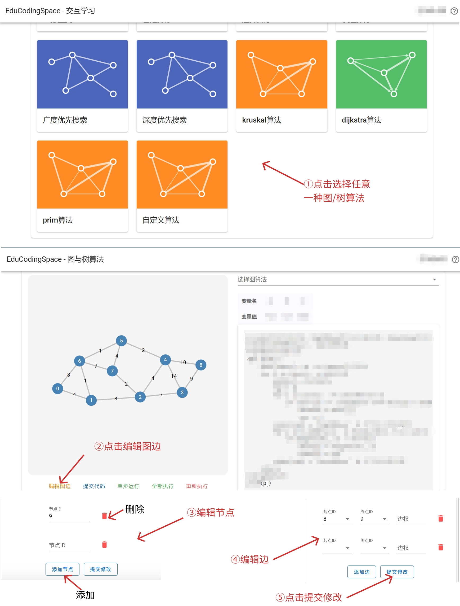
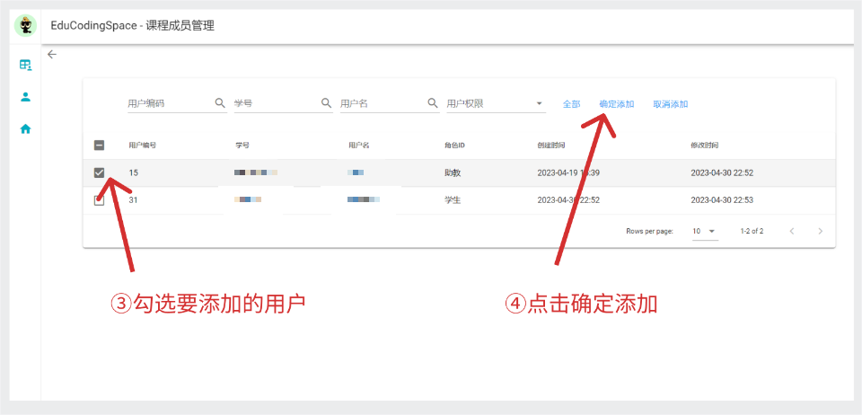
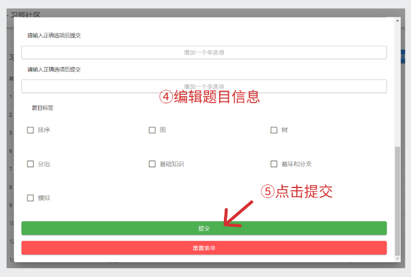

<h1 style="text-align: center"> 立体化教学资源支撑系统<br>用户使用说明 </h1>

<h2> 目录 </h2>

<!-- @import "[TOC]" {cmd="toc" depthFrom=1 depthTo=2 orderedList=false} -->

<!-- code_chunk_output -->

- [引言](#引言)
  - [编写目的](#编写目的)
  - [参考资料](#参考资料)
- [软件概述](#软件概述)
  - [目标](#目标)
  - [功能](#功能)
- [运行环境](#运行环境)
  - [硬件](#硬件)
  - [支持软件](#支持软件)
- [开发者使用说明](#开发者使用说明)
  - [前端开发服务器部署](#前端开发服务器部署)
  - [前端生产服务器部署](#前端生产服务器部署)
  - [后端部署](#后端部署)
  - [前后端接口](#前后端接口)
- [用户使用说明](#用户使用说明)
  - [用户基本功能](#用户基本功能)
  - [用户个人中心栏目](#用户个人中心栏目)
  - [用户端仪表盘栏目](#用户端仪表盘栏目)
  - [用户端交互学习栏目](#用户端交互学习栏目)
  - [用户端习题社区栏目](#用户端习题社区栏目)
  - [用户端交流社区栏目](#用户端交流社区栏目)
  - [教师端课程管理](#教师端课程管理)
  - [教师端习题管理](#教师端习题管理)
  - [管理员全局课程管理](#管理员全局课程管理)
  - [管理员全局用户管理](#管理员全局用户管理)
- [非常规过程](#非常规过程)
  - [误删服务器代码](#误删服务器代码)
- [程序文件（或命令文件）和数据文件一览表](#程序文件或命令文件和数据文件一览表)
  - [前端文件](#前端文件)
  - [后端文件](#后端文件)

<!-- /code_chunk_output -->


# 引言

## 编写目的

本使用说明面向后续的开发运维人员，以及普通用户。后续开发运维人员可以通过本用户使用说明书了解到项目部署细节、主要功能、前后端接口、前后端文件树结构。普通用户可以通过本使用说明书了解到各个页面的主要功能以及操作说明，能够帮助用户迅速熟悉本平台。

## 参考资料

| 标题       | 作者 | 发表日期 |
| ---------- | ---- | -------- |
| 需求规格书 |  EDU-TH-2 小组成员   |     内部文档     |
| 概要设计书 |  EDU-TH-2 小组成员   |      内部文档    |

# 软件概述

## 目标

随着信息技术的不断发展，越来越多的人开始学习编程。然而，编程对于初学者来说较为抽象，不易理解。目前多数教学形式仅停留于教材、幻灯片展示。而对于编程类课程，仅仅通过教材或课件进行理论教学，仍然不够直观；或者通过动画展示算法运行流程，较为直观，但样例较为单一，且制作动画难度较大。 学生不通过实践进行编程学习是十分困难的。而交互式编程教学则可以解决这个问题。通过算法可视化、程序运行可视化，学生可以进行实践学习。因此，我们计划开发一个互动式编程教学平台，为教材、幻灯片等传统教学工具提供更先进、立体的教学辅助手段，帮助学生更好地学习编程、算法课程。

## 功能

| 分类               | 功能                   | 优先级 | 描述                                                         |
| ------------------ | ---------------------- | ------ | ------------------------------------------------------------ |
| 用户基本功能       | 用户端用户登录         | 1      | 用户登录                                                     |
| ^                  | 用户端扫码             | 1      | 用户选择展示类型并扫描二维码                                 |
| 用户个人中心栏目   | 用户端查看个人信息     | 1      | 展示用户个人信息：用户头像、用户名、个人学号、用户身份、当前课程 |
| ^                  | 用户端修改用户头像     | 2      | 用户可以修改个人头像                                         |
| ^                  | 用户端切换课程         | 1      | 用户可以切换当前课程                                         |
| ^                  | 用户端修改密码         | 1      | 用户可以修改密码                                             |
| ^                  | 用户端退出登录         | 1      | 用户退出登录                                                 |
| 用户端交互学习栏目 | 用户端选择交互学习     | 2      | 用户查看交互学习都有哪些内容，可以筛选算法类别、具体算法     |
| ^                  | 用户端交互学习代码提交 | 1      | 用户进行二分查找/排序/图/树等交互学习提交编辑后代码          |
| ^                  | 用户端编辑图边         | 1      | 允许用户对图边进行编辑                                       |
| ^                  | 用户端代码执行显示     | 1      | 动态显示代码执行过程                                         |
| 用户习题社区栏目   | 用户端浏览习题社区     | 1      | 用户查看习题/题组列表，包括题目名称、题目描述等信息          |
| ^                  | 用户端题组详情         | 1      | 用户查看题组详情，包括题组题目、题组描述、题组包含习题       |
| ^                  | 用户端习题详情         | 1      | 用户查看习题详情，包括习题题目、习题内容、习题作答区         |
| ^                  | 用户端作答习题         | 1      | 用户端作答并完成测评                                         |
| 用户交流社区栏目   | 用户端浏览交流社区     | 1      | 用户浏览交流社区中发布的帖子，包括帖子题目、帖子简介、帖子发布和更新时间 |
| ^                  | 用户端发布帖子         | 1      | 用户编辑并发布帖子                                           |
| ^                  | 用户端查看帖子/回复    | 1      | 用户查看帖子详情，包括帖子题目、帖子内容、帖子发布者、帖子发布和更新时间、帖子相关评论 |
| ^                  | 用户回复帖子           | 1      | 用户对帖子进行回复                                           |
| ^                  | 用户端编辑帖子/回复    | 1      | 用户对发布的帖子/回复进行编辑                                |
| ^                  | 用户删除帖子/回复      | 1      | 用户对对发布的帖子/回复进行删除                              |
| 教师课程管理       | 教师端修改课程信息     | 1      | 教师修改课程信息                                             |
| ^                  | 教师端加入课程用户     | 1      | 教师从用户列表里选择用户加入课程                             |
| ^                  | 教师端导入课程用户     | 2      | 教师通过文件将用户导入并加入课程                             |
| ^                  | 教师端删除课程用户     | 1      | 教师将用户从课程里删除                                       |
| 教师习题管理       | 教师端创建习题         | 1      | 教师/助教编辑并创建一个习题                                  |
| ^                  | 教师端编辑习题         | 1      | 教师/助教对指定习题进行编辑                                  |
| ^                  | 教师端删除习题         | 1      | 教师/助教删除指定习题                                        |
| ^                  | 教师端创建题组         | 1      | 教师/助教创建一个题组                                        |
| ^                  | 教师端编辑题组         | 1      | 教师/助教编辑指定题组                                        |
| ^                  | 教师端删除题组         | 1      | 教师/助教删除题组                                            |
| 管理员课程管理     | 管理员修改课程信息     | 1      | 管理员修改课程信息，操作方法与教师端一致                     |
| ^                  | 管理员加入课程用户     | 1      | 管理员从用户列表里选择用户加入课程，操作方法与教师端一致     |
| ^                  | 管理员导入课程用户     | 2      | 管理员通过文件将用户导入并加入课程，操作方法与教师端一致     |
| ^                  | 管理员删除课程用户     | 1      | 管理员将用户从课程里移出，操作与教师端一致                   |
| ^                  | 管理员创建课程         | 1      | 管理员创建一个新的课程                                       |
| ^                  | 管理员删除课程         | 1      | 管理员删除一个课程                                           |
| 管理员课程管理     | 管理员修改用户信息     | 1      | 管理员修改用户信息                                           |
| ^                  | 管理员重置用户密码     | 1      | 管理员重置某个用户的密码                                     |
| ^                  | 管理员删除用户         | 1      | 管理员删除一个用户                                           |
| ^                  | 管理员新建用户         | 1      | 管理员新建一个用户                                           |
| ^                  | 管理员批量新建用户     | 2      | 管理员从文件导入用户信息并批量新建用户                       |

### 性能

本项目部署在课程组提供的服务器上，计算资源有限，对于一般的操作时延在3s以内，总体上对于用户访问，性能可以接受。

# 运行环境

## 硬件

主机的可用存储空间不少于 10GB。内存建议不少于 2GB，带宽不低于 1Mbps。

## 支持软件

项目通过 Docker 解决环境需求问题，物理机器上只需要配置如下环境：

- docker
- git

# 开发者使用说明


## 前端开发服务器部署

首先从仓库中的 client-frontend 中拉取前端代码，然后后在前端代码主目录下执行构建镜像指令并运行该镜像：

```shell
docker build -t my-vue-app .
docker run   
      --restart=always
      --name front-app
      -itd
      -p 8686:8686
      "my-vue-app"
```

镜像成功运行后，前端便部署完成，可以通过 8686 端口访问。

## 前端生产服务器部署

首先从仓库中的 client-frontend 中拉取前端代码，然后后在前端代码主目录下执行构建镜像指令并运行该镜像：

```shell
docker build -f build.Dockerfile -t my-vue-app-pro
docker run   
      --restart=always
      --name front-app-pro
      -itd
      -p 6060:6060
      "my-vue-app-pro"
```

镜像成功运行后，前端便部署完成，可以通过 6060 端口访问。
## 后端部署

首先从华为云仓库中的 eduspace-backend 中拉取后端代码，然后后在后端代码主目录下执行构建镜像指令并运行该镜像：

```shell
docker build -t my-gin-app .
docker run   
      --restart=always
      --name backend-app
      --mount type=bind,source=/root/backend/mydatabase.sqlite,target=/app/gin/database/mydatabase.sqlite
      --mount type=bind,source=/root/backend/logs,target=/app/logs
      --mount type=bind,source=/etc/localtime,target=/etc/localtime,readonly
      --mount type=bind,source=/var/run/docker.sock,target=/var/run/docker.sock
      --mount type=bind,source=/root/backend/scripts/run,target=/app/gin/scripts/run
      -itd
      -p 8081:8080
      "my-gin-app"
```

镜像成功运行后，后端便部署完成。（需根据数据库、日志文件的路径修改指令）

## 前后端接口

### 用户登录 `login` ##

#### 接口信息 ####

POST `/users/login`

#### 接口条件 ####

无

#### 接口参数 ####

请求参数表

| 名称     | 位置 | 类型   | 必选 | 中文名 | 说明       |
| -------- | ---- | ------ | ---- | ------ | ---------- |
| buaa_id  | body | string | 是   | 学工号 | 用户学工号 |
| password | body | string | 是   | 密码   | 用户密码   |

#### 接口返回值 ####

成功状态**200**

返回数据结构

| 名称     | 类型     | 必选 | 中文名         | 说明                                 |
| -------- | -------- | ---- | -------------- | ------------------------------------ |
| buaa_id  | string   | true | 学工号         | 用户学工号                           |
| role     | string   | true | 用户身份       | 包括“学生”、“助教”、“教师”、“管理员” |
| token    | string   | true | 登录身份验证符 | 登录成功返回 token                   |
| user_id  | integer  | true | 用户 id        | 用户主键                             |
| username | string   | true | 用户名         | 用户名                               |
| avatar   | string   | true | 用户头像       | 头像 url                             |
| courses  | [object] | true | 课程信息       | 用户选择课程信息，包含id、name属性   |
| id       | integer  | true | 课程id         | 用户选择课程 id                      |
| name     | string   | true | 课程名         | 用户选择课程名                       |

失败状态**400**

| 名称  | 类型   | 必选 | 中文名 | 说明             |
| ----- | ------ | ---- | ------ | ---------------- |
| error | string | true | 错误   | 登录失败返回原因 |

### 获取二维码 `getQrCode` ###

#### 接口信息 ####

GET `/utils/getqrcode`

#### 接口请求 ####

需要在 Header 中携带有效的用户 Token

#### 接口参数 ####

请求参数

| 名称 | 位置  | 类型   | 必选 | 中文名   | 说明                     |
| ---- | ----- | ------ | ---- | -------- | ------------------------ |
| url  | query | string | 否   | 网址 url | 前端请求获得二维码的网址 |

请求URL示例

```plaintext
前端域名/utils/getqrcode?url=http%3A%2F%2F114.116.211.180%3A8080%2F%23%2Fvisualization%2Fsort%2FquickSort"
```

#### 接口返回值 ####

二进制编码的图片文件ArrayBuffer形式（需要前端转换显示为二维码）

### 修改头像 `changeAvatar` ###

#### 接口信息 ####

POST `/users/upload-avatar/{user_id}`

#### 接口条件 ####

需要在 Header 中携带有效的用户 Token。

#### 接口参数 ####

请求参数表

| 名称    | 位置 | 类型   | 必选 | 中文名   | 说明                     |
| ------- | ---- | ------ | ---- | -------- | ------------------------ |
| user_id | path | string | 是   | 用户 id  | 需要修改头像的用户 id    |
| image   | body | string | 是   | 头像图片 | 用户要修改的头像图片文件 |

#### 接口返回值 ####

后续处理：前端获取到后端成功接收信息后，利用时间信息更新图片 url，展示用户修改后的头像，实现用户头像更新。

### 修改密码 `changePassword` ###

#### 接口信息 ####

PUT `/users/{user_id}/changePassword`

后端验证，如果用户输入的旧密码`old_password`和数据库中的密码相同，则将密码更新为`new_password`。否则返回错误信息。

#### 接口条件 ####

需要在 Header 中携带有效的用户 Token。

#### 接口参数 ####

请求参数表

| 名称         | 位置 | 类型   | 必选 | 中文名  | 说明                 |
| ------------ | ---- | ------ | ---- | ------- | -------------------- |
| user_id      | path | string | 是   | 用户 id | 用户主键             |
| old_password | body | string | 是   | 旧密码  | 用于校验的更新前密码 |
| new_password | body | string | 是   | 新密码  | 用户需要更新的密码   |

#### 接口返回值 ####

状态码**200**

| 名称    | 类型   | 必选 | 中文名 | 说明         |
| ------- | ------ | ---- | ------ | ------------ |
| message | string | true | 信息   | 更新密码成功 |

状态码**400**

| 名称  | 类型   | 必选 | 中文名 | 说明       |
| ----- | ------ | ---- | ------ | ---------- |
| error | string | true | 信息   | 旧密码无效 |

### 登出 `logout` ###

#### 接口信息 ####

POST `/users/logout`

#### 接口条件 ####

需要在 Header 中携带有效的用户 Token

#### 接口参数 ####

无

#### 接口返回值 ####

返回数据结构

状态码**200**

| 名称    | 类型   | 必选 | 中文名 | 说明     |
| ------- | ------ | ---- | ------ | -------- |
| message | string | true | 信息   | 登出成功 |

### 获取用户弱点分析 `getWeakness` ###

#### 接口信息 ####

GET `/users/{user_id}/weakness`

#### 接口条件 ####

需要在 Header 中携带有效的用户 Token

#### 接口参数 ####

Path请求参数

| 名称    | 位置 | 类型   | 必选 | 中文名  | 说明     |
| ------- | ---- | ------ | ---- | ------- | -------- |
| user_id | path | string | 是   | 用户 id | 用户主键 |

#### 接口返回值 ####

返回数据结构

| 名称   | 类型     | 必选 | 中文名     | 说明                                              |
| ------ | -------- | ---- | ---------- | ------------------------------------------------- |
| labels | [object] | true | 标签       | 显示在统计图上的标签，包含name、max属性           |
| name   | string   | true | 标签名     | 统计图上条目的标签名                              |
| max    | integer  | true | 标定最大值 | 一般来说就是1                                     |
| data   | [object] | true | 数据       | 统计图中每个标签对应的数据，包含label、weight属性 |
| label  | string   | true | 数据标签   | 显示的数据标签                                    |
| weight | number   | true | 数据权重   | 相较于max的一个权重，可代表错误率等属性           |

### 获取做题情况 `getQuestionOverview` ###

#### 接口信息 ####

GET `/users/{user_id}/questionOverview`

#### 接口条件 ####

需要在 Header 中携带有效的用户 Token

#### 接口参数 ####

Path请求参数

| 名称    | 位置 | 类型   | 必选 | 中文名  | 说明     |
| ------- | ---- | ------ | ---- | ------- | -------- |
| user_id | path | string | 是   | 用户 id | 用户主键 |

#### 接口返回值 ####

返回数据结构

| 名称       | 类型     | 必选 | 中文名     | 说明                                                   |
| ---------- | -------- | ---- | ---------- | ------------------------------------------------------ |
| overview   | [object] | true | 做题情况   | 用户做题情况，包含correctNum、notDoneNum、wrongNum属性 |
| correctNum | integer  | true | 正确题目数 | 用户做题正确的数目数                                   |
| notDoneNum | integer  | true | 未做题目数 | 用户未作答题目数                                       |
| wrongNum   | integer  | true | 错误题目数 | 用户做题错误的题目数                                   |

### 获取推荐习题列表 `getRecQuestion` ###

#### 接口信息 ####

GET `/users/{user_id}/recQuestion`

#### 接口条件 ####

需要在 Header 中携带有效的用户 Token

#### 接口参数 ####

Path请求参数

| 名称    | 位置 | 类型   | 必选 | 中文名  | 说明     |
| ------- | ---- | ------ | ---- | ------- | -------- |
| user_id | path | string | 是   | 用户 id | 用户主键 |

#### 接口返回值 ####

返回数据结构

| 名称          | 类型     | 必选 | 中文名       | 说明                                                         |
| ------------- | -------- | ---- | ------------ | ------------------------------------------------------------ |
| questionList  | [object] | true | 推荐习题列表 | 该用户的推荐习题列表，包含problem_id、problem_title、tags属性 |
| problem_id    | integer  | true | 习题 id      | 该习题主键                                                   |
| problem_title | string   | true | 习题标题     | 该习题标题                                                   |
| tags          | [string] | true | 习题标签     | 该习题标签                                                   |

### 二分查找代码填空提交 `postBinarySearch` ###

#### 接口信息 ####

POST `/visualizations/binarySearch/submitCode`

接口说明

```python
# 格式：##CodeBlank[i]##  i为第几个空
# 样例：
import json

def normalize(arr):
    min_val = min(arr)
    max_val = max(arr)

    normalized_arr = []
    for val in arr:
        normalized_val = round(20 + ((val - min_val) / (max_val - min_val)) * 150)
        normalized_arr.append(normalized_val)

    return normalized_arr

def binary_search(array, target):
    res = {
        "barNum": len(array),
        "steps": [],
        "barValue": [],
        "barHeight": []
    }
    for item in array:
        if type(item) != int:
            res["success"] = "array初值错误"
            return -1
        else:
            res["barValue"].append(item)
    res["barHeight"] = normalize(res["barValue"])

    left = 0
    right = len(array) - 1
    res["steps"].append(['' for _ in range(len(array))])
    while $$CodeBlank[0]$$ :
        mid = (left + right) // 2
        cur_step = ['lightblue' for _ in range(len(array))]
        cur_step[left] = 'yellow'
        cur_step[right] = 'yellow'
        cur_step[mid] = 'red' # 优先显示red
        if array[mid] == target:
            res["steps"].append(cur_step)
            return res
        elif array[mid] < target:
            left = $$CodeBlank[1]$$
        else:
            right = $$CodeBlank[2]$$
        res["steps"].append(cur_step)
    return res

array = $$CodeBlank[3]$$
target = $$CodeBlank[4]$$
print(json.dumps(binary_search(array, target)))
```

#### 接口条件 ####

需要在 Header 中携带有效的用户 Token

#### 接口参数 ####

请求参数

| 名称       | 位置 | 类型     | 必选 | 中文名       | 说明         |
| ---------- | ---- | -------- | ---- | ------------ | ------------ |
| codeBlanks | body | [string] | 是   | 代码填空数组 | 代码填空数组 |

#### 接口返回值 ####

接口数据结构

| 名称      | 类型      | 必选 | 中文名        | 说明                                                       |
| --------- | --------- | ---- | ------------- | ---------------------------------------------------------- |
| barNum    | integer   | true | 条柱数量      | 二分查找的数据数量                                         |
| steps     | [array]   | true | step 信息数组 | 每一个运行步骤各条柱的颜色                                 |
| barHeight | [integer] | true | 条柱高度      | 从左到右每一个条柱的高度。高度由数值归一化而来，30~150之间 |
| barValue  | [integer] | true | 条柱数值      | 从左到右每一个条柱的实际数值                               |

### 排序加载  `getSort` ###

#### 接口信息 ####

GET `/visualizations/sort/{type}`

#### 接口说明

type参数为'bubbleSort'，'selectionSort'，'quickSort'，返回对应的前端展示代码填空字符串，和填空的默认值. **加入提交代码的4个返回值 heights,values,steps,detail** 这四个值就是对应排序的默认执行结果。

#### 接口条件 ####

需要在 Header 中携带有效的用户 Token

#### 接口参数 ####

| 名称 | 位置 | 类型   | 必选 | 中文名 | 说明                                                 |
| ---- | ---- | ------ | ---- | ------ | ---------------------------------------------------- |
| type | path | string | 是   | 类型   | type参数为'bubbleSort'，'selectionSort'，'quickSort' |

#### 接口返回值 ####

返回数据列表

| 名称         | 类型      | 必选 | 中文名        | 说明                                                       |
| ------------ | --------- | ---- | ------------- | ---------------------------------------------------------- |
| code         | string    | true | 代码          | 返回请求类型排序的代码                                     |
| inputDefault | [string]  | true | 输入框默认值  | 允许用户输入部分输入框的默认值                             |
| values       | [integer] | true | 条柱数值      | 从左到右每一个条柱的实际数值                               |
| heights      | [integer] | true | 条柱高度      | 从左到右每一个条柱的高度。高度由数值归一化而来，30~150之间 |
| steps        | [array]   | true | step 信息数组 | 每一个运行步骤需要交换哪两个条柱                           |
| detail       | [array]   | true | 条柱颜色      | 每一运行步骤，各条柱颜色。如果为空，则赋予各条柱随机颜色   |

### 提交排序 `postSort` ###

#### 接口信息 ####

POST `/visualizations/sort/submitCode/{type}`

#### 接口条件 ####

需要在 Header 中携带有效的用户 Token

#### 接口参数 ####

请求参数列表

| 名称       | 位置 | 类型     | 必选 | 中文名       | 说明         |
| ---------- | ---- | -------- | ---- | ------------ | ------------ |
| type       | path | string   | 是   | 类型         | 排序类型     |
| codeBlanks | body | [string] | 是   | 代码填空数组 | 代码填空数组 |

#### 接口返回值 ####

返回数据列表

| 名称    | 类型      | 必选 | 中文名        | 说明             |
| ------- | --------- | ---- | ------------- | ---------------- |
| values  | [integer] | true | 条柱数值      | 数组真实值       |
| heights | [integer] | true | 条柱高度      | 数组归一化高度   |
| steps   | [array]   | true | step 信息数组 | 数组交换步骤     |
| detail  | [array]   | true | 条柱颜色      | 数组颜色变化步骤 |

### 图加载代码 `getGraph` ###

#### 接口信息 ####

GET `/visualizations/graph/{type}`

参数type为图算法的类型。返回值含 code, inputDefault, 以及该算法默认代码、输入运行结果[nodeColors, nodeLabelColors, linkTextColors,linkColor] 额外返回一个默认图的信息。 weight为空字符串的话，代表无权图。

#### 接口条件 ####

需要在 Header 中携带有效的用户 Token

#### 接口参数 ####

| 名称 | 位置 | 类型   | 必选 | 中文名     | 说明                             |
| ---- | ---- | ------ | ---- | ---------- | -------------------------------- |
| type | path | string | 是   | 图算法类型 | 例如dfs、dijkstra、kruskal、prim |

#### 接口返回值 ####

返回数据列表

| 名称            | 类型     | 必选 | 中文名         | 说明                                   |
| --------------- | -------- | ---- | -------------- | -------------------------------------- |
| code            | string   | true | 代码           | 返回请求类型图的代码                   |
| inputDefault    | [string] | true | 输入框默认值   | 如果没有输入框，数组为空               |
| nodeColors      | [array]  | true | 节点颜色       | 每一步骤各节点颜色                     |
| linkColors      | [array]  | true | 连接边的颜色   | 每一步各连接边的颜色                   |
| nodeLabelColors | [array]  | true | 节点标签颜色   | 每一步节点标签颜色                     |
| linkTextColors  | [array]  | true | 连接边文字颜色 | 每一步边标签颜色，如果为空默认使用黑色 |
| links           | [object] | true | 连接边         | 包含source、target、weight属性         |
| source          | integer  | true | 边起点         | -                                      |
| target          | integer  | true | 边终点         | -                                      |
| weight          | integer  | true | 边权重         | -                                      |

### 图提交 `postGraph` ###

#### 接口信息 ####

POST `/visualizations/graph/submitCode/{type}`

同样的post,区别是代码的输入图在参数graphInfo里面 返回值4个四个颜色数组[nodeColors,linkcolors,nodeLabelColors,linkTextColors]

#### 接口条件 ####

需要在 Header 中携带有效的用户 Token

#### 接口参数 ####

请求参数列表

| 名称       | 位置 | 类型     | 必选 | 中文名     | 说明                             |
| ---------- | ---- | -------- | ---- | ---------- | -------------------------------- |
| type       | path | string   | 是   | 图算法类型 | 例如dfs、dijkstra、kruskal、prim |
| codeBlanks | body | [string] | 是   | 代码块     | 如果用户没有填写代码，返回空数组 |
| graphInfo  | body | object   | 是   | 图信息     | 包含nodes、links属性             |
| nodes      | body | [object] | 是   | 节点信息   | 包含id属性                       |
| id         | body | integer  | 是   | 节点 id    | -                                |
| links      | body | [object] | 是   | 连接边信息 | 包含source、target、weight属性   |
| source     | body | integer  | 是   | 边起点     | -                                |
| target     | body | integer  | 是   | 边终点     | -                                |
| weight     | body | integer  | 是   | 边权重     | -                                |

#### 接口返回值 ####

返回值数据结构

| 名称            | 类型    | 必选 | 中文名         | 说明                                   |
| --------------- | ------- | ---- | -------------- | -------------------------------------- |
| nodeColors      | [array] | true | 节点颜色       | 每一步骤各节点颜色                     |
| linkColors      | [array] | true | 边颜色         | 每一步骤各边的颜色                     |
| nodeLabelColors | [array] | true | 节点标签颜色   | 每一步节点标签颜色                     |
| linkTextColors  | [array] | true | 连接边文字颜色 | 每一步边标签颜色，如果为空默认使用黑色 |

### 获取习题列表 `getAllExercise` ###

#### 接口信息 ####

GET `/questions/getall`

#### 接口条件 ####

需要在 Header 中携带有效的用户 Token

#### 接口参数 ####

无

#### 接口返回值 ####

返回数据结构列表

| 名称       | 类型     | 必选  | 中文名           | 说明                                                         |
| ---------- | -------- | ----- | ---------------- | ------------------------------------------------------------ |
| id         | integer  | true  | 习题 id          | 习题主键                                                     |
| title      | string   | true  | 习题题目         | 习题名                                                       |
| content    | string   | true  | 习题内容         | 习题内容（Markdown格式）                                     |
| answer     | string   | true  | 习题答案         | -                                                            |
| tags       | [string] | true  | 习题知识点标签   | -                                                            |
| created_at | string   | true  | 习题创建时间     | 创建时间                                                     |
| updated_at | string   | true  | 习题最后更新时间 | 最后更新时间                                                 |
| type       | string   | true  | 习题类型         | 包含”fill_blank"填空、“single_select"单选、”multi_select“多选 |
| data       | object   | false | 习题数据         | 后端存储本字段的 json 格式字符串                             |
| choices    | [string] | false | 习题选项         | 如果习题为选择题，该项为习题各选项内容，否则为空             |

### 获取题组列表 `getAllExam` ###

#### 接口信息 ####

GET `/exams/getall`

#### 接口条件 ####

需要在 Header 中携带有效的用户 Token

#### 接口参数 ####

无

#### 接口返回值 ####

返回数据结构列表

| 名称        | 类型    | 必选 | 中文名           | 说明               |
| ----------- | ------- | ---- | ---------------- | ------------------ |
| id          | integer | true | 题组 id          | 题组主键           |
| name        | string  | true | 题组名称         | 题组名称           |
| description | string  | true | 题组简介         | 题组简介(Markdown) |
| created_at  | string  | true | 题组创建时间     | 创建时间           |
| updated_at  | string  | true | 题组最后更新时间 | 最后更新时间       |

### 获取题组详情 `getExerciseSetDetail` ###

#### 接口信息 ####

GET `/exams/{exam_id}`

#### 接口条件 ####

需要在 Header 中携带有效的用户 Token

#### 接口参数 ####

| 名称    | 位置 | 类型   | 必选 | 中文名 | 说明   |
| ------- | ---- | ------ | ---- | ------ | ------ |
| exam_id | path | string | 是   | 题组id | 题组id |

#### 接口返回值 ####

返回数据结构

| 名称        | 类型     | 必选 | 中文名             | 说明                    |
| ----------- | -------- | ---- | ------------------ | ----------------------- |
| id          | integer  | true | 题组 id            | 题组主键                |
| title       | string   | true | 题组标题           | 题组名                  |
| description | string   | true | 题组简介           | markdown形式            |
| questions   | [Object] | true | 题组包含的题目列表 | 包含id、title、tags属性 |
| id          | integer  | true | 习题 id            | 习题主键                |
| title       | string   | true | 习题标题           | 习题名                  |
| tags        | [string] | true | 习题标签列表       | 习题知识点标签          |

### 获取习题详情 `getExerciseDetail` ###

#### 接口信息 ####

GET `/questions/{question_id}`

#### 接口条件 ####

需要在 Header 中携带有效的用户 Token

#### 接口参数 ####

| 名称        | 位置 | 类型   | 必选 | 中文名  | 说明     |
| ----------- | ---- | ------ | ---- | ------- | -------- |
| question_id | path | string | 是   | 习题 id | 习题主键 |

#### 接口返回值 ####

| 名称       | 类型     | 必选  | 中文名       | 说明                                                         |
| ---------- | -------- | ----- | ------------ | ------------------------------------------------------------ |
| id         | integer  | true  | 习题 id      | 习题主键                                                     |
| title      | string   | true  | 习题标题     | 习题名                                                       |
| content    | string   | true  | 习题内容     | 习题内容（Markdown格式）                                     |
| tags       | [string] | true  | 习题标签列表 | 习题知识点标签                                               |
| created_at | string   | true  | 习题创建时间 | 创建时间                                                     |
| updated_at | string   | true  | 习题更新时间 | 最后更新时间                                                 |
| type       | string   | true  | 习题类型     | 包含”fill_blank"填空、“single_select"单选、”multi_select“多选 |
| data       | object   | false | 习题数据     | 后端存储本字段的 json 格式字符串，包含choices属性            |
| choices    | [string] | false | 习题选项     | 如果习题为选择题，该项为习题各选项内容，否则为空             |

### 用户提交作答 `submitexerciseAnswer` ###

#### 接口信息 ####

POST `/questions/{question_id}/submit`

#### 接口条件 ####

需要在 Header 中携带有效的用户 Token

接口参数

| 名称        | 位置 | 类型   | 必选 | 中文名   | 说明               |
| ----------- | ---- | ------ | ---- | -------- | ------------------ |
| question_id | path | string | 是   | 习题 id  | 习题主键           |
| answer      | body | string | 是   | 习题作答 | 用户提交的习题答案 |

#### 接口返回值 ####

返回数据结构

| 名称        | 类型    | 必选 | 中文名       | 说明                    |
| ----------- | ------- | ---- | ------------ | ----------------------- |
| result      | boolean | true | 评测结果     | true为正确，false为错误 |
| result_desc | string  | true | 评测结果说明 | -                       |

### 获取帖子列表 `getAllBlogs` ###

#### 接口信息 ####

GET `/posts/getall`

#### 接口条件 ####

需要在 Header 中携带有效的用户 Token

#### 接口参数 ####

无

#### 接口返回值 ####

| 名称          | 类型     | 必选 | 中文名       | 说明                                                         |
| ------------- | -------- | ---- | ------------ | ------------------------------------------------------------ |
| posts         | [object] | true | 帖子列表     | 返回所有帖子列表，包含id、title、created_at、updated_at、poster_avatar、poster_name、info属性 |
| id            | integer  | true | 帖子 id      | post主键                                                     |
| title         | string   | true | 帖子标题     | 帖子标题                                                     |
| created_at    | string   | true | 帖子创建时间 | 创建时间                                                     |
| updated_at    | string   | true | 帖子更新时间 | 最后更新时间                                                 |
| poster_avatar | string   | true | 发帖人头像   | 发帖人头像 url                                               |
| poster_name   | string   | true | 发帖人姓名   | -                                                            |
| intro         | string   | true | 帖子简介     | 来源于帖子内容，不超过50字，多余用“……”表示                   |

### 发布讨论帖 `postBlog` ###

#### 接口信息 ####

POST `/posts/postblog`

#### 接口条件 ####

需要在 Header 中携带有效的用户 Token

#### 接口参数 ####

请求参数列表

| 名称    | 位置 | 类型   | 必选 | 中文名   | 说明 |
| ------- | ---- | ------ | ---- | -------- | ---- |
| title   | body | string | 是   | 帖子标题 | -    |
| content | body | string | 是   | 帖子内容 | -    |

#### 接口返回值 ####

返回值数据结构

| 名称    | 类型   | 必选 | 中文名 | 说明             |
| ------- | ------ | ---- | ------ | ---------------- |
| message | string | true | 信息   | 返回成功发帖信息 |

### 获取讨论帖详情 `getBlogByID` ###

#### 接口信息 ####

GET `/posts/{post_id}`

#### 接口条件 ####

需要在 Header 中携带有效的用户 Token

#### 接口参数 ####

| 名称    | 位置 | 类型   | 必选 | 说明    |
| ------- | ---- | ------ | ---- | ------- |
| post_id | path | string | 是   | 帖子 id |

#### 接口返回值 ####

返回数据结构

| 名称          | 类型    | 必选 | 中文名       | 说明                 |
| ------------- | ------- | ---- | ------------ | -------------------- |
| id            | integer | true | 帖子 id      | 帖子主键             |
| title         | string  | true | 帖子标题     | 帖子标题             |
| content       | string  | true | 帖子内容     | -                    |
| poster_id     | integer | true | 发帖人 id    | 用户主键             |
| poster_name   | string  | true | 发帖人用户名 | 发帖人用户名         |
| poster_avatar | string  | true | 发帖人头像   | -                    |
| created_at    | string  | true | 帖子创建时间 | -                    |
| updated_at    | string  | true | 帖子更新时间 | 帖子最近一次更新时间 |

### 获取讨论帖评论 `getBlogRemark` ###

#### 接口信息 ####

GET `/comments/getall/{post_id}`

#### 接口条件 ####

需要在 Header 中携带有效的用户 Token

#### 接口参数 ####

| 名称    | 位置 | 类型   | 必选 | 说明    |
| ------- | ---- | ------ | ---- | ------- |
| post_id | path | string | 是   | 帖子 id |

#### 接口返回值 ####

返回数据结构

| 名称        | 类型     | 必选 | 中文名     | 说明                   |
| ----------- | -------- | ---- | ---------- | ---------------------- |
| comments    | [object] | true | 回复       | 包含下面列举的其他属性 |
| id          | integer  | true | 回复 ID    | 回复主键               |
| content     | string   | true | 回复内容   | -                      |
| user_id     | integer  | true | 回复者 id  | 用户主键               |
| user_name   | string   | true | 回复者昵称 | 用户名                 |
| user_avatar | string   | true | 回复者头像 | 用户头像 url           |
| created_at  | string   | true | 创建时间   | 回复创建时间           |
| updated_at  | string   | true | 更新时间   | 回复更新时间           |

### 编辑讨论帖 `postBlogEdit` ###

#### 接口信息 ####

PUT `/posts/{post_id}`

#### 接口条件 ####

需要在 Header 中携带有效的用户 Token

#### 接口参数 ####

请求参数列表

| 名称    | 位置 | 类型   | 必选 | 中文名  | 说明     |
| ------- | ---- | ------ | ---- | ------- | -------- |
| post_id | path | string | 是   | 帖子 id | 帖子主键 |
| title   | body | string | 是   | 标题    | 帖子标题 |
| content | body | string | 是   | 内容    | 帖子内容 |

#### 接口返回值 ####

返回数据结构

| 名称    | 类型   | 必选 | 中文名 | 说明                 |
| ------- | ------ | ---- | ------ | -------------------- |
| message | string | true | 信息   | 返回成功编辑帖子信息 |

### 编辑回复 `postBlogRemarkEdit` ###

#### 接口信息 ####

PUT `/comments/{comment_id}`

#### 接口条件 ####

需要在 Header 中携带有效的用户 Token

#### 接口参数 ####

请求参数列表

| 名称       | 位置 | 类型   | 必选 | 中文名   | 说明     |
| ---------- | ---- | ------ | ---- | -------- | -------- |
| comment_id | path | string | 是   | 评论 id  | 评论主键 |
| content    | body | string | 是   | 评论内容 | 评论内容 |

#### 接口返回值 ####

返回数据结构

| 名称    | 类型   | 必选 | 中文名 | 说明                 |
| ------- | ------ | ---- | ------ | -------------------- |
| message | string | true | 信息   | 返回成功编辑回复信息 |

### 删除讨论帖 `postBlogDelete` ###

#### 接口信息 ####

DELETE `/posts/{post_id}`

#### 接口条件 ####

需要在 Header 中携带有效的用户 Token

#### 接口参数 ####

| 名称    | 位置 | 类型   | 必选 | 说明    |
| ------- | ---- | ------ | ---- | ------- |
| post_id | path | string | 是   | 帖子 id |

#### 接口返回值 ####

返回数据结构

| 名称    | 类型   | 必选 | 中文名 | 说明                 |
| ------- | ------ | ---- | ------ | -------------------- |
| message | string | true | 信息   | 返回成功删除帖子信息 |

### 删除回复 `postBlogRemarkDelete` ###

#### 接口信息 ####

DELETE `/comments/{comment_id}`

#### 接口条件 ####

需要在 Header 中携带有效的用户 Token

#### 接口参数 ####

| 名称       | 位置 | 类型   | 必选 | 中文名  | 说明     |
| ---------- | ---- | ------ | ---- | ------- | -------- |
| comment_id | path | string | 是   | 评论 id | 评论主键 |

#### 接口返回值 ####

返回数据结构

| 名称    | 类型   | 必选 | 中文名 | 说明                 |
| ------- | ------ | ---- | ------ | -------------------- |
| message | string | true | 信息   | 返回成功删除回复信息 |

### 回复帖子 `postBlogRemark` ###

#### 接口信息 ####

POST `/comments/addcomment`

#### 接口条件 ####

需要在 Header 中携带有效的用户 Token

#### 接口参数 ####

请求参数列表

| 名称    | 位置 | 类型    | 必选 | 中文名   | 说明     |
| ------- | ---- | ------- | ---- | -------- | -------- |
| post_id | body | integer | 是   | 帖子 id  | 帖子主键 |
| content | body | string  | 是   | 评论内容 | 评论内容 |

#### 接口返回值 ####

返回数据结构

| 名称    | 类型   | 必选 | 中文名 | 说明                 |
| ------- | ------ | ---- | ------ | -------------------- |
| message | string | true | 信息   | 返回成功创建回复信息 |

### 创建新习题 `createNewExercise` ###

#### 接口信息 ####

POST `/questions/addquestion` 习题类型有多选、单选、填空三种：{"multi_choice","single_choice","fill_blank"}; 习题详情存在data: 填空题无，选择题的选项在 data.choices :array[string]

#### 接口条件 ####

需要在 Header 中携带有效的用户 Token

#### 接口参数 ####

请求数据列表

| 名称      | 位置 | 类型     | 必选 | 中文名  | 说明                                                         |
| --------- | ---- | -------- | ---- | ------- | ------------------------------------------------------------ |
| course_id | body | integer  | 是   | 课程 id | 课程主键                                                     |
| title     | body | string   | 是   | 标题    | 习题名                                                       |
| content   | body | string   | 是   | 内容    | 习题内容（Markdown格式）                                     |
| answer    | body | string   | 是   | 答案    | 习题答案                                                     |
| tags      | body | [string] | 是   | 标签    | 习题知识点标签                                               |
| type      | body | string   | 是   | 类型    | 习题类型有多选、单选、填空三种：{"multi_choice","single_choice","fill_blank"}; |
| data      | body | object   | 否   | 数据    | 后端存储本字段的 json 格式字符串                             |
| choices   | body | [string] | 否   | 选项    | 习题包含选项（如果题目不是选择题，则该属性为空）             |

#### 接口返回值 ####

返回数据结构

| 名称    | 类型   | 必选 | 中文名 | 说明                 |
| ------- | ------ | ---- | ------ | -------------------- |
| message | string | true | 信息   | 返回成功创建新题信息 |

### 编辑习题 `editExercise` ###

#### 接口信息 ####

PUT `/questions/{question_id}`

#### 接口条件 ####

需要在 Header 中携带有效的用户 Token

#### 接口参数 ####

请求参数列表

| 名称        | 位置 | 类型     | 必选 | 中文名  | 说明                                                         |
| ----------- | ---- | -------- | ---- | ------- | ------------------------------------------------------------ |
| question_id | path | string   | 是   | 习题 id | 习题主键                                                     |
| course_id   | body | integer  | 是   | 课程 id | 课程主键                                                     |
| title       | body | string   | 是   | 标题    | 习题名                                                       |
| content     | body | string   | 是   | 内容    | 习题内容（Markdown格式）                                     |
| answer      | body | string   | 是   | 答案    | 习题答案                                                     |
| tags        | body | [string] | 是   | 标签    | 习题知识点标签                                               |
| type        | body | string   | 是   | 类型    | 习题类型有多选、单选、填空三种：{"multi_choice","single_choice","fill_blank"}; |
| data        | body | object   | 否   | 数据    | 后端存储本字段的 json 格式字符串，包含choices属性            |
| choices     | body | [string] | 否   | 选项    | 习题包含选项（如果题目不是选择题，则该属性为空）             |

#### 接口返回值 ####

返回数据结构

| 名称    | 类型   | 必选 | 中文名 | 说明                 |
| ------- | ------ | ---- | ------ | -------------------- |
| message | string | true | 信息   | 返回成功编辑习题信息 |

### 删除习题 `deleteExercise` ###

#### 接口信息 ####

DELETE `/questions/{question_id}`

#### 接口条件 ####

需要在 Header 中携带有效的用户 Token

#### 接口参数 ####

| 名称        | 位置 | 类型   | 必选 | 中文名  | 说明     |
| ----------- | ---- | ------ | ---- | ------- | -------- |
| question_id | path | string | 是   | 习题 id | 习题主键 |

#### 接口返回值 ####

返回数据结构

| 名称    | 类型   | 必选 | 中文名 | 说明                 |
| ------- | ------ | ---- | ------ | -------------------- |
| message | string | true | 信息   | 返回成功删除习题信息 |

### 创建题组 `createNewExerciseSet` ###

#### 接口信息 ####

POST `/exams/addexam`

#### 接口条件 ####

需要在 Header 中携带有效的用户 Token

#### 接口参数 ####

请求参数列表

| 名称        | 位置 | 类型      | 必选 | 中文名   | 说明               |
| ----------- | ---- | --------- | ---- | -------- | ------------------ |
| name        | body | string    | 是   | 题组名称 | 题组名称           |
| description | body | string    | 是   | 题组描述 | 题组简介(Markdown) |
| questions   | body | [integer] | 是   | 题组问题 | 包含题目id的数组   |

#### 接口返回值 ####

返回数据结构

| 名称    | 类型   | 必选 | 中文名 | 说明                 |
| ------- | ------ | ---- | ------ | -------------------- |
| message | string | true | 信息   | 返回成功创建题组信息 |

### 编辑题组 `editExerciseSet` ###

#### 接口信息 ####

PUT `/exams/{exam_id}`

#### 接口条件 ####

需要在 Header 中携带有效的用户 Token

#### 接口参数 ####

请求参数列表

| 名称        | 位置 | 类型      | 必选 | 中文名   | 说明                   |
| ----------- | ---- | --------- | ---- | -------- | ---------------------- |
| exam_id     | path | string    | 是   | 题组 id  | 题组主键               |
| name        | body | string    | 是   | 题组名称 | 题组名称               |
| description | body | string    | 是   | 题组描述 | 题组简介(Markdown)     |
| questions   | body | [integer] | 是   | 题组问题 | 题组包含的问题 id 列表 |

#### 接口返回值 ####

返回数据结构

| 名称    | 类型   | 必选 | 中文名 | 说明                 |
| ------- | ------ | ---- | ------ | -------------------- |
| message | string | true | 信息   | 返回成功编辑题组信息 |

### 删除题组 `deleteExerciseSet` ###

#### 接口信息 ####

DELETE `/exams/{exam_id}`

#### 接口条件 ####

需要在 Header 中携带有效的用户 Token

#### 接口参数 ####

| 名称    | 位置 | 类型   | 必选 | 中文名  | 说明     |
| ------- | ---- | ------ | ---- | ------- | -------- |
| exam_id | path | string | 是   | 题组 id | 题组主键 |

#### 接口返回值 ####

返回数据结构

| 名称    | 类型   | 必选 | 中文名 | 说明                 |
| ------- | ------ | ---- | ------ | -------------------- |
| message | string | true | 信息   | 返回成功删除题组信息 |

### 添加课程  `postCourse` ###

#### 接口信息 ####

POST `/courses/signup`

#### 接口条件 ####

需要在 Header 中携带有效的用户 Token

#### 接口参数 ####

| 名称        | 位置 | 类型     | 必选 | 中文名 | 说明         |
| ----------- | ---- | -------- | ---- | ------ | ------------ |
| array       | body | [object] | true | 数组   | 课程对象数组 |
| name        | body | string   | true | 名称   | 课程名称     |
| description | body | string   | true | 描述   | 课程描述     |

#### 接口返回值 ####

成功200

| 名称    | 类型   | 必选 | 中文名 | 说明             |
| ------- | ------ | ---- | ------ | ---------------- |
| message | string | true | 信息   | 返回是否成功信息 |

### 删除课程 `deleteCourse` ###

#### 接口信息 ####

DELETE `/courses/{course_id}`

#### 接口条件 ####

需要在 Header 中携带有效的用户 Token

#### 接口参数 ####

| 名称      | 位置 | 类型   | 必选 | 中文名 | 说明       |
| --------- | ---- | ------ | ---- | ------ | ---------- |
| course_id | path | string | true | 课程id | 课程的主键 |

#### 接口返回值 ####

成功200

| 名称    | 类型   | 必选 | 中文名 | 说明             |
| ------- | ------ | ---- | ------ | ---------------- |
| message | string | true | 信息   | 返回是否成功信息 |

### 编辑课程 `putCourse` ###

#### 接口信息 ####

PUT `/courses/{course_id}`

#### 接口条件 ####

需要在 Header 中携带有效的用户 Token

#### 接口参数 ####

| 名称        | 位置 | 类型   | 必选 | 中文名   | 说明     |
| ----------- | ---- | ------ | ---- | -------- | -------- |
| course_id   | path | string | true | 课程主键 | 课程主键 |
| name        | body | string | true | 名称     | 课程名称 |
| description | body | string | true | 介绍     | 课程介绍 |

#### 接口返回值 ####

成功200

| 名称    | 类型   | 必选 | 中文名 | 说明             |
| ------- | ------ | ---- | ------ | ---------------- |
| message | string | true | 信息   | 返回是否成功信息 |

### 添加课程用户 `postCourseUser` ###

#### 接口信息 ####

POST `/courses/{course_id}/add_students`

#### 接口条件 ####

需要在 Header 中携带有效的用户 Token

#### 接口参数 ####

| 名称      | 位置 | 类型      | 必选  | 中文名 | 说明                     |
| --------- | ---- | --------- | ----- | ------ | ------------------------ |
| course_id | path | string    | true  | 课程id | 课程主键                 |
| array     | body | [integer] | false | 数组   | 要加入某个课程的用户主键 |

#### 接口返回值 ####

成功200

| 名称    | 类型   | 必选 | 中文名 | 说明             |
| ------- | ------ | ---- | ------ | ---------------- |
| message | string | true | 信息   | 返回是否成功信息 |

### 删除课程用户 `deleteCourseUser` ###

#### 接口信息 ####

DELETE `/courses/{course_id}/students/{student_id}`

#### 接口条件 ####

需要在 Header 中携带有效的用户 Token

#### 接口参数 ####

| 名称       | 位置 | 类型   | 必选 | 中文名 | 说明     |
| ---------- | ---- | ------ | ---- | ------ | -------- |
| course_id  | path | string | true | 课程id | 课程主键 |
| student_id | path | string | true | 用户id | 用户主键 |

#### 接口返回值 ####

成功200

| 名称    | 类型   | 必选 | 中文名 | 说明             |
| ------- | ------ | ---- | ------ | ---------------- |
| message | string | true | 信息   | 返回是否成功信息 |

### 添加用户 `postUser` ###

#### 接口信息 ####

POST `/users/signup`

#### 接口条件 ####

需要在 Header 中携带有效的用户 Token

#### 接口参数 ####

| 名称     | 位置 | 类型     | 必选 | 中文名 | 说明                         |
| -------- | ---- | -------- | ---- | ------ | ---------------------------- |
| array    | body | [object] | true | 数组   | 用户信息数组，包含下列其他项 |
| username | body | string   | true | 用户id | 用户主键                     |
| role     | body | integer  | true | 角色   | 用户权限                     |
| password | body | string   | true | 密码   | 用户密码                     |
| buaa_id  | body | string   | true | 学工号 | 用户学工号                   |

#### 接口返回值 ####

成功200

| 名称    | 类型   | 必选 | 中文名 | 说明             |
| ------- | ------ | ---- | ------ | ---------------- |
| message | string | true | 信息   | 返回是否成功信息 |

### 删除用户 `deleteUser` ###

#### 接口信息 ####

DELETE `/users/{user_id}`

#### 接口条件 ####

需要在 Header 中携带有效的用户 Token

#### 接口参数 ####

| 名称    | 位置 | 类型   | 必选 | 中文名 | 说明     |
| ------- | ---- | ------ | ---- | ------ | -------- |
| user_id | path | string | true | 用户id | 用户主键 |

#### 接口返回值 ####

成功200

| 名称    | 类型   | 必选 | 中文名 | 说明             |
| ------- | ------ | ---- | ------ | ---------------- |
| message | string | true | 信息   | 返回是否成功信息 |

### 编辑用户信息 `putUser` ###

#### 接口信息 ####

PUT `/users/{user_id}`

#### 接口条件 ####

需要在 Header 中携带有效的用户 Token

#### 接口参数 ####

| 名称     | 位置 | 类型    | 必选  | 中文名 | 说明       |
| -------- | ---- | ------- | ----- | ------ | ---------- |
| user_id  | path | string  | true  | 用户id | 用户编号   |
| username | body | string  | true  | 用户名 | 用户名     |
| buaa_id  | body | string  | false | 学工号 | 用户学工号 |
| role     | body | integer | true  | 角色   | 用户权限   |

#### 接口返回值 ####

成功200

| 名称    | 类型   | 必选 | 中文名 | 说明             |
| ------- | ------ | ---- | ------ | ---------------- |
| message | string | true | 信息   | 返回是否成功信息 |

### 重置用户密码 `postPassword` ###

#### 接口信息 ####

POST `/users/resetPassword`

#### 接口条件 ####

需要在 Header 中携带有效的用户 Token

#### 接口参数 ####

| 名称     | 位置 | 类型   | 必选 | 中文名 | 说明       |
| -------- | ---- | ------ | ---- | ------ | ---------- |
| buaa_id  | body | string | true | 学工号 | 用户学工号 |
| password | body | string | true | 密码   | 用户密码   |

#### 接口返回值 ####

成功200

| 名称    | 类型   | 必选 | 中文名 | 说明             |
| ------- | ------ | ---- | ------ | ---------------- |
| message | string | true | 信息   | 返回是否成功信息 |

### 获取所有用户 `getAllUsers` ###

#### 接口信息 ####

GET `/users/getall`

#### 接口条件 ####

需要在 Header 中携带有效的用户 Token

#### 接口参数 ####

无

#### 接口返回值 ####

成功200

| 名称       | 类型    | 必选 | 中文名   | 说明                 |
| ---------- | ------- | ---- | -------- | -------------------- |
| id         | integer | true | id       | 用户主键             |
| username   | string  | true | 用户名   | 用户名               |
| buaa_id    | string  | true | 学工号   | 用户学工号           |
| role       | integer | true | 角色     | 用户权限             |
| created_at | string  | true | 创建时间 | 用户创建时间         |
| updated_at | string  | true | 更新时间 | 用户信息被更新的时间 |

### 获取所有课程信息 `getAllCourses` ###

#### 接口信息 ####

GET `/courses/getall`

#### 接口条件 ####

需要在 Header 中携带有效的用户 Token

#### 接口参数 ####

| 名称        | 类型    | 必选 | 中文名   | 说明             |
| ----------- | ------- | ---- | -------- | ---------------- |
| id          | integer | true | 主键     | 课程主键         |
| name        | string  | true | 名称     | 课程名称         |
| description | string  | true | 描述     | 课程介绍         |
| created_at  | string  | true | 创建时间 | 课程创建时间     |
| updated_at  | string  | true | 更新时间 | 课程最后更新时间 |

#### 接口返回值 ####

成功200

| 名称    | 类型   | 必选 | 中文名 | 说明             |
| ------- | ------ | ---- | ------ | ---------------- |
| message | string | true | 信息   | 返回是否成功信息 |

### 自定义提交代码 `postCustomCode` ###

#### 接口信息 ####

POST `/visualizations/custom/submitCode`

提交完整代码字符串。后端调用py解析脚本进行解析，返回python stdout中打印的json。

#### 接口条件 ####

需要在 Header 中携带有效的用户 Token

#### 接口参数 ####

请求参数

| 名称 | 位置 | 类型   | 必选 | 中文名 | 说明                 |
| ---- | ---- | ------ | ---- | ------ | -------------------- |
| code | body | string | 是   | 代码   | 提交的完整代码字符串 |

#### 接口返回值 ####

接口数据结构

| 名称           | 类型                                                         | 必选 | 中文名   | 说明                                 |
| -------------- | ------------------------------------------------------------ | ---- | -------- | ------------------------------------ |
| highlightSteps | [integer]                                                    | true | 高亮步骤 | 需要高亮步骤，一个整数数组           |
| steps          | [object{5}]                                                  | true | 步骤     | step 信息数组                        |
| stdout         | string                                                       | true | 标准输出 | step中返回的标准输出信息             |
| event          | string                                                       | true | 事件     | step中返回的事件                     |
| func_name      | string                                                       | true | 函数名   | step中返回的函数名                   |
| global_vars    | [object{2}]                                                  | true | 全局变量 | step中返回数组，包括全局变量名和其值 |
| key            | string                                                       | true | 关键词   | global_vars中全局变量名              |
| value          | string\|integer \|boolean\|array  \|object{0} \|number\|null | true | 值       | global_vars中全局变量值              |
| local_vars     | [object{2}]                                                  | true | 局部变量 | step中返回数组，包括局部变量名和其值 |
| key            | string                                                       | true | 关键词   | local_vars中局部变量名               |
| value          | string\|integer \|boolean\|array  \|object{0} \|number\|null | true | 值       | local_vars中局部变量值               |

# 用户使用说明

## 用户基本功能

### 用户端用户登录

用户首先输入学工号和密码，然后点击登录，即可完成用户登录。


### 用户扫码

用户点击左侧边栏进入指定栏目，依次选择算法类型、算法，然后点击生成二维码即可在查看到二维码，然后通过移动端扫描二维码，即可通过移动端访问对应的网页。


## 用户个人中心栏目

用户点击左侧边栏的个人中心栏目，即可进入个人中心栏目。


### 用户端查看个人信息

用户进入个人信息栏目即可查看用户个人信息。


### 用户端修改用户头像

用户点击修改用户头像按钮，然后点击弹窗中输入上传新用户头像，点击确定，完成修改用户头像。


### 用户端切换课程

用户进入个人中心界面，点击个人信息卡上的切换课程按钮，然后在打开的弹窗中选择想要切换成的课程，点击确定切换课程。


### 用户端修改密码

用户进入个人中心界面，点击个人信息卡上的修改密码按钮，然后在打开的弹窗中编辑密码，点击确定修改密码。


### 用户端退出登录

用户进入个人中心界面，点击个人信息卡上的退出登录按钮，页面跳转到最初的登录界面，完成退出登录。


## 用户端仪表盘栏目

### 用户端浏览个人分析和交互学习推荐

用户点击主页即可进入个人仪表盘栏目，查看推荐习题、题目正确率分析、做题情况总览。


## 用户端交互学习栏目

### 用户端选择交互学习

用户点击侧边栏指定栏目，即可进入交互学习栏目，选择算法点击相应的卡片，即可跳转到算法对应的交互学习界面。


交互式学习界面主要由算法演示部分、选择算法部分、变量值变化显示部分以及代码区组成。其中代码区有可编辑代码区域以及用黄色条标注的正在运行的代码。

### 用户端交互学习提交代码

用户进入算法学习界面之后，即可点击代码块部分的输入框中点击编辑代码，然后点击提交代码，即可完成代码的编辑和提交。


### 用户端编辑图边

这项功能仅在图与树的算法交互学习中可以使用。用户首先需要在交互学习主界面选择任意一种图/树算法，然后点击编辑图边按钮，在弹窗中编辑节点以及无向边（如果边权重相同则不用填写边权），然后点击提交修改，即实现了编辑图边功能，算法过程演示区域的图/树会根据用户的编辑进行改变。




### 用户端代码执行显示

用户在执行按钮区选择按钮进行点击即可查看代码执行过程。”单步执行“表示每次点击只执行一步，“全部执行”表示点击一次后代码会按顺序一次执行完，“重新执行”表示点击后会回归初始状态。


## 用户端习题社区栏目

### 用户端查看习题详情

用户点击习题社区后，点击浏览习题，即可完成习题的浏览功能。点击某个习题，即可查看习题详情。


### 用户端作答习题

用户进入某个习题详情界面后，便可以根据题目描述在回答区域作答，作答完成后点击提交，即可收到后端关于题目作答是否成功的反馈。


### 用户端查看题组详情

用户点击习题社区后，点击浏览题组，即可完成题组的浏览功能，点击某个题组，即可查看题组详情。


## 用户端交流社区栏目

### 用户端浏览和查找帖子

用户点击进入交流社区后，在搜索框中输入要搜索帖子的关键词，点击搜索按钮即可进行搜索。


### 用户端查看帖子/回复

用户点击想要查看的贴子，即可进入讨论帖新详情界面，在此界面即可查看讨论帖内容以及回复。


### 用户端发布帖子

用户进入交流社区后，点击创建讨论帖，在弹窗内输入创建帖子的标题和内容，点击确认创建进行帖子的创建。


### 用户端回复帖子

用户首先点击要回复的帖子，点击回复，在弹出的编辑框内编写回复的内容，编写完成后，点击确认创建，进行回复。


### 用户端编辑帖子/回复

用户在自己发布的帖子或者回复界面，点击编辑，即可在弹窗中对内容进行编辑，点击确认编辑，即可完成对帖子的编辑。


### 用户端删除帖子/回复

用户在自己发布的帖子/回复界面，点击删除，在弹窗中选择确认删除，即可完成对帖子的删除工作。


## 教师端课程管理

### 教师端修改课程信息

教师登录，进入管理端后，选择课程管理，点击要修改的课程对应的编辑按钮，在弹窗中对课程信息进行编辑，编辑完成后，点击确定，即可保存。


### 教师端加入课程用户

教师点击某门课后的用户管理，点击选择用户添加，勾选要添加的用户，点击确定添加，在弹出的弹窗里继续点击确定添加，即可将用户加入课程。





### 教师端导入课程用户

教师在课程成员管理界面点击文件导入用户组，在点击文件上传框，上传一个符合格式的文件，上传文件后，点击确定添加，即可导入课程用户。


### 教师端删除课程用户

教师在课程用户管理界面，选择要删除的用户，点击删除，在弹出的确认框里，点击删除，即可完成课程的删除操作。


## 教师端习题管理

### 教师端创建习题

教师进入习题社区后，点击管理习题，点击创建新习题，编辑完题目信息后，点击提交，即可创建新习题。




### 教师端编辑习题

教师在习题管理界面，点击习题后面的编辑按钮，编辑完习题内容后，点击提交，即可更改习题内容。


### 教师端删除习题

教师在习题管理界面，点击删除按钮，在弹窗中，点击确定，即可从题库中删除习题。


### 教师端创建题组

教师点击习题社区，点击管理题组，点击创建题组，在弹窗内编辑题组内容，包括选择题目加入题组等，最后点击提交，即可创建一个新的题组。


### 教师端编辑题组

教师在管理题组界面，点击要编辑的题组后面对应的编辑按钮，在弹窗中编辑题组信息，编辑完毕后，点击提交，即可完成题组的编辑工作。


### 教师端删除题组

教师在管理题组界面，点击某个题组对应的删除按钮，在弹窗中选择确定，即可完成题组的删除。


## 管理员全局课程管理

### 管理员创建课程

管理员登录后，点击导航栏的管理端，然后再点击管理端课程管理，点击右上角新建，编辑课程信息后，点击确定，即可创建一个课程。


### 管理员删除课程

管理员在课程管理界面，点击要删除的课程对应的删除按钮，在弹出的弹窗中点击删除，即可删除课程。


## 管理员全局用户管理

### 管理员新建用户

管理员在管理界面，点击管理员用户管理，点击新建用户，在弹出的表单里编辑用户信息，点击确定，即可新建一个用户。


### 管理员删除用户

管理员在用户管理界面，点击要删除的用户后面对应的删除按钮，在弹窗中点击删除，即可完成用户的删除操作。


### 管理员修改用户信息

管理员在用户管理界面，点击编辑，在弹窗中编辑用户信息，编辑完成后，点击确定，即可完成对用户信息的编辑。


### 管理员重置用户密码

管理员在用户管理界面，点击要重置密码的用户的对应的重置密码按钮，在弹窗中输入新的密码，点击确定，即可重置该用户的密码。


### 管理员批量新建用户

管理员在用户管理界面，点击批量新建用户，点击文件上传栏，根据要求上传一个符合格式的文件，点击确定创建，即可完成批量新建用户操作。


# 非常规过程

## 误删服务器代码

参考第4节部署步骤，重新从仓库中拉取代码即可。

# 程序文件（或命令文件）和数据文件一览表

## 前端文件


## 后端文件


